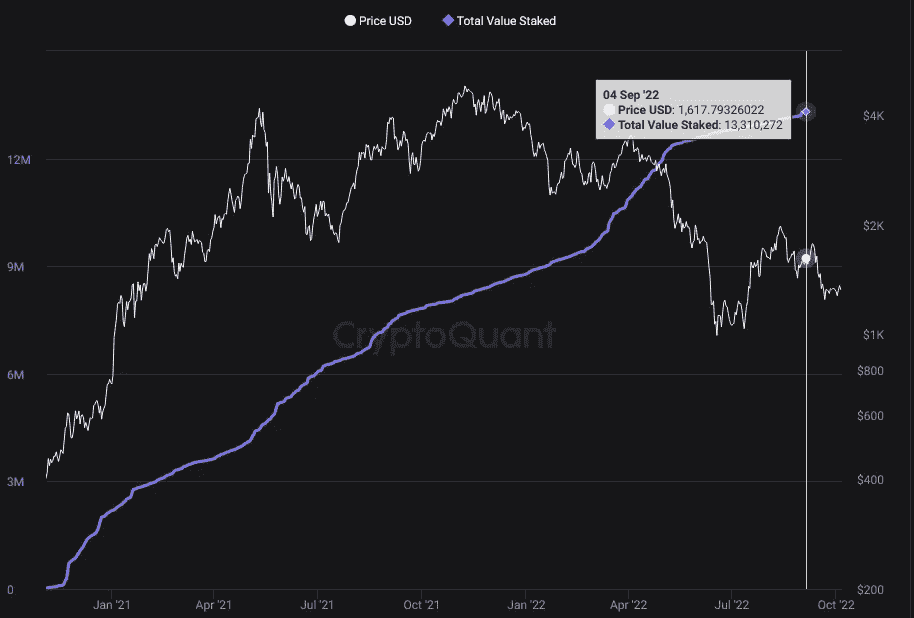

# 上海升级:以太坊的下一步是什么

> 原文：<https://medium.com/coinmonks/the-shanghai-upgrade-whats-next-for-ethereum-597b4c36e8e9?source=collection_archive---------8----------------------->

# 介绍

合并终于过去了，虽然有人可能认为大量的创新已经过去，但事实远非如此。这次合并只是[以太坊路线图](https://www.gsr.io/insights/ethereums-roadmap-a-guide-to-the-merge-and-beyond/)中五个部分的第一部分。这五个部分通常被称为以太坊的五个“推动力”:合并、激增、边缘、净化和挥霍。这些部分中的每一部分都可以很容易地成为它们自己的系列文章，但是我们还没有完全完成第一阶段。我将在[上海升级](https://github.com/ethereum/execution-specs/blob/master/network-upgrades/mainnet-upgrades/shanghai.md#eips-considered-for-inclusion)中讨论以太坊的下一步，包括验证器撤销，EVM 对象格式，以及在我们进入浪涌之前的一些杂项改进。

The Ethereum Roadmap (Vitalik Buterin)

# 信标链撤回

## 信标链存款是如何工作的

上海升级的第一个功能是期待已久的 EIP-4895，它将允许验证者从赌注合同中撤回其 32 个 ETH。到目前为止，将 ETH 放入 staking 合同是一条单行道:一旦你作为验证者将 32 个 ETH 放入 stake，你就无法取回它。自信标链于 2020 年 12 月 1 日推出以来，[已有超过 1400 万以太](https://etherscan.io/address/0x00000000219ab540356cbb839cbe05303d7705fa)被存入标桩合同。这相当于循环中乙醚总量的 11.6%，价值约为 187 亿美元。

Total ETH Staked ([CryptoQuant](https://cryptoquant.com/asset/eth/chart/eth2/total-value-staked?window=DAY&sma=0&ema=0&priceScale=log&metricScale=linear&chartStyle=line))

## 取款是如何进行的

EIP-4895 将允许验证者把从信标链的撤销推到 EVM，或以太坊虚拟机。[EVM](https://ethereum.org/en/developers/docs/evm/)是一个软件平台，它执行交易、智能合约，并定义每个区块的网络状态。网络状态由帐户、余额和机器状态等数据组成。这是旧状态和一组新的有效事务的函数。为了收回它们所有的以太，一个验证器必须首先退出验证器集合，或者队列。验证者可以留在验证者集合中，并提取他们的赌注奖励，只要他们提取后的余额至少为 32 以太。撤销 ETH 涉及一种新的交易类型，称为“撤销操作”，不同于普通交易。常规交易由 EVM 执行，并产生交易费，如果支付交易费的资金不足，交易有时会失败。然而，撤军行动是无条件的，不能失败。它们是对接收钱包的+32 ETH 余额更新，而不是 EVM 执行，以避免正常交易带来的复杂性和潜在故障。由于它们只是一个余额更新，因此不会产生汽油费，并且在从信标链请求后，执行层会立即处理它们。

The Ethereum Virtual Machine ([ethereum.org](https://ethereum.org/en/developers/docs/evm/))

## 解锁提款的长期影响

由于超过 11%的供应已被锁定，围绕从赌注合同中解锁提款将从根本上对 ETH 是利好还是利空一直存在争议。争论的双方都有自己的观点，但是这篇文章仅仅强调了它们。不利的一面是，大量的资本被锁定，如果宏观经济趋势继续恶化，将有很大的动机出售这些乙醚。在上海升级版推出后，我们很可能会看到相当大的抛售压力。

Percentage of Staked Ether in Profit (Glassnode)

在这个参数的另一方面，每个[时期](https://www.techtarget.com/searchdatacenter/definition/epoch)(每 6.4 分钟)只有 6 个验证者可以退出验证者集合，这意味着由于[非常长的队列](https://ethereum.org/en/upgrades/merge/#misconceptions)，所有验证者将花费一年以上的时间来退出集合。这意味着，如果有一个释放到市场上的以太，这将是一个非常缓慢的。此外，那些已经锁定 32 ETH 的人很可能拥有大量的额外资本，并且是该网络的长期信徒。因此，他们不太可能放弃以 ETH 计价的长期股权投资回报。此外， [75%的股份押在 ETH 上，相比收购时处于亏损状态](https://studio.glassnode.com/workbench/cd814a82-3cf7-43a6-5f8e-9e200d6430d1?s=1604009618&u=1664841600&utm_campaign=mp_01_2022&utm_medium=insights_woc&utm_source=gn_insights&zoom=)，也就是说目前不会有多少收益。类似 stETH 和 rETH 这样的液态下注代币也有，这意味着人们在下注时有很大的机会获得奖励，如果愿意可以通过[卖出。最后，对机构投资者来说，允许提款是一个更有吸引力的机会。随着机构开始推出以太等资产的托管服务，机构很可能会对入股感兴趣，而费用和追踪误差最小、流动性更强的选择将是一个有吸引力的机会。](https://cryptoslate.com/will-26b-staked-in-eth-2-0-be-unlocked-and-sold-after-the-merge/)

# EVM 对象格式

上海升级带来的第二个附加功能是 EVM 对象格式，包含在 [EIP-3540 中。](https://eips.ethereum.org/EIPS/eip-3540)这为所有智能合约提供了一个基于其部署的 EVM 版本的特定标识符。目前，EVM 没有预先定义的结构组织。这个 EIP 将允许链上代码和数据的分离。部署到以太坊的智能合约是不可变的，这意味着一旦部署，就不能更改。任何推向 EVM 的变更都有可能破坏现有的智能合约，并且由于不变性，它们无法修复。这将迫使某人部署受影响的智能合约的全新版本。这个 EIP 将合同分为两类:EOF 格式的合同和遗留合同。这将允许对 EVM 的新更改应用于 EOF 格式的合同，而遗留合同将完全不受影响。这为以太坊虚拟机的可升级性提供了更大的灵活性，同时为未针对 EVM 的意外变化进行优化的旧合同提供了保护。

# 杂项改进

除了这两个主要的改进，在这次升级中还有几个[小 EIP](https://github.com/ethereum/execution-specs/blob/master/network-upgrades/mainnet-upgrades/shanghai.md#eips-considered-for-inclusion)将被推送，包括 EIP[3651](https://eips.ethereum.org/EIPS/eip-3651)、 [3855](https://eips.ethereum.org/EIPS/eip-3855) 和 [3860](https://eips.ethereum.org/EIPS/eip-3860) 。这些措施包括一般天然气费的改善，特别适用于直接比特币基地付款。他们还致力于降低合同中各种优化方法的使用或误用方面的智能合同风险。

# 结论

总的来说，以太坊在未来有很多令人兴奋的事情，包括要添加的功能、可伸缩性和安全性改进，以及清理网络本身。然而，路线图还有很长的路要走，在进入下一阶段之前，许多修复和功能仍然需要到位。上海的升级将在 2023 年初的某个时候进行,并将为合并后的以太坊的未来做好准备。

> 交易新手？试试[加密交易机器人](/coinmonks/crypto-trading-bot-c2ffce8acb2a)或者[复制交易](/coinmonks/top-10-crypto-copy-trading-platforms-for-beginners-d0c37c7d698c)