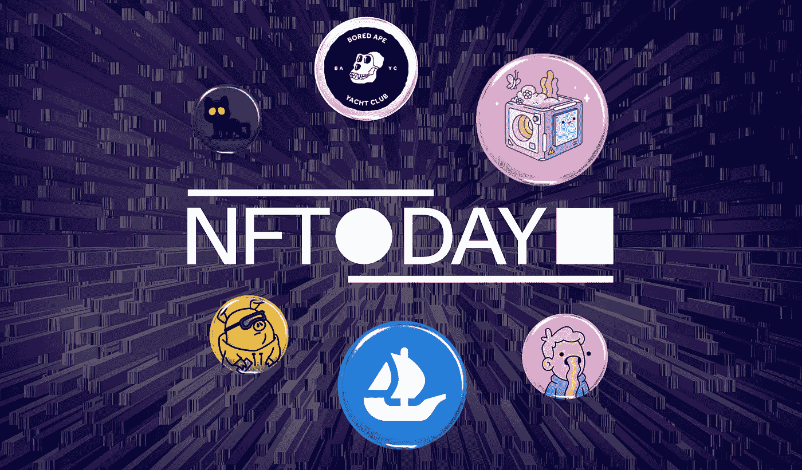

# 9 月 20 日国际 NFT 日的意义

> 原文：<https://medium.com/coinmonks/the-significance-of-september-20-as-international-nft-day-ca157af3f096?source=collection_archive---------39----------------------->

上周标志着不可替代代币发展的一个重要里程碑。这一次的新闻不是关于另一个唱片销售，也不是关于一个明目张胆的 NFT 骗局。相反，这是对 NFT 的纪念，因为 9 月 20 日是第一个国际 NFT 日。

区块链的不可替代性已经走过了漫长的道路；这一旅程始于 2017 年 9 月 20 日 DapperLabs 首席技术官 Dieter Shirley 对 ERC-721 标准的介绍。一晃五年过去了，NFTs 已经成长为一个价值 113 亿美元的空间。

这篇文章的目的不是讨论 NFT 是什么或它们做什么，而是讨论 9 月 20 日的意义以及它对不可替代代币的未来意味着什么。

# 2022 年国际 NFT 日

NFT 在 web3 领域不再是异类。引人注目的销售、强大的平台和受欢迎的收藏相结合，将 NFTs 推向了区块链行业的前沿。今天，该领域著名的公司包括 Dapper Labs、Opensea 和幼虫实验室，仅举几例。

为了纪念第一个国际 NFT 日，该领域的许多顶级公司聚集在一起，赋予这一天以重要意义。它们包括:a16z，Animoca Brands，BuildSpace，比特币基地 NFT，CryptoSlam！、Dapper Labs、Flow、Gaia、LearnWeb3、Matrix World、元宇宙总部、OpenSea、Rarible、Ripple、TheFirstMint、Tokenproof 和 XRP 莱杰。

为了庆祝这一天，计划举办一系列活动，包括实体和虚拟活动，将利益相关者聚集在一起，讨论 NFT 的发展趋势。你可以通过查看[国际 NFT 日网站](https://www.internationalnftday.org/)来一窥这一天是如何纪念的。您还可以在网站上访问其他即将于 2022 年和 2023 年在不同城市和国家举行的 NFT 活动。

# 国际 NFT 日的意义

将国际 NFT 日确立为一年一度的活动，无论是对当前还是未来，这都具有重要意义。

首先，NFT 空间的杰出参与者能够聚集在一起，使其第一次年度活动取得成功，这本身就是一种成功。这表明他们不顾分歧和竞争，通过共同努力致力于 NFT 的未来。如果主要竞争对手能够走到一起支持一个共同的事业，这无疑是一个积极的空间(这可能是必要的，毕竟他们的生存)。

其次，关于第一点。发起国际 NFT 日也很重要，因为它为主要行业领袖提供了一个聚集一堂并为该领域制定议程的途径。可以讨论新的创新想法，并且可以共同解决空间中的关键问题。最近，围绕艺术品盗窃和剽窃的问题变得猖獗，这种事件可以为行业提供一个共同努力解决这一问题的途径。

此外，国际 NFT 日也可以作为一个行业创造 NFT 意识的日子。尽管在过去的五年里这个空间有了很大的增长，但是增长的潜力仍然很大。知道非功能性测试功能的人的比例仍然很低，在其他领域的采用才刚刚开始。9 月 20 日可能有助于教育人们如何部署 NFTs 来转变业务，从而进一步吸引更多的人进入该领域。

# 最终想法

国际 NFT 日的发起是开始建设国家森林公园未来的良好开端。这是一个漫长的过程，最后，我们可以开始看到非功能性测试在这里停留。

> 交易新手？试试[加密交易机器人](/coinmonks/crypto-trading-bot-c2ffce8acb2a)或者[复制交易](/coinmonks/top-10-crypto-copy-trading-platforms-for-beginners-d0c37c7d698c)