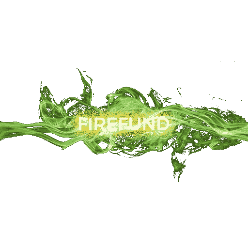

# 迪菲沉睡的巨人被发现了

> 原文：<https://medium.com/coinmonks/the-sleeping-giant-of-defi-has-been-found-c21d7c47b967?source=collection_archive---------0----------------------->

Sustainable investing

## 现在加入，并为长期被动收入做好准备

我基本上已经放弃了投资回报率矿工，他们是 99%的庞氏骗局，设计了复杂的令牌组学和复杂的网站，以混淆事实，即高承诺收益率是不可持续的。

烘豆和它的叉子，稳定基金，财富山，被占领土，比萨塔 1 和 2，浮利欧，AOE 和更多。早点回家，玩房子的钱，他们说，我受够了不眠之夜。

现在，我寻找可持续的收益、不变的合约、抗恐慌抛售、抗银行挤兑、抗鲸鱼、外部收入来源。doxxing 是一个额外的奖励，但它现在价值不大。

听起来好得难以置信？在那里，我发现了一颗隐藏的宝石——fire fund。我已经下了$500 美元的赌注，我还会继续下注。原因如下。

# 1.可持续的年利率——0.5%

他们坚持可持续发展。0.5%相对较低，但可以实现。该团队由金融投资者组成，而不仅仅是密码爱好者或合同开发者。我哪里知道？看他们回答问题的方式就知道了，要么他们知道好的投资者是做什么的，要么他们自己就是好的投资者。自己监测他们的 TG，做出自己的判断。他们有一个活跃的团队。

https://t.me/FireFundFinance

# 2.他们有外部收入来源

我已经看到 2 注入合同 TVL。根据他们的网站，他们通过期货、期权、大宗商品交易和其他金融工具获利。老实说，他们可以说任何他们想说的，我们只需要显示收入。他们是少数几个真正做到的人之一。

# 3.他们的审计得分为零

等等。什么！？？

这是该团队的官方声明:

如果你一直在关注社区对话，George Stamp 只是在我们公开质疑他之后才指出代码中的具体错误，而且是在我们收到 0 审核分数之后，这是相当恶意的。

*他还说我们之前没有项目，这降低了信任度。新人受罚。*

*我们试图通过主张 Dev 退出来捍卫可持续性，但他们坚持没有后门(Dev 退出)，这将使我们成为一个庞氏骗局。我们抵制了，答案是 V2。*

尽管如此，我们很自豪地分享这个故事，因为时间会证明分数是错误的。

只是觉得每个人都值得一个解释。

在那里，我在 V1，他们退还一切，包括税收和利润，他们不是最受欢迎的低 Apr 和所谓的借壳，但对我来说，他们没有表现出任何东西，但诚信。

# 4.这份合同非常安全

该合同已由社区起草。在 v1 之后，该团队听取了社区的建议，并采取措施向社区保证，所有者是有时间限制的，每周只能从他们的投资合同中取出 10%，但投资者每天至少可以取出 5%。

这实质上意味着，如果投资者嗅到任何可疑之处，他们可以比所有者更快地解除合同。

# 5.道德投资

这对我来说是最重要的。地毯和 ponzis 给 DEFI 一个坏名声。

Firefune 致力于可持续发展，

1.  Apr 是可持续的
2.  未使用的推荐不会转到开发，而是保留在合同中
3.  鲸鱼受到限制，但不会受到惩罚，如果它们的股份超过合同价值的 5%，它们可以部分解禁。
4.  他们只要求从你的钱包里得到有限的批准=赌注金额，这样你的钱包就安全了。
5.  他们不会推诿和造成泵。这是一个缓慢而稳定的增长。

最后，我喜欢他们的愿景，用他们团队 Silverracoon 的话说:

是的，现在的计划是让鱼慢慢蚕食，随着合同的增长，赌注将变成海豚和鲨鱼，然后是鲸鱼。鱼会感到非常安全和复合，因为它们支撑着鲸鱼。这就是记号组学的设计……

*这意味着，由于鲸鱼反倾销税，鲸鱼现在有点害怕带着大赌注进入，因为它们可能会陷进去。因此，它允许较小的鱼赌注较小的金额，2-3 个数字，逐步增加合同价值。通过这种方式，希望增加 4 或 5 位数的鲸鱼将在合同价值更大时进入，以免形成超过 5%的股份。这样，投资者 demgographic 得到了许多初始鱼类的支持，鲸鱼后来才出现。*

说够了。我不是付费作家，只是社区的一员。如果你对下面的链接感兴趣，请和我一起参加一个更好的项目。

# 这是一个沉睡的巨人，可能会在未来重塑投资回报项目

网站:https://firefund.finance/

TG:https://t.me/FireFundFinance

*   *沉睡的巨人是社区成员@carbonvelo* 创造的一个术语

声明:我不是财务顾问。这篇文章的内容纯粹是出于教育/研究的目的，仅仅基于我的个人观点。

> 交易新手？在[最佳加密交易](/coinmonks/crypto-exchange-dd2f9d6f3769)上尝试[加密交易机器人](/coinmonks/crypto-trading-bot-c2ffce8acb2a)或[复制交易](/coinmonks/top-10-crypto-copy-trading-platforms-for-beginners-d0c37c7d698c)