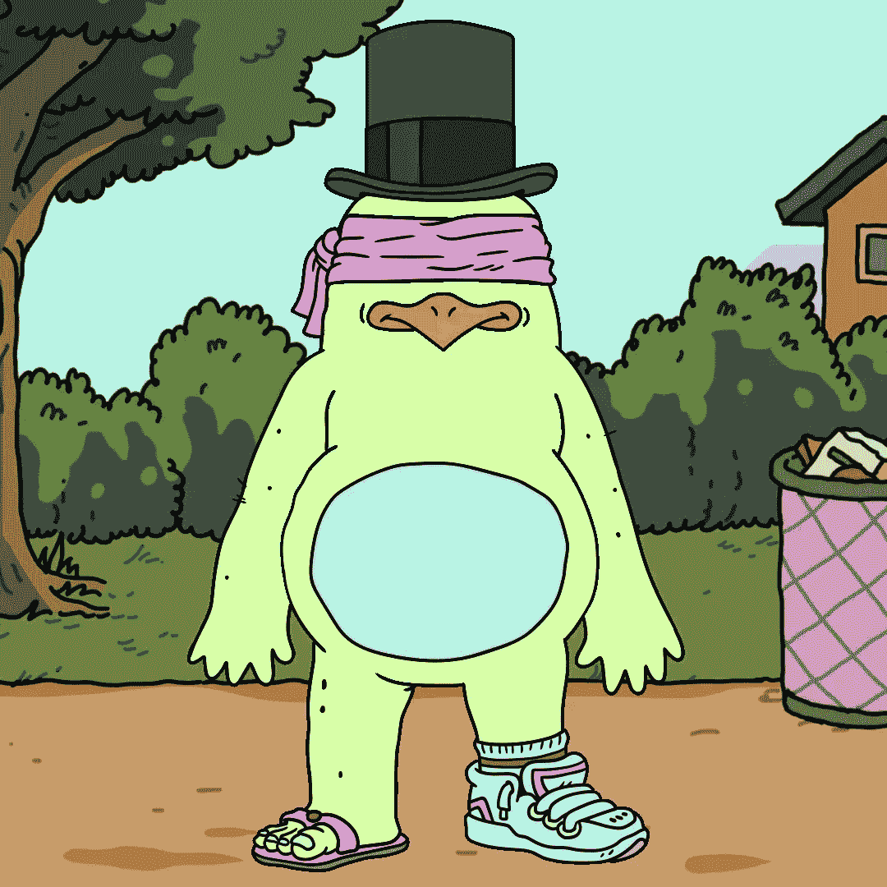
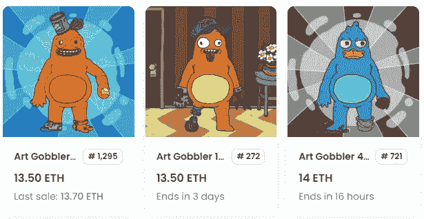
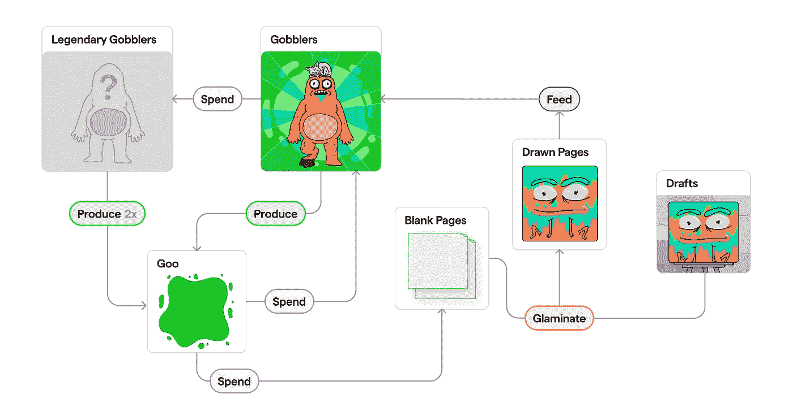
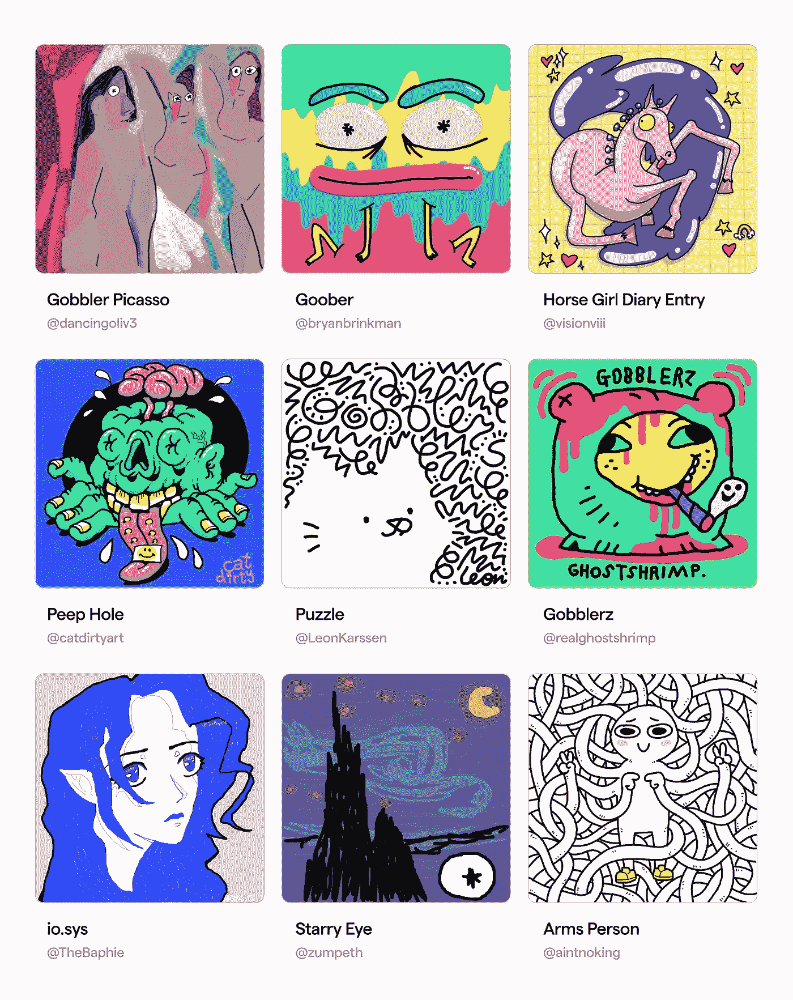
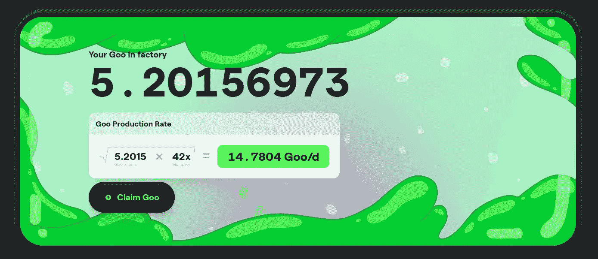
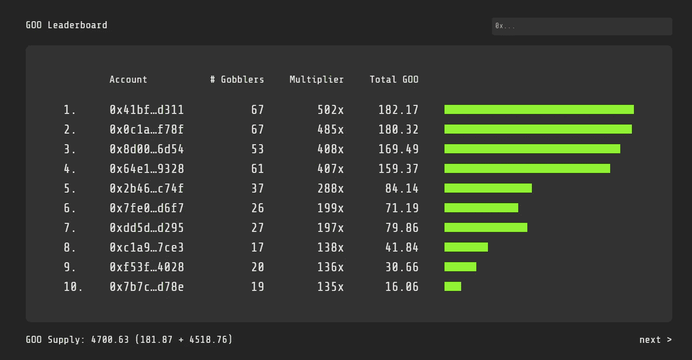

# 社会实验 NFT 项目艺术饕餮 2 天涨到 22000 多美元

> 原文：<https://medium.com/coinmonks/the-social-experiment-nft-project-art-gobbler-rose-to-more-than-22-000-us-dollars-in-2-days-35ec3708a0f8?source=collection_archive---------21----------------------->

Art Gobbler 于 11 月 1 日推出。第一阶段推出 1700 个 Gobbler NFTs，白名单用户可以免费造币；此外，300 个预留给项目创建者和共同建设者，剩余的 8000 个 NFT 将在未来 10 年内使用。年内逐步释放。

白名单用户主要是知名的 NFT kol、内容创作者和 Twitter 名人等。，而且一般玩家很难获得；目前楼面价 15.3ETH，2 万多美金；累计交易金额超过 9,600 ETH，超过 1400 万美元，其中有 873 个地址持有。

Art Gobbler NFT

火鸡 NFT 是一组由人工智能生成的卡通形象。玩家可以通过持有 Gobbler 来产生粘性物质。每个 NFT 都有不同的属性，产生的粘性物质的数量也不同。获得的粘性物质可以出售，或者继续制作成新的火鸡或画板。

目前 GOO 在二级市场的交易价格，价格一度涨到 2200U，而且 GOO 的数量没有上限，其价格和数量完全取决于市场人气。

69 只普通的饕餮可以组合成一只传说中的饕餮，产生咕的能力更高。

Floor price 11.8ETH

艺术饕餮是一个分散的艺术工厂。艺术家使用一个平台绘图工具，即画板，来绘制艺术品，生成 NFT，并将每个 Gobbler 制作成 1/1 NFT。

每只火鸡都被设计成有一个大肚子来吞食艺术品，并将被吃掉的艺术品挂在链子上，永久陈列在肚子画廊里。

How Gobbler NFTs work

艺术家可以在平台上创作生成 NFT，并在交易中获得一定收益。

如果项目的知名度更高，将吸引更多的艺术创作者，这意味着更多更好的艺术品，也可以推高整体的艺术价值。

当然，最重要的价值还是取决于 Gobbler 的市场人气和价格反馈。

Artist-created NFTs

每个玩家根据他们持有的饕餮属性，永久地获得链条上产生的粘性物质总量的固定比例。

例如，如果 Gobbler 持有的重量是 1%，那么它拥有 1%的粘性物质总供应量。即使黏胶价格暴跌，产量剧增，也不会影响个人获得黏胶的价值。

如果不持有 NFT，单纯持有 GOO，持有的 GOO 比例会因为总量的增加而不断被稀释，价值会越来越低。所以吞咕不是个好办法。

GOO’s yield formula

根据合同协议，在接下来的 8000 只火鸡中，最初每个月将铸造 200 枚薄荷糖，随着时间的推移，这个数量将会减少。

Gobblers NFT 的市场价格也会根据购买人气进行反向调整，即购买的人越多，价格越高，反之亦然。

如果不是白名单阶段拿到 Gobblers 的玩家，现在进入门槛有点高。现在的楼面价是 15ETH，几个小时前还是 20ETH，已经亏了 5ETH。

咕的输出根据函数有波动，每个饕餮的输出会相互影响。

Top 10 addresses holding Gobblers NFTs

虽然 Art Gobblers 定位为社交实验，但前期空投福利只给 kol 和名人，普通玩家只能在二级市场购买；

未来，Gobbler 和 GOO 的价格是否会随着时间的推移人气降低，最终导致无人问津，不得而知。

如果当初没有参与实验，不妨等着看实验的最终结果。

以上只是我个人观点，没有投资建议。我是楚小莲，我正在关注元宇宙和 web3。

> 交易新手？试试[加密交易机器人](/coinmonks/crypto-trading-bot-c2ffce8acb2a)或者[复制交易](/coinmonks/top-10-crypto-copy-trading-platforms-for-beginners-d0c37c7d698c)