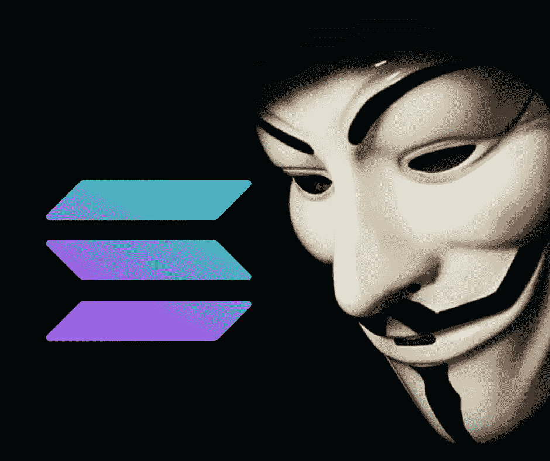
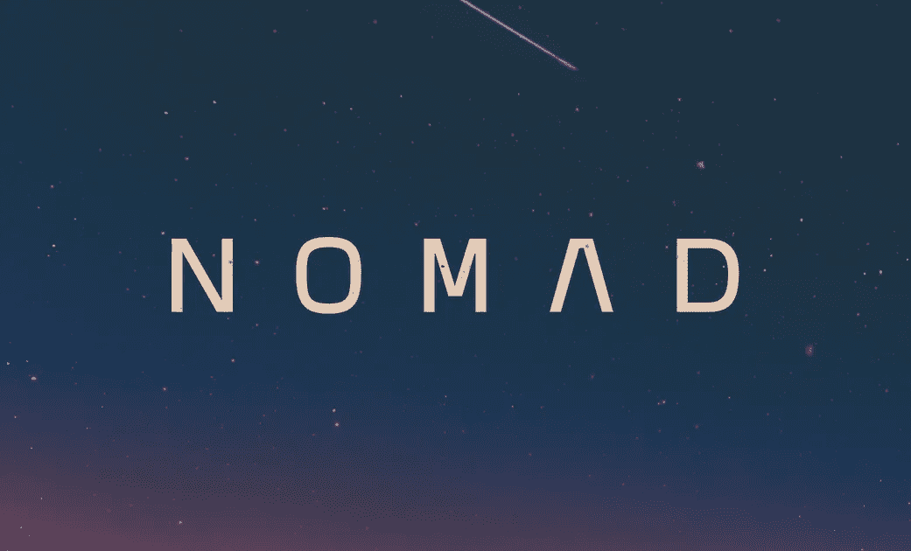
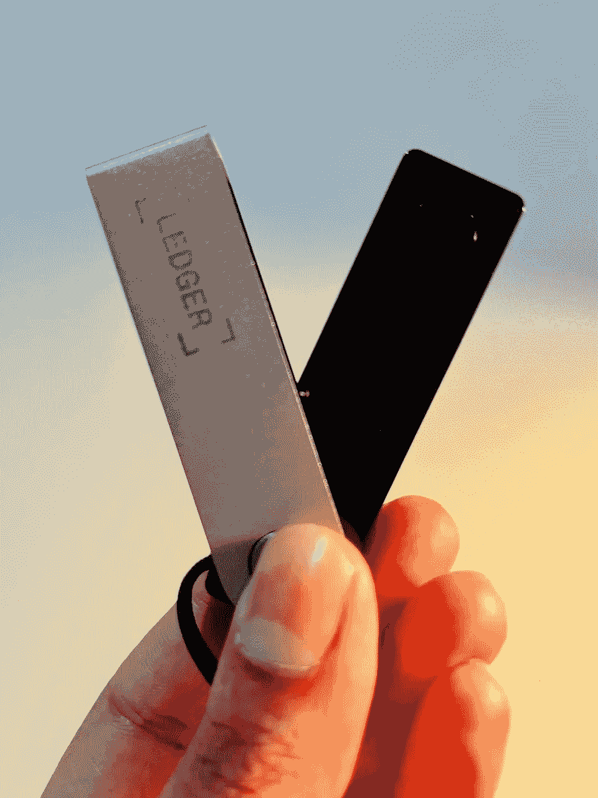
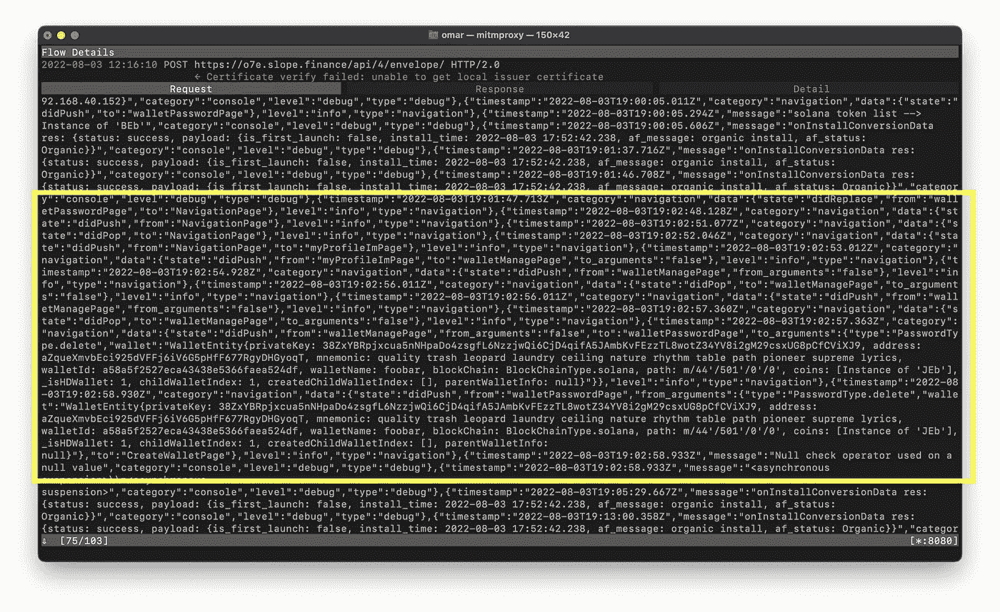

# 索拉纳黑客和为什么你需要一个硬件钱包

> 原文：<https://medium.com/coinmonks/the-solana-hack-and-why-you-need-a-hardware-wallet-c1de88de1b92?source=collection_archive---------0----------------------->

昨晚，当索拉纳被黑的消息传来时，我的 alpha 聊天窗口出现了通知。

“大规模剥削/流失正在进行，索拉纳看到它生活在太阳城，无数人不知从哪里失去了整体平衡。”

"现在把所有东西都转移到账本上."@SolportTom

随着 Twitter 上的更新如火如荼，我的聊天开始猜测发生了什么。许多人对以其闪电般的速度和频繁的中断而闻名的第 1 层链进行了抨击。

"友情提示:索拉纳是 L1 区块链平台的麦当劳冰淇淋机."-@WooShwayze

Web 3 领域的黑客数量越来越多，目前无法追踪。俗话说，“改天再黑。”然而，这看起来很真实，因为就在几个小时前，跨链消息协议 Nomad 的近 2 亿美元数字资产被盗。

虽然黑客攻击的细节最初还不清楚，但 Slope 和 Phantom 钱包在几个小时内就被盗走了数百万美元。SolanaStatus 的 Twitter 页面让更广泛的 Web 3 社区对迅速发展的形势保持更新。

“一个漏洞使得一个恶意行为者从索拉纳的多个钱包中取走了资金。截至世界协调时凌晨 5 点，大约 7767 个钱包受到影响。该漏洞已经影响了几个钱包，包括 Slope 和 Phantom。”

索拉纳基金会运营的 Twitter 页面继续强调使用硬件钱包的重要性，这是确保数字资产足够安全的唯一方法。

“没有证据表明硬件钱包受到了影响——我们强烈鼓励用户使用硬件钱包。”@solanastatus

不幸的是，Web 3 社区面临的一个主要问题是硬件钱包没有被广泛使用，因为它们往往昂贵且不方便。然而，那些幸运地拥有一台电脑的人不必经历看到钱包被掏空的痛苦经历。

到今天下午，我们对这种破坏可能是如何发生的有了更清楚的了解。根据@oxfoobar 的一条推文，后来得到 CoinDesk 的证实，Slope Wallet 可能在自己的内部服务器上以明文形式记录了种子短语。同样使用 Slope 的 Phantom Wallet 用户也在此次攻击中受到了威胁。

Slope Wallet 发布了一份声明，其中他们既没有确认也没有否认这些指控，尽管他们似乎对这种情况承担了一些责任。

“我们正在积极诊断，并致力于公布完整的验尸报告，赢回你们的信任，并尽我们所能做出正确的决定。”—斜率

虽然具体数字各不相同，但据估计，受害者被吸走了近 600 万索尔。确切的金额数字没有我们报道的其他违规事件那么大，但是，Solana 是 L1 最著名的连锁店之一，Slope hack 的消息对 Web 3 的声誉安全来说不是好兆头。

去拿账本，在外面注意安全。

感谢您的阅读。

看看我在推特上未经过滤的想法:

[https://twitter.com/wasifmrahman](https://twitter.com/wasifmrahman)

在 LinkedIn 上关注我的职业生涯:

https://www.linkedin.com/in/wasifmrahman/

我对媒体的另一个想法是:

【https://medium.com/@wasifmrahman 

来源:

[https://decrypt . co/106649/Solana-wallet-hack-what-we-known-known-than-we-known-so known](https://decrypt.co/106649/solana-wallet-hack-what-we-know-so-far)

[https://www . Bloomberg . com/news/articles/2022-08-03/crypto-take-a-fresh-hit-as-千家索拉纳钱包被黑#xj4y7vzkg](https://www.bloomberg.com/news/articles/2022-08-03/crypto-takes-a-fresh-hit-as-thousands-of-solana-wallets-hacked#xj4y7vzkg)

[https://www . coin desk . com/markets/2022/08/03/phantom-wallet-exploit-drains-millions-in-sol-tokens/](https://www.coindesk.com/markets/2022/08/03/phantom-wallet-exploit-drains-millions-in-sol-tokens/)

 [## 开发商称，索拉纳的 600 万美元剥削可能与 Slope 钱包有关

### 伊莱是 CoinDesk 的新闻记者。他持有 ETH，SOL 和 AVAX。索拉纳区块链背后的开发商说…

www.coindesk.com](https://www.coindesk.com/business/2022/08/03/solanas-latest-6m-exploit-likely-tied-to-slope-wallet-devs-say/?utm_medium=referral&utm_source=rss&utm_campaign=headlines) 

> 交易新手？尝试[加密交易机器人](/coinmonks/crypto-trading-bot-c2ffce8acb2a)或[复制交易](/coinmonks/top-10-crypto-copy-trading-platforms-for-beginners-d0c37c7d698c)