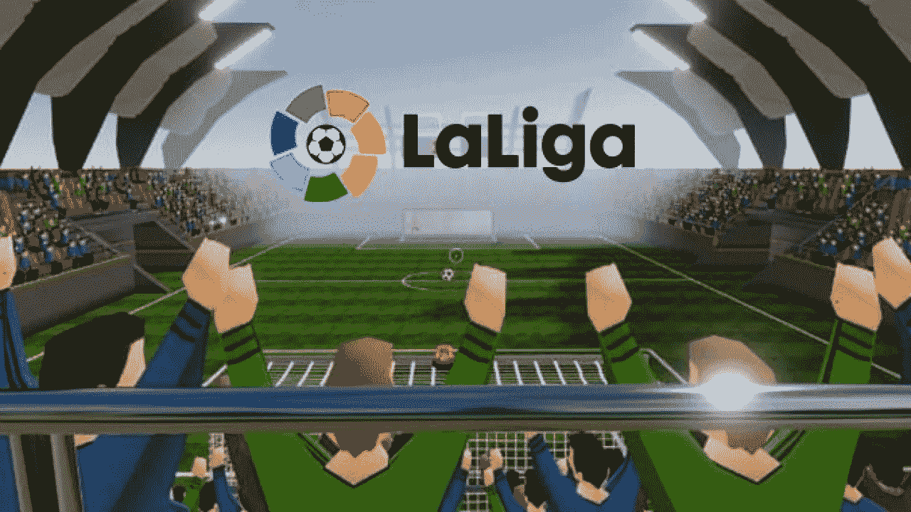

# 西班牙人拉利加去了……分散地的元宇宙

> 原文：<https://medium.com/coinmonks/the-spanish-laliga-goes-metaverse-at-decentraland-f37c25c73f83?source=collection_archive---------17----------------------->

西班牙甲级足球联赛和世界上最负盛名的联赛之一 Laliga 已经与两家与元宇宙相关的公司 **Stadioplus** 和 **Vegas City Limited** 达成战略合作伙伴关系，将其部分运营数字化，以提供关于[分散球场](https://coinmarketcap.com/currencies/decentraland/)和基于以太坊的[元宇宙](https://bitnewasbot.com/tag/metaverse)的新体验。

通过此举，Laliga 旨在将世界各地的粉丝带到虚拟世界的新体验中。

**相关:** [**顶级极品元宇宙一亩三分地**](https://bitnewsbot.com/best-metaverse-worlds-to-buy-land/)

在新冠肺炎疫情之后，世界各地的许多体育组织和联盟开始更加关注他们的战略，将数字技术作为一种打开新收入流的方法。

在这种情况下，世界上最受欢迎的联赛之一 Laliga 宣布进入元宇宙。

# 新的活动和经历

与**分散地**的战略合作伙伴关系将允许 LaLiga 向粉丝呈现新的活动和体验。

在这个项目中，LaLiga 将利用 Stadioplus 的帮助，Stadioplus 是一个致力于将体育世界与 Web3 和元宇宙联系起来的团队，以及 Vegas City Limited，另一家专门为元宇宙和虚拟世界创造体验的公司。

通过这一举措，Laliga 希望通过虚拟体验接触到与这些世界联系更紧密的新的和更年轻的观众。

新的体验将在拉斯维加斯市提供，这是一个分散的地区，举办体育，游戏和娱乐为基础的体验。

Laliga 特许经营和许可负责人 Stephen Ibbotson 在评论这一合作关系时说:

> “对于 LALIGA 来说，重要的是我们继续创新我们向球迷提供组织的方式，无论是在球场上还是球场下。这份协议将让我们接触到新的受众，比如分散的受众。”
> 
> - Stephen Ibbotson，Laliga 特许经营和许可主管

关于将体育融入元宇宙的重要性，分散基金会首席执行官 Agus Ferreira 说:

> “我们相信电子竞技是展示 WEB3 和去中心化潜力的绝佳机会。这就是为什么我们很高兴与 STADIOPLUS 合作，将 LALIGA 融入分散的土地，将这个在全球拥有数亿观众的联盟带到元宇宙。”
> 
> -阿古斯·费雷拉，权力下放基金会首席执行官

*原载于 2022 年 9 月 19 日*[*【https://bitnewsbot.com】*](https://bitnewsbot.com/the-spanish-laliga-goes-metaverse-at-decentraland/)*。*

> 交易新手？尝试[加密交易机器人](/coinmonks/crypto-trading-bot-c2ffce8acb2a)或[复制交易](/coinmonks/top-10-crypto-copy-trading-platforms-for-beginners-d0c37c7d698c)