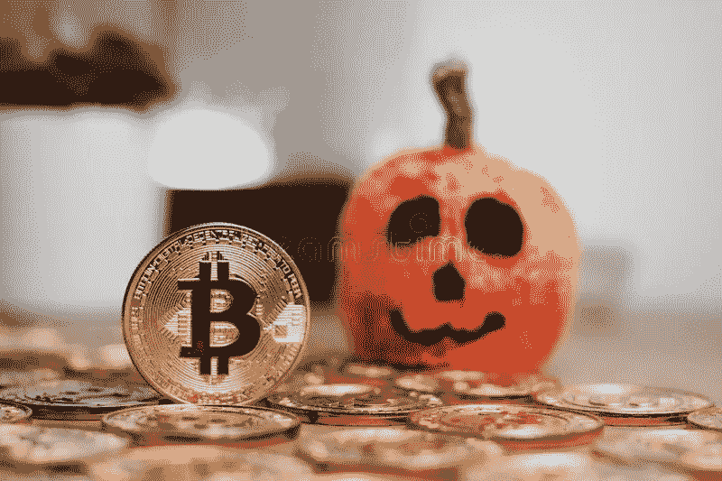

# 比特币令人毛骨悚然的真相:是恶作剧还是款待？

> 原文：<https://medium.com/coinmonks/the-spooky-truth-about-bitcoin-is-it-a-trick-or-a-treat-ac8643106aa0?source=collection_archive---------42----------------------->

dreamstime

随着各个年龄段的年轻人将他们的生活带进他们的篮子和水桶，尽可能多地收集糖果(希望没有污染)，是时候让我们来看看加密之王——比特币了。

比特币(BTC)在 19000 美元关口附近徘徊了一个多月，瞬间反弹刚刚超过 20000 美元。