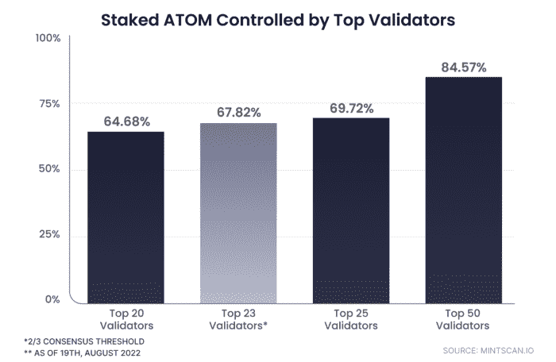

# 原子打桩的状态:2022 年 8 月报告

> 原文：<https://medium.com/coinmonks/the-state-of-atom-staking-august-2022-report-cbc0d9c42a80?source=collection_archive---------38----------------------->

ATOM 仍然是 Cosmos Hub 最闪亮的明星，有助于保护整个网络，同时在整个产业链和集成的 IBC 生态系统中充当 DeFi 的催化剂。随着用户继续下注，网络变得更加强大，促进了更多的活动。

下一节分析了上个月的重要原子数据，让你对 Cosmos Hub 的活动有一个全面的了解。

# 1/ ATOM 概述

以下是关于通用 ATOM 令牌统计的[主要数据点](https://www.coingecko.com/en/coins/cosmos-hub)

*   总市值:30.4 亿美元以上
*   24 小时交易量:1.61 亿美元以上
*   唯一钱包地址:128 万以上
*   流通供应量:2.92 亿+代币
*   保税代币:2 亿多代币

# 2/宇宙中心概述

以下数据显示了过去 30 天内宇宙枢纽上 [IBC 活动的重要数据点:](https://mapofzones.com/?testnet=false&period=720&tableOrderBy=ibcVolume&tableOrderSort=desc&sortOrder=desc&filterAmount=&trendLine=&zone=cosmoshub-4)

*   IBC 卷(30D):1.54 亿美元以上
*   IBC 转会(30 天):27.2 万英镑以上
*   活动区域(30D): 48
*   砌块高度:11.75 米

# 3/锁定市值

在撰写本文时，通过设定市值，Cosmos Hub (ATOM)在加密货币资产中排名第九[，从上个月开始保持其位置，现在停留在 20.8 亿美元以上。就赌注比率而言，它在 87 个 PoS 网络中排名第 21 位，自上个月以来一直相当稳定。](https://www.stakingrewards.com/cryptoassets/)

# 4/赌注比率和统计

在过去的 30 天里，ATOM 的赌注比率提高了 3%多一点，总计 65.58%。这最有可能是由于一系列原因，包括 ATOM 和 Cosmos Hub 的更多使用，以及加密货币市场人气的整体上升。

目前， [2 亿+原子代币与其 3.05 亿+的流通供应量相关联](https://www.stakingrewards.com/earn/cosmos/metrics/)。

这对 ATOM 来说是一个重大的净利好，因为它将在 2020 年达到 75%的峰值。

# 5/原子代表

在评估 ATOM staking 在 Cosmos Hub 上的采用量时，唯一代表是一个重要方面，因为他们代表了对保护链的兴趣和投入的增加。在撰写本文时，ATOM 代表的人数为 499，116 人，比一个月前增加了 2%。

# 6/验证器统计

Cosmos Hub 总共有 431 个验证器，其中有 175 个有效验证器，这有助于确保其网络安全。运行一个验证器节点会导致大约 19% 的[平均 APR，这与上个月相似。](https://www.mintscan.io/cosmos)

*尽管在过去一个月中控制的数量有适度的变化(治理共识阈值)，但前 23 名验证者继续合计持有超过 67.85%的所有股份。

# 7/中本系数

Nakamoto 系数是区块链验证器集合中股份集中度的关键指标，它显示了恶意破坏链条所需的最小验证器数量。

当系数值较高时(与活动验证器的总数相比)，堆叠的令牌更均匀地分布在网络验证器中，加强了链的分散性和安全性。

[拥有 175 个有效验证者的中本聪系数](https://nakaflow.io/)，自 7 月份上次更新以来一直保持在 7。

# 结束语

该报告的目的是为您提供 ATOM staking 数据的全面信息摘要。

有关即将发布的更多内容的最新信息，包括下个月的 ATOM staking 报告，请务必关注我们的渠道和社交媒体账户。

**坎德拉研究**

[全球](https://t.me/candelaglobal) l [越南](https://t.me/candelaresearchvn) l [社区](https://t.me/cosmosvncommunity) l [推特](https://twitter.com/candelaresearch)

> 交易新手？尝试[加密交易机器人](/coinmonks/crypto-trading-bot-c2ffce8acb2a)或[复制交易](/coinmonks/top-10-crypto-copy-trading-platforms-for-beginners-d0c37c7d698c)