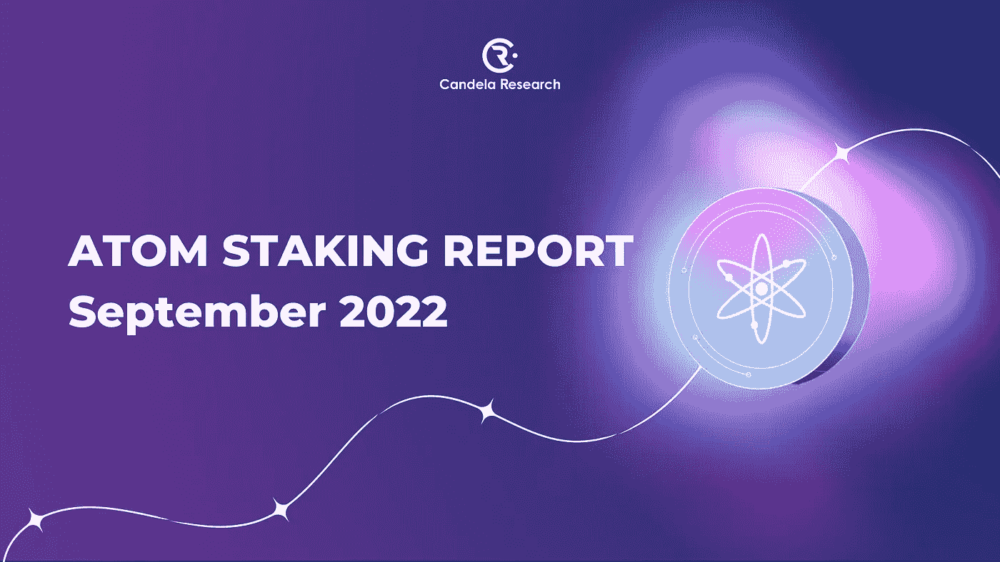
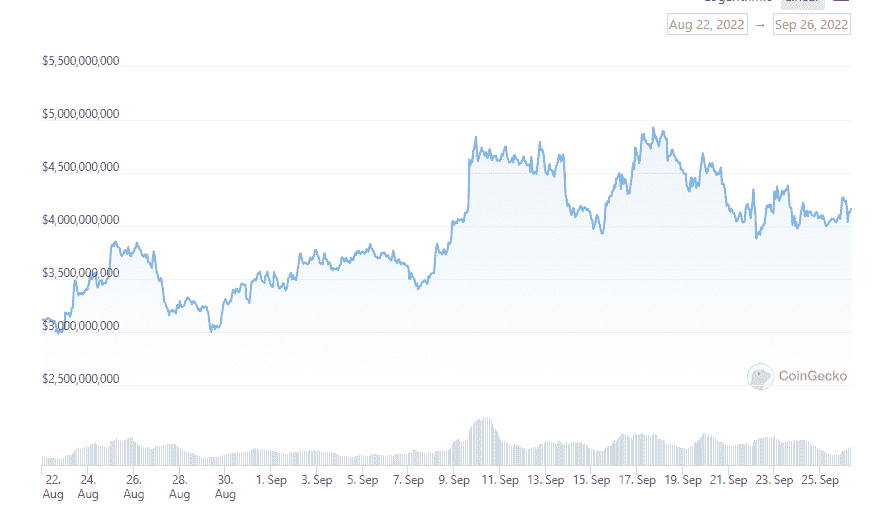
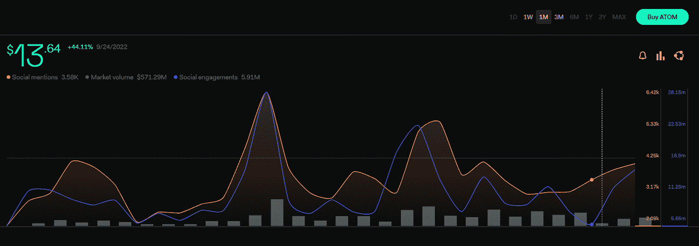
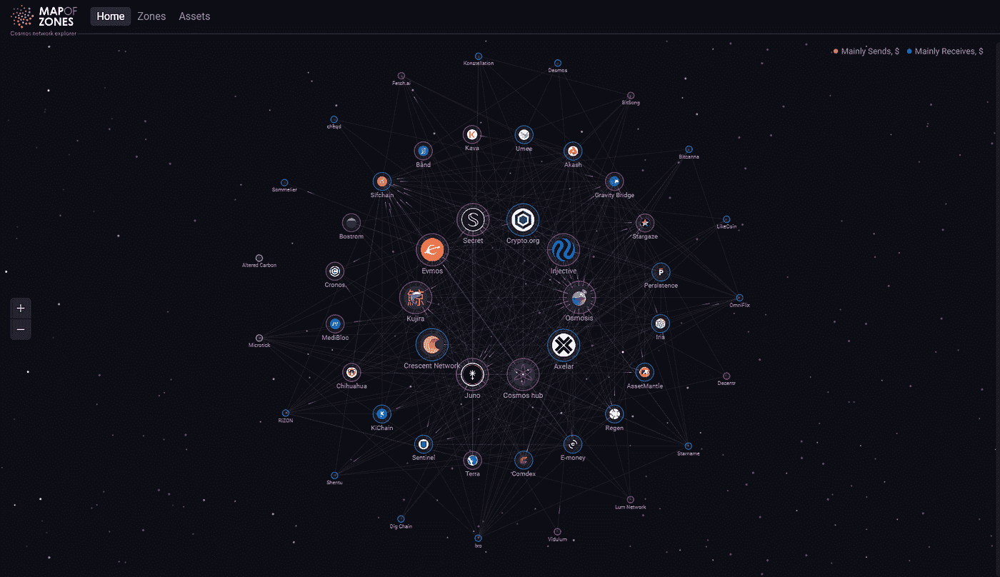
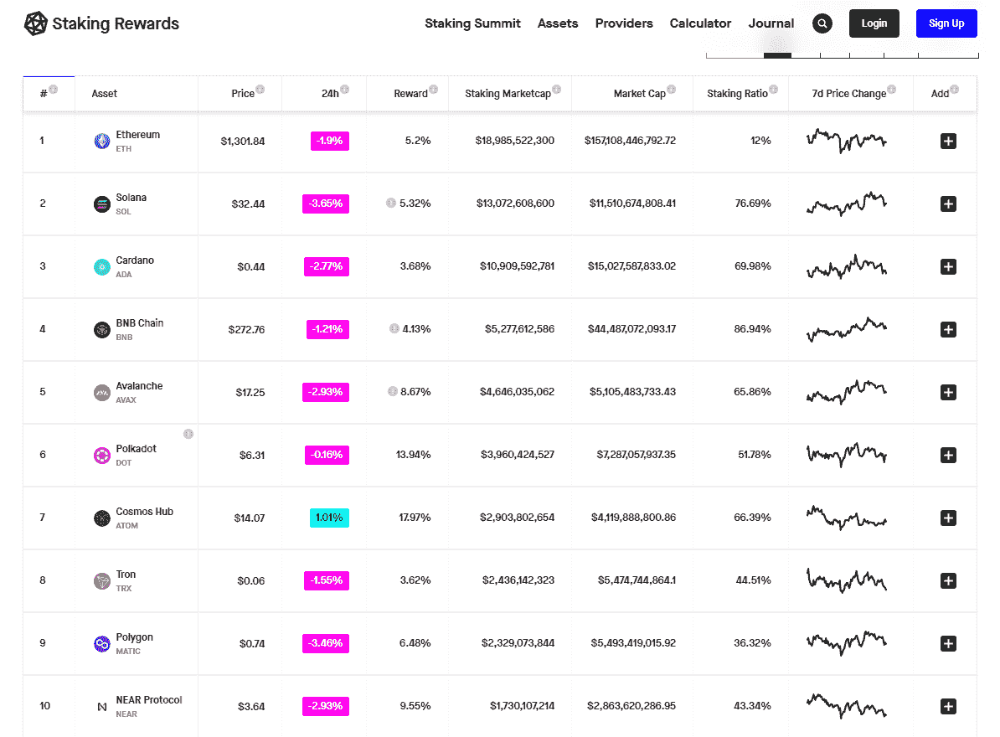
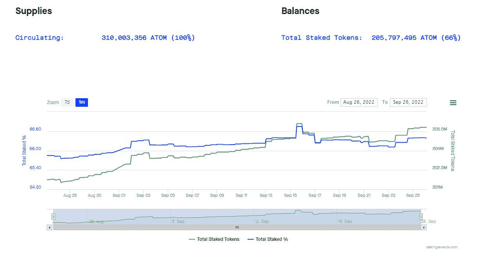
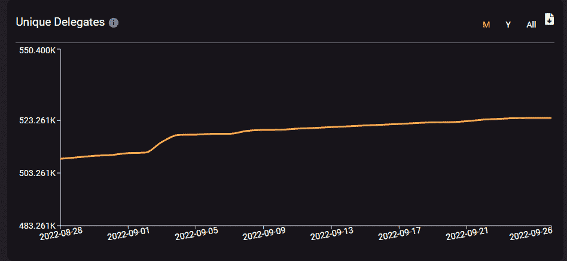
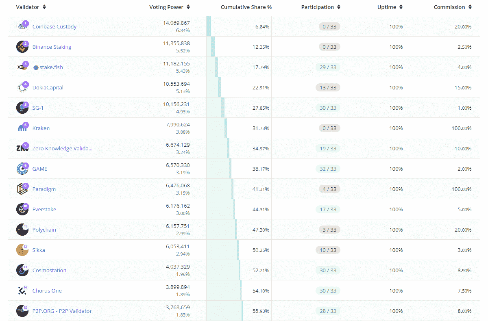
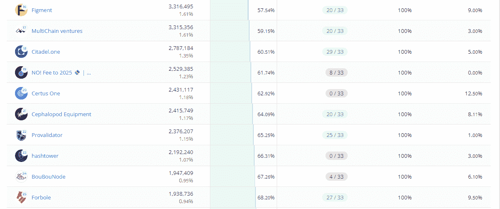
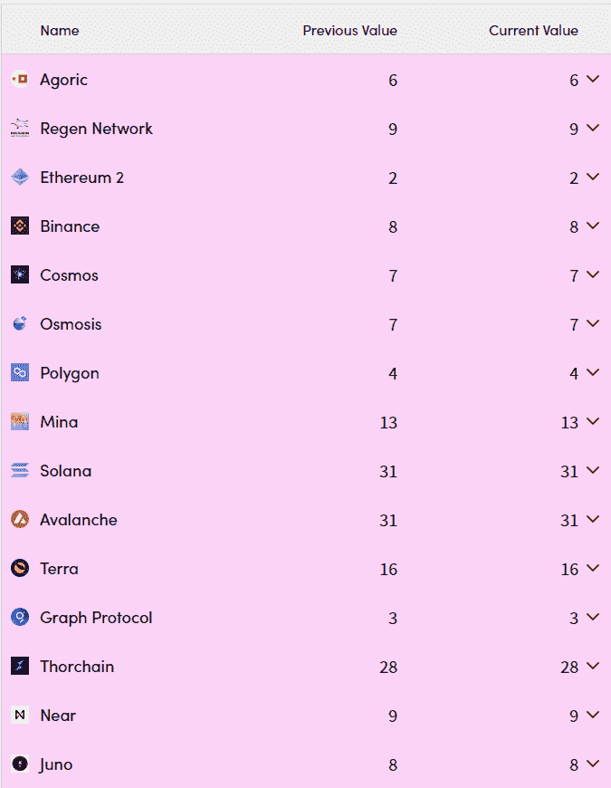

# 原子打桩的状态:2022 年 9 月报告

> 原文：<https://medium.com/coinmonks/the-state-of-atom-staking-september-2022-report-5307af00f68b?source=collection_archive---------4----------------------->

承诺宇宙更先进未来的宇宙 2022 和广受期待的 ATOM 都在上个月引起了社区的关注。该项目的创始人将概述该项目的长期目标和新的白皮书。

下一节分析了上个月的重要原子数据，让你对 Cosmos Hub 的活动有一个全面的了解。

# 1/ ATOM 概述

以下是关于通用 ATOM 令牌统计的[个主要数据点](https://www.coingecko.com/en/coins/cosmos-hub):

*   总市值:415 亿美元以上(36.5%)——排名第 20
*   24 小时交易量:4.78 亿美元以上(增幅 196.89%)
*   持有人:784，841 人
*   流通供应量:2.92 亿+代币
*   绑定代币:2.05 亿+代币(+2.5%)

*   社交提及:107.72 万(+36.7%)
*   社交活动:3.3064 亿人(+60.72%)

# 2/宇宙中心概述

以下数据显示了过去 30 天内宇宙枢纽上 [IBC 活动的重要数据点:](https://mapofzones.com/?testnet=false&period=720&tableOrderBy=ibcVolume&tableOrderSort=desc&sortOrder=desc&filterAmount=&trendLine=&zone=cosmoshub-4)

*   IBC 销量(30 天):2.06 亿美元以上
*   IBC 转会(30 天):35 万英镑以上
*   活动区域(30D): 49
*   砌块高度:12.20 米(+3.86%)

# 3/锁定市值

在撰写本报告时，宇宙中心(ATOM)在加密货币资产中排名第七(T5)，比上月上升了 2 位，目前停留在 41 亿美元以上。就赌注比率而言，它在 85 家 PoS 网络中排名第 20 位，自上个月以来一直相当稳定。

# 4/赌注比率和统计

ATOM 的跑马圈地比例在之前的 30 天里提升了 1%多一点，总计 66.39%。这最有可能是由于一系列原因，包括 ATOM 和 Cosmos Hub 的更多使用，以及加密货币市场人气的整体上升，麦德林的 Cosmoverse 活动将公布 atom 2.0 文件&愿景

目前，[2.05 亿+原子令牌与其 3.1 亿+的循环供应量相关联](https://www.stakingrewards.com/earn/cosmos/metrics/)。

这对 ATOM 来说是一个重大的净利好，因为它将在 2020 年达到 75%的峰值。

# 5/原子代表

在评估 ATOM staking 在 Cosmos Hub 上的采用量时，唯一代表是一个重要方面，因为他们代表了对保护链的兴趣和投入的增加。在撰写本文时，ATOM 代表的人数为 524，191 人，比一个月前增加了 5.02%。

# 6/验证器统计

Cosmos Hub 总共有 441 个验证器，其中有 175 个有效验证器，这有助于确保其网络安全。运行一个验证器节点会导致大约 19% 的[平均 APR，这与上个月相似。](https://www.mintscan.io/cosmos)

**尽管在过去一个月中控制的数量略有变化(监管共识阈值)，但前 24 名验证者继续合计持有超过 67.26%的所有股份。*

# 7/中本系数

Nakamoto 系数是区块链验证器集合中股份集中度的关键指标，它显示了恶意破坏链条所需的最小验证器数量。

当系数值较高时(与活动验证器的总数相比)，堆叠的令牌更均匀地分布在网络验证器中，加强了链的分散性和安全性。

拥有 175 个有效验证者的中本聪系数，自八月最后一次更新以来一直保持在 7。

# 结束语

该报告的目的是为您提供 ATOM staking 数据的全面信息摘要。让我们为宇宙 2.0 的新未来做好准备，不断学习，明智投资。

有关即将发布的更多内容的最新信息，包括下个月的 ATOM staking 报告，请务必关注我们的渠道和社交媒体账户。

**用蜂巢研究坎德拉**

[全球](https://t.me/candelaglobal) l [越南](https://t.me/candelaresearchvn) l [社区](https://t.me/cosmosvncommunity) l [推特](https://twitter.com/candelaresearch)

> 交易新手？试试[加密交易机器人](/coinmonks/crypto-trading-bot-c2ffce8acb2a)或者[复制交易](/coinmonks/top-10-crypto-copy-trading-platforms-for-beginners-d0c37c7d698c)