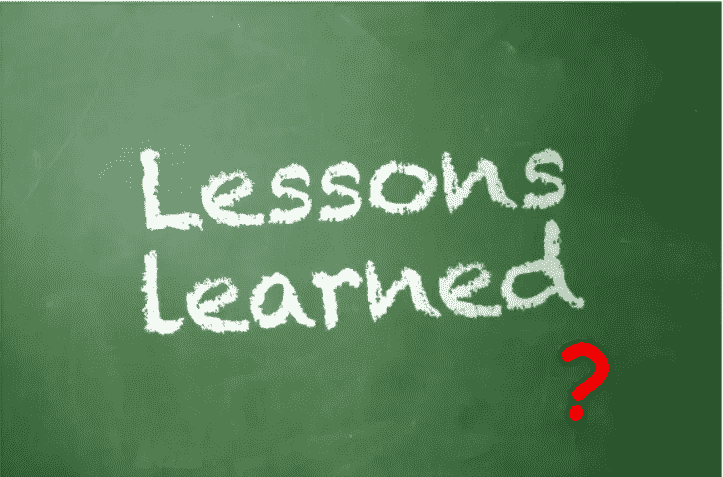
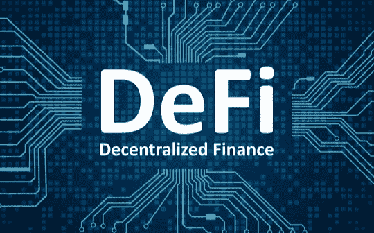

# 定义和加密的状态

> 原文：<https://medium.com/coinmonks/the-state-of-defi-crypto-8b410e9b95a5?source=collection_archive---------7----------------------->

*免责声明:我有加密货币，我的观点明显有失偏颇。这不是财务建议，DYOR。*

# 概述

2022 年肯定是一个现实的检查(就像以前在加密或其他方面的任何崩溃一样)。熊市消灭了很多大坏蛋:Celsius、Voyager、LUNA、BlockFi，最后但同样重要的是，FTX。与此同时，它也冲走了一些由秘密领域或普通媒体推动的信仰。

具体到 DeFi，大部分庞氏协议已经死亡或即将死亡。我怀疑它们将在未来几个月以另一种形式回归，并且可能在下一轮牛市到来时(如果)还会有一些更大的波动。

# 课程

1.  **加密货币**整体来看还是**小不点**。它的最高市值约为 3 万亿美元，比苹果的 mcap 还低。截至本文撰写之时，苹果的市值仍为 2.4 万亿美元，而 Cryptos 的市值约为 7770 亿美元。它还远没有大到不能倒，而且没有人会很快飞来拯救已经死亡或濒临死亡的公司。我们最近看到币安在看了他们的书后取消了他们在 FTX 的交易，因为故事仍在发展，我想说，CZ 没有跟进是对他的公司和用户的。
2.  加密货币仍处于婴儿期，非常像任何旧时尚淘金热，这个行业吸引了许多骗子和骗子(其中一些有非常大的名气)。市场仍然不受监管(这不是我呼吁监管，至少不是这么简单)，这个领域已经被证明仍然是狂野的西部。
    在牛市的兴奋和 FOMO 的推动下，大玩家或小玩家用他们没有的钱玩游戏，在这个过程中过度杠杆化，最终在熊市到来时被彻底消灭。
3.  不是你的钥匙，也不是你的硬币。中本聪提出的加密空间的第一课。一路走来，随着收获和投机，一些人放松了警惕，现在正在为此付出代价。我毫不怀疑它会再次发生。说到底，人就是人。

# DeFi 怎么办？

1.  不要相信有影响力的人，尤其是那些不守信用的人。我还没见过一个 AMA 人提出这些尖锐的问题。他们很少透露他们是否得到报酬，这是一种公然的利益冲突(在 TradeFi 中是禁止的)。在我的每一篇文章中，你首先读到的是我的免责声明，所以你知道我的立场。
    他们要么有一个袋子，要么受雇利用他们的观众，要么两者兼而有之。无论哪种方式，大多数情况下，你在这些泵和转储方案为时已晚。不信任我？看看 big DeFi YouTube 频道，告诉我项目的百分比(应该很高)变成了 0(这对组合不再是可交易的，或者代币已经变得一文不值)。没有一个令牌崩溃了，但仍然存在，但崎岖不平，失败或扣动了他们的交易对的扳机。
    不要误会我的意思，我并不反对营销和推广，但每次都必须提前披露这些信息。
2.  **DeFi** 还非常**年轻**，宇宙第一块大石头 Uniswap 才两岁多。大多数“高级”协议都是庞氏协议，这是很自然的，而且公平地说，大多数协议都是这样说的。如果你允许我说的话，这是提供一个“财务”系统的最简单和最懒惰的方法。同样的事情过去发生过，现在仍在发生(麦道夫)。
    不过，并不是所有公司都像 DEX、DEX aggregator 或 Curve 一样糟糕。
3.  **寻找试图通过 zk(零知识)或其他方式解决可扩展性等问题的协议**。互操作性、桥梁(如果可以安全实现的话)等等……这显然不是财务建议，我只是写一些我脑海中闪过的东西。
4.  不是你的钥匙，也不是你的硬币。对于一个叫做去中心化金融的领域，很多协议都是高度集中的，你需要投入沉没成本来获得回报。如果你不早，不断套现，很有可能，你会无所适从。
    然后，当项目最终失败时，你将按照团队的条款(无论是什么条款)走下去。这是最纯粹形式的中央集权。

# 最后的话

一些完全不可靠的个人想法，我只是一个在键盘上随便打字的人。

**区块链来了**。没错，FTX 和其它国家代表着一次严重的挫折，但在某种程度上，这些坏演员被赶出去是件好事，这也是市场“修正”一词被使用的原因。

我特别喜欢这些低迷时刻，当整个市场陷入恐慌，我们在一般媒体上看到令人担忧的标题。在我看来，这是研究严肃项目的最佳时机，对我来说，也是投资未来几年的最佳时机。

我希望你们都有一个愉快的阅读，我不确定，因为我可以告诉你，我感觉到我自己的内心冲突。然而，如果是这种情况，请点击👏按钮，这样这篇文章就可以接触到更多的人。

> 交易新手？试试[加密交易机器人](/coinmonks/crypto-trading-bot-c2ffce8acb2a)或者[复制交易](/coinmonks/top-10-crypto-copy-trading-platforms-for-beginners-d0c37c7d698c)