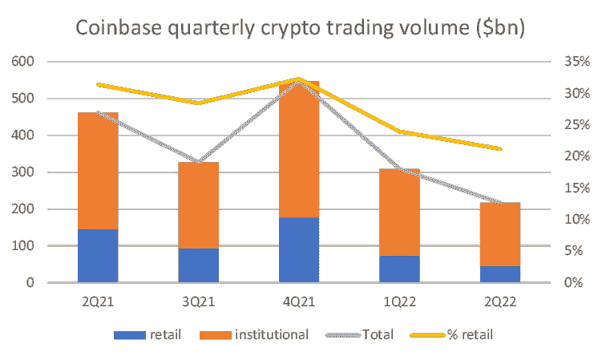
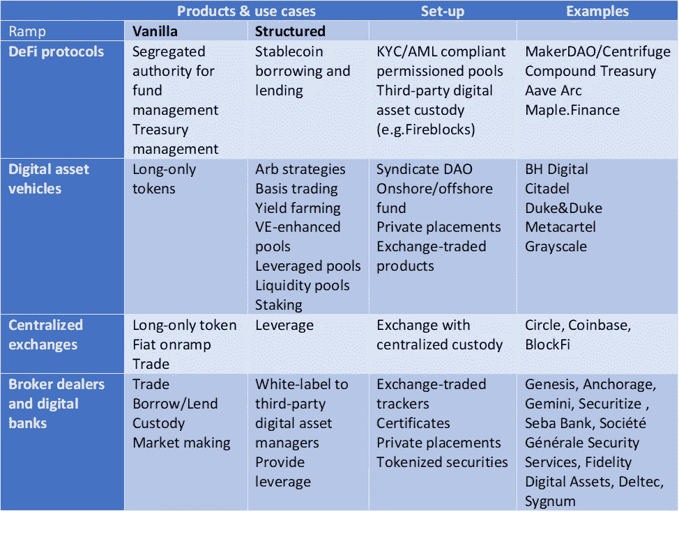

# 密码学中机构采用的状态

> 原文：<https://medium.com/coinmonks/the-state-of-institutional-adoption-in-crypto-fc7e49b1dd29?source=collection_archive---------22----------------------->

source: Photo by [Sean Pollock](https://unsplash.com/@seanpollock?utm_source=unsplash&utm_medium=referral&utm_content=creditCopyText) on [Unsplash](https://unsplash.com/s/photos/institution?utm_source=unsplash&utm_medium=referral&utm_content=creditCopyText)

机构兴趣来了。截至 2021 年底，CoinShares 报告称，2011 财年，3 家最大的数字资产管理公司合计拥有 500 亿美元 AUM，机构资金净流入为 93 亿美元。机构资产也开始直接在链上流动，Compound 和 Aave 的合规许可资产池总计约 6000 万美元，低于峰值时的 2.6 亿美元以上。加上对冲基金敞口，我们估计，目前机构资产总额约为 250 亿美元，低于峰值时的 500 亿美元。在全球 100 万亿美元的投资资产中，这仍然只是很小的一部分。

机构交易量很粘，尽管价值急剧下降。以比特币基地 2Q22 报告为代表，机构密码交易量为 1710 亿美元，约占总交易量的 80%。它的价值比 2014 年第四季度下降了 50%,这意味着考虑到 2012 年上半年加密市场下跌了约 60%,它大致保持稳定。有趣的是，50%的交易量来自 BTC 和瑞士联邦理工学院。

source: Coinbase 2Q22 report

他们为什么感兴趣？简单的答案是创收和保留，因为他们的客户要求将其作为一种投资。除了将加密作为一种投资，机构还对透明度、信任、可编程性/自动化、隐私、高交易量和全球可伸缩性等用例感兴趣。这些新颖的用例可能会推动加密技术的下一步发展，目前为止，加密技术还仅限于 BTC 和联邦理工学院。机构 AUM 有可能从目前微不足道的 250 亿美元 AUM 增长 200 倍，达到全球投资资产的 5%左右。

每个机构类型有哪些用例？

-资产管理公司对交易、基金发行、基金管理、风险管理、多样化和阿尔法生成感兴趣

-资本市场经纪商希望提供数字资产的交易、结算和托管服务

-银行希望升级其在支付、贷款、借款、承销和银团贷款方面的基础设施

- Fintechs 将工资单、支付和 DAO 中的用例视为社区管理工具

为了促进机构采用，合规性必须与世界标准保持一致。金融机构对 KYC/反洗钱、托管和风险管理有很高的要求，因为它们代表客户管理资产。因此，他们必须找到安全和合规的入口来访问密码，同时在链上传递真实世界的资产。

如今，坡道上的管道以不同的形式存在。直接访问协议仍然很少被采用，因为用例仅限于借出和借入 stablecoins，并且 rails 对于大多数不是本地加密的机构来说并不熟悉。争论的一部分与违约率(4%贷款/6%借款)相对缺乏竞争力有关，相比之下，目前 3 个月期美国伦敦银行同业拆借利率为 3.6%。然而，提供符合法规的平台和服务的数字经纪人和托管人有很大的吸引力。

产品和用例因机构选择的 ramp 而异。

source: 360 Advisory LLC

到目前为止，加密轨道和机构之间的融合最好是通过提供合规托管和结构的 digital-saavy 经纪交易商来尝试。到目前为止，通过他们的渠道测试的产品只是简单地针对 ETH 和 BTC，尽管我们看到人们对基于算法的策略的兴趣越来越大。这些策略通常在对冲基金类型的结构中制定得最好，这种结构求助于数字经纪人服务。

下一个前沿是通过 Maple 这样的计划将现实世界的资产引入加密轨道。财务开始形成潜在的解决方案。真实资产令牌化是另一种选择，尽管到目前为止还没有证明是最有效的。

我们在机构采用方面处于早期，但拐点已近。

**关于—**

*360 咨询有限责任公司是一家总部位于波士顿的 RIA 公司，管理投资，包括加密*

👉[上午 9 点至 30 点](https://twitter.com/930AM2)🐰🕳

**来源—**

👉[https://consensys.net/blockchain-use-cases/finance/](https://consensys.net/blockchain-use-cases/finance/)

👉比特币基地 2Q22 报告[https://s27 . q4cdn . com/397450999/files/doc _ financials/2022/Q2/v2/Q2-2022-Shareholder-letter . pdf](https://s27.q4cdn.com/397450999/files/doc_financials/2022/q2/v2/Q2-2022-Shareholder-Letter.pdf)

👉CoinShare 财年报告[https://www.binance.com/en/news/top/6693616](https://www.binance.com/en/news/top/6693616)

👉复合国债[https://thedefiant.io/compound-treasury-lending](https://thedefiant.io/compound-treasury-lending)

> 交易新手？尝试[加密交易机器人](/coinmonks/crypto-trading-bot-c2ffce8acb2a)或[复制交易](/coinmonks/top-10-crypto-copy-trading-platforms-for-beginners-d0c37c7d698c)