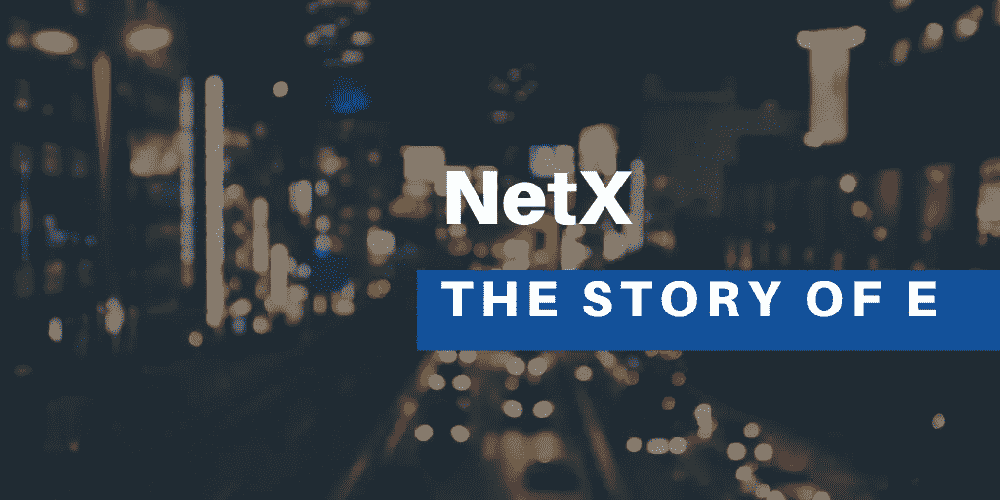

# E 的故事(三)

> 原文：<https://medium.com/coinmonks/the-story-of-e-iii-428df5c2ce9c?source=collection_archive---------31----------------------->



E 是一台大型密封智能机器，已经停用了将近 200 年。人物模糊不清。一个人只能认出上面的“E”，自然就成了他的名字。由于没有记录在案，没人知道他是谁，也不知道他从哪里来。一些人认为它来自外太空；一些人认为过去的人被冷冻在机器里；有人评论它是过去时代的加密机；有人称之为有机体；甚至有人认为是那个时代传下来的意志力。

没有人知道真相，更不用说他的名字了。只是有传言说他浓缩了一个时代的精彩故事。今天的世界被称为后信息时代的原因也与 e 高度相关。在他的时代，有机体的迹象只是在它达到高潮时出现。但这个世界显然已经进化成了一个有机体的更强版本。我们可以说，如果没有 e，我们生活的这个世界一开始就不会存在。

那个时代的故事储存在 E 的记忆里…

响…响…响…醒醒…醒醒…醒醒…

窗外震动的警报声和鸟儿的歌唱迎来了崭新的一天。场景中，一个男人从梦中醒来，懒懒地关掉闹钟，然后坐起来。他拖着沉重的身躯走向衣柜，换上一套复古卡其色的古色古香的西装，把人带回那个时代。

衣柜旁边放着一个人那么高的黑盒子，看起来不适合房间的简单。盒子上的摄像机旋转，当男人大步走向盒子时，盒子自动打开。显然，人工智能人脸识别技术在那个时代是可行的。

这名男子从盒子里拿起几套可穿戴设备中的一套，戴上它。很容易推断出这些设备是用于人机交互的。它们中的大多数看起来与现代的相似，除了一些头戴式设备，我们祖先的遗传智慧可以很容易地追溯到那里。

人们很难说出这些头戴设备的用途。它们可能是一些视觉工具，那个时代特有的产物。当这个人放下他眼睛上的眼镜时，场景切换到他的视野。一个安静而平淡的世界突然获得了很多精彩。

室外温度显示在透明的窗户上。黄褐色的木制家具变成了银灰色的钢制家具。盾牌和锤子出现在白墙上。一个温柔但明亮的女声从手机里传出来，问候这个男人“早上好，先生”。

那个男人一边收拾屋子一边打招呼，“早上好，贾维斯。请简单介绍一下今天的日程安排。”

“是的，先生。今天阳光明媚。室外温度是 73 华氏度。早上，在 Ethanim 实验室有一个实验。晚上，你将和你的妻子庆祝结婚纪念日。餐厅已经订好了。”

“那么早餐一定是盛宴了？对吧，贾维斯？”

“当然。你最喜欢的枫糖浆松饼端上来了，你的妻子准备了草莓酱。但是果酱是你妻子给吉姆的，因为你起床晚了。”

那人发出一些奇怪的声音，摆出一副狰狞的面孔，“该死的，吉姆。他又一次拿走了我的早餐。这可能是我不会说我喜欢狗的原因。当然，我不讨厌我的妻子。她真是个美人。对吧，贾维斯？”

“是的，先生。你的妻子肯定很漂亮。”

“我怎么会做出错误的选择呢？我真的很爱她。但这不是重点。”

那人停了一会儿，嘀咕道:“我做得对吗？和我昨晚看的古代电影是一样的表情和语气。我是个天才。”

那个女声没有任何反应。显然，这个机器人并不完全智能。这个男人什么也没说，只是收拾了一下房间，然后走了出去。

*未完待续……*

```
**The writer says…** This is a rhapsody for Metaverse. It will be unfolded in a flashback and will focus on a group of people living in 2422 who love digging into history and seeking truth. They are exploring a period of time that is mysterious to themselves as well as us, who are living at present. I try to present the story in a relaxing way but forgive me if there is any loose logic since it sometimes became as choppy as waters when I think about metaverse.
```

# 📚必读

[E 的故事-一](/coinmonks/the-story-of-e-766b1e6efa0) | [E 的故事-二](/coinmonks/the-story-of-e-ii-ba1cae973b5d)

***NetX，面向可信可靠的智能自治系统的数字生活的链原生互联网(***[***Trias***](https://www.trias.one/)***)***

[***铁人三项***](https://www.triathon.space/#/)***|***[***Ethanim***](https://www.ethanim.network/)***|***[***Tusima***](https://www.tusima.network/#/)***| behemo tum | Octavius | leviam | Divina***

> 加入 Coinmonks [电报频道](https://t.me/coincodecap)和 [Youtube 频道](https://www.youtube.com/c/coinmonks/videos)了解加密交易和投资

# 另外，阅读

*   [如何在 Uniswap 上交换加密？](https://coincodecap.com/swap-crypto-on-uniswap) | [A-Ads 评论](https://coincodecap.com/a-ads-review)
*   [WazirX vs CoinDCX vs bit bns](/coinmonks/wazirx-vs-coindcx-vs-bitbns-149f4f19a2f1)|[block fi vs coin loan vs Nexo](/coinmonks/blockfi-vs-coinloan-vs-nexo-cb624635230d)
*   [本地比特币审核](/coinmonks/localbitcoins-review-6cc001c6ed56) | [加密货币储蓄账户](https://coincodecap.com/cryptocurrency-savings-accounts)
*   [什么是保证金交易](https://coincodecap.com/margin-trading) | [美元成本平均法](https://coincodecap.com/dca)
*   [支持卡审核](https://coincodecap.com/uphold-card-review) | [信任钱包 vs 元掩码](https://coincodecap.com/trust-wallet-vs-metamask)