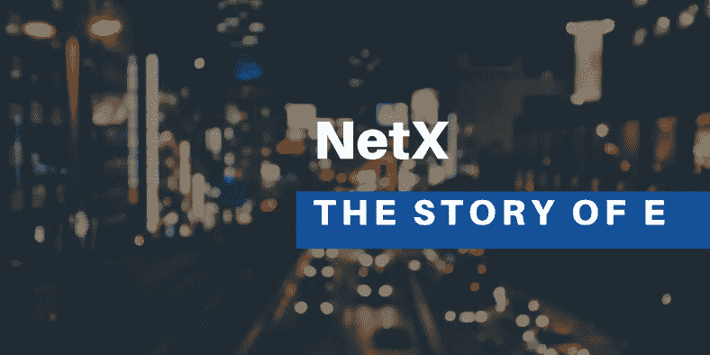

# E 的故事(六)

> 原文：<https://medium.com/coinmonks/the-story-of-e-vi-70ec6954a75e?source=collection_archive---------16----------------------->



现在是 2422 年。E 故事的揭露，给老教授和他的两个实习生带来了无与伦比的名气和金钱。惊天动地的消息发布一周后，他们被邀请参加世界上最重要的颁奖典礼，在那里他们发表了关于他们实验的主题演讲。

这位老教授穿着复古西装，戴着一顶古色古香的茶色帽子，站在宏伟的会场中央，旁边是视频中男子戴着的一副护目镜和一个内部装有海量数据的电子设备。他用各种手势发表激情演讲的虚拟视频在全球播放。

" E 的全名是 Ethanim AR。经过数百年的腐烂，他的名字已经模糊不清了。我们只能模糊地识别字符 e。机器内部的书面副本显示，AR 是增强现实的缩写。AR 是一种通过头戴式可穿戴设备洞察虚拟世界的技术。所有人机交互(HCI)都被称为伦理。那个时代见证了 AR 辅助人机交互的巅峰时代。这也是 Ethanim AR 得名的原因。”

“人机交互模式可以追溯到 400 年前，远早于 AR 技术和其他物理设备的普及。最初的想法仍然是在海上寻找合适的航母。这个领域不知道它是否会被 AR 或其他虚拟设备携带，更不用说我们的观众现在佩戴的设备了。那个时代的人们会想象人类和物理设备之间交互的未来。他们把未来命名为元宇宙。”

“Ethanim AR 是在 AR 设备上运行的元宇宙。Ethanim 具有足够的包容性，允许各种技术在其上发展和竞争。许多 metaverses 选择将 Ethanim 放在名字的开头。我们不知道是用户还是时代选择了这项技术。我们只知道 AR 是最终获胜的那一方。”

“经过 200 年的发展，随着竞争的推进，AR 最终有被淘汰的风险。数据显示，在政府关闭前一个月，不断提出的权力下放提案得到了近 90%选民的支持。最后几个集中的机构，主要是实验室，也被迫关闭。所有的数据和几个 AR 设备都封在那台机器里。强大的多级算法加密在那个时代是安全的，因为计算能力仍然受到限制。这样，试图通过解密夺取中央集权和用户数据的集权支持者就被挡在了门外。这标志着一个集权社会的彻底崩溃和一个分权社会的诞生。”

“我们生活在一个去中心化的时代。短时间内我们可能很难想象一个中心化的世界是什么样子。权力下放并不完全，但至少 90%是在 200 年前实现的。集中化的企业发现只有狭小的生存空间。我们刚才提到的 Ethanim AR 就是其中之一。该公司将 AR 用户的所有私人信息和数据存储在公司大楼下某个角落周围的服务器中，这似乎让我们感到惊讶。今天，即使对老年人来说，这也超出了认知极限。如果有人问他们关于服务器的事情，他们会认为你疯了。这也是我们这个时代大多数人的感受。没有人知道或想知道那个令人难以置信的过时的时代。这就解释了为什么这台机器会休眠这么长时间。”

此刻，这位教授仍然保持着冷静的姿态，一点也不像一个刚刚解决了一个数百年未解的历史难题的老顽固。但是对于接下来的故事，即使是见多识广的教授也无法掩饰他的兴奋。

*未完待续……*

```
**The writer says…** This is a rhapsody for Metaverse. It will be unfolded in a flashback and will focus on a group of people living in 2422 who love digging into history and seeking truth. They are exploring a period of time that is mysterious to themselves as well as us, who are living at present. I try to present the story in a relaxing way but forgive me if there is any loose logic since it sometimes became as choppy as waters when I think about metaverse.
```

# 📚必读

[E 的故事-I](/coinmonks/the-story-of-e-766b1e6efa0) | [E 的故事-II](/coinmonks/the-story-of-e-ii-ba1cae973b5d) | [E 的故事-III](/coinmonks/the-story-of-e-iii-428df5c2ce9c) | [E 的故事-IV](/coinmonks/the-story-of-e-iv-119730aff8b5) | [E 的故事-V](https://triaslab.medium.com/the-story-of-e-v-81924652d9f5)

***NetX，面向数字生活的可信可靠的智能自治系统链原生互联网(***[***Trias***](https://www.trias.one/)***)***

[***铁人三项***](https://www.triathon.space/#/)***|***[***Ethanim***](https://www.ethanim.network/)***|***[***tu Sima***](https://www.tusima.network/#/)***| behemo tum | Octavius | leviam | Divina***

> 交易新手？尝试[加密交易机器人](/coinmonks/crypto-trading-bot-c2ffce8acb2a)或[复制交易](/coinmonks/top-10-crypto-copy-trading-platforms-for-beginners-d0c37c7d698c)