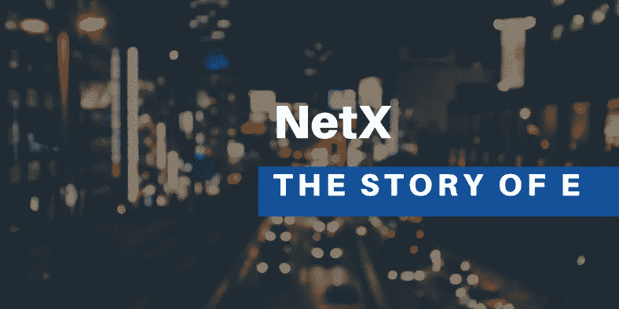

# E 的故事(八)

> 原文：<https://medium.com/coinmonks/the-story-of-e-viii-f9bfa90f94c4?source=collection_archive---------12----------------------->



"N etX 已经潜入了我们生活的每一个角落。没有人意识到，我们的日常生活、行为，以及这个完全去中心化的社会，都属于 NetX。随着社会彻底去除中心化，NetX 的名字逐渐被埋没在尘埃里。”

“而 Ethanim 也代表了 NetX 的一部分，作为那个时代人机交互的定义。正如 200 年前的历史记录所表明的那样，从他们决定关闭 Ethanim AR 的那天起，所有 Ethanim 都只有 Ethanim，没有任何后缀。因此，你和你的可穿戴设备都是 Ethanim 不可或缺的组成部分。这就解释了为什么 Ethanim 还活着，就像我提到的那样在你身边。”

“而我身边的护目镜，是研究人员 200 年前佩戴的 Ethanim 的个人 AR 设备。过去的场景保存在里面。稍后，我们将演示。感兴趣的人可以和我们一起做进一步的研究。”

“当然，除了护目镜之外，这个巨大的机器中还封装了更多的贵重物品。NetX 最初是由基金会创建的七个相互连接、协调和集成的部分。只有当这七个部分满足时，应用程序开发过程才是完全分散的。Ethanim 只占一小部分。其余六个部分仍未被发现。但我相信零件也一直存在于我们的生活和社会中。在不久的将来，这些 NetX 组件将会带来更多有趣的技术和故事，从而为这个世界增添更多的活力。

“这就是我想说的。感谢您今天的光临。”

演讲赢得了热烈的掌声。演讲的视频也立即在全球范围内传播开来。

在被囚禁了 200 年之后，NetX 又回到了公众的视线中。各种古董以令人振奋的拍卖价格出售。七分史料给各行各业提供了启发性的思考。热衷古董的老教授，也是最大的贡献者，被授予最高奖。除了丰厚的奖金，头显也是作为奖励送给他的。即使不是作为奖励，鉴于教授对古董的深深痴迷，他也不会放弃对这个两个世纪前代表时尚界和技术的可穿戴设备的所有权。

颁奖仪式结束后，教授和他的两个实习生回到实验室，拿出护目镜。盯着这幅两百年前的艺术品，当他极度兴奋时，一个绝妙的主意击中了他。

“如果他能活过来，如果他能恢复意识，如果他被植入了现有的智能管家系统，如果他配备了最完整的智能形态，集成了旧数据和现代智能，那么……”

教授思考了一会儿。这个时代的人工智能技术远远领先于两百年前。旧的在用户输入数据时给出反馈。新的机器人像人类一样进行复杂的计算和预测。

“从技术上来说，是可以实现的。如果贾维斯的类似思维被灌输……”

“他将是一个出生于数百年前的跨时代‘有机体’，并且一直活到现在。”

他的手在发抖。以前没有任何一种生物能活这么久，更不用说经过几个世纪的“冬眠”后的空前复苏了。光是这个想法就给他已经堵塞的血管增加了很大的压力。

思考片刻后，教授叫来他的实习生，拍拍他的脸，清了清嗓子，用严肃的声音说道:

“这些年来，你们都为 Ethanim 的复兴付出了很多努力。我们的努力得到了全世界的认可。高声誉必然伴随着来自众多实验室的高薪邀请。是走是留，现在由你决定。”

“而我现在已经是个老人了。未来可能没那么有前途。”

两个年轻人交换了一眼，毫不犹豫地回答:“我们想留下来。没有你们不间断的指导和承诺，我们永远无法取得这些成就。”

"另外，盖茨比需要他的红酒，不是吗？"

教授笑了，释放了他压抑的兴奋:

“现在，我要做的事情将远远超越伊塔尼姆的修复，而且…”

他做了五个手势。“五年多。这将是你自己的选择。你们都很年轻，有很多事要做。但是在我这里…”

“闲话少说，教授。你需要我们做的任何事。随便起个名字。”一个年轻人打断了他的“施法”。在老教授的指引下，两位实习生兴奋地迎来了下一章。

然后，教授向他的两个队友简要介绍了他的设想。他们看起来既惊讶又兴奋。他们知道他们的下一个任务将是前所未有的，更不用说它一旦起飞带来的影响了。世界发展的轨迹甚至可能被改变。他们非常乐意和教授呆在一起，五年，十年，甚至二十年。

这两个人的勇气和坚持给教授留下了深刻的印象，并为在他生命的晚期拥有他们而自豪。他坚信他的愿望将在两个梦想家的帮助下实现，或者说，贾维斯将几乎获得重生。

教授小心翼翼地抚摸着桌上的 AR 护目镜，一脸纯净地轻轻说:“留给我的时间不多了。舞台将会给这些年轻人。我真想等到你苏醒。你一定也有同样的想法。对吧，贾维斯？”

他停顿了几秒钟…

“或者我应该星期五给你打电话？”

月亮又亮又高，挂在天上。温柔是注定不平凡的夜晚。

这是 E 系列的倒数第二件作品。

```
**The writer says…** This is a rhapsody for Metaverse. It will be unfolded in a flashback and will focus on a group of people living in 2422 who love digging into history and seeking truth. They are exploring a period of time that is mysterious to themselves as well as us, who are living at present. I try to present the story in a relaxing way but forgive me if there is any loose logic since it sometimes became as choppy as waters when I think about metaverse.
```

# 📚必读

[E 的故事-I](/coinmonks/the-story-of-e-766b1e6efa0) | [E 的故事-II](/coinmonks/the-story-of-e-ii-ba1cae973b5d) | [E 的故事-III](/coinmonks/the-story-of-e-iii-428df5c2ce9c) | [E 的故事-IV](/coinmonks/the-story-of-e-iv-119730aff8b5) | [E 的故事-V](https://triaslab.medium.com/the-story-of-e-v-81924652d9f5) | [E 的故事-VI](/coinmonks/the-story-of-e-vi-70ec6954a75e) | [E 的故事-VII](/coinmonks/the-story-of-e-vii-eb62515af81e)

***NetX，面向数字生活的可信可靠的智能自治系统链原生互联网(***[***Trias***](https://www.trias.one/)***)***

[***铁人三项***](https://www.triathon.space/#/)***|***[***Ethanim***](https://www.ethanim.network/)***|***[***Tusima***](https://www.tusima.network/#/)***| behemo tum | Octavius | leviam | Divina***

> 交易新手？尝试[加密交易机器人](/coinmonks/crypto-trading-bot-c2ffce8acb2a)或[复制交易](/coinmonks/top-10-crypto-copy-trading-platforms-for-beginners-d0c37c7d698c)