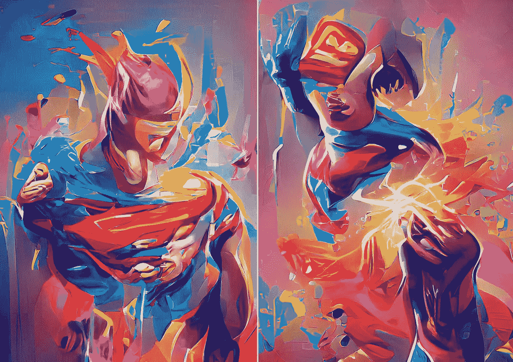

# NFTs 的超级力量

> 原文：<https://medium.com/coinmonks/the-superpower-of-nfts-d078c3ac3636?source=collection_archive---------20----------------------->

**Prompt:** superpowers, superhero abstracts, vibrant colors, 2 variations. Made on [Dream](https://www.wombo.art/)

正如凯文·凯利喜欢说的，“互联网是世界上最大的复印机，任何接触到它的东西都会被复制”

电影制片厂和唱片公司能够在互联网复制机下生存下来的唯一方法是使用*流媒体*，这为消费娱乐提供了一种简单、负担得起且合法的方式。社交媒体继续向复印机输入被过度使用的*分享*按钮，任何有新闻价值的东西最终都会成为一种模因。

万维网创造了一个*丰富的互联网*，在这里内容可以自由漫游，甚至有限制的内容也能找到出路。打击盗版的唯一方法是让内容更容易获取— *订阅模式*成为新的规范。

然而，区块链的出现和互联网代币经济的出现将会扰乱复印机的内部运作。这种变化的关键很大程度上在于区块链有能力向以前不存在的地方灌输价值观。

输入不可替代的令牌(NFT ),承诺内容创作者、艺术家、音乐家和作家在网络上从未有过的东西。NFTs 的超能力是能够为数字内容创造 ***数字稀缺*** 。

其中的逻辑是，虽然一个给定的图像可能有成千上万个副本，但唯一重要的是在公共的、不可改变的账本上注册为条目的那一个。“一个”版本被认为是原始版本；那个“一”版本带有所有权的*值*；因此使其变得稀缺。

有趣的是，这种稀缺所有权模型实际上在一个丰富的互联网上蓬勃发展。某样东西被复制得越多，就越受欢迎，原创的价值就越大。太棒了。

## 稀缺性重要吗？

当然，问题是，在一个丰富的数字世界中，稀缺性是否重要？如果你能得到某物，那么拥有它的价值是什么？如果你可以简单地播放歌曲，为什么要从歌手那里买一首呢？

在我们的物理世界中，所有权总是与对某物的物理接触联系在一起。过去，我拥有一张黑胶唱片，这是我接触音乐的途径。物质总是包含有限的数量，这很容易理解它的稀缺性。然而，由字节组成的数字内容很容易复制，并且不占用任何物理空间。

这就可以理解为什么有很多人怀疑通过 NFTs 的数字稀缺真的只是人为制造的。

现实是，许多人将继续对订阅服务感到满意，而没有拥有的欲望，这在一个数字化的世界里是有意义的。但是……内容创作者不需要数百万粉丝来维持生计，他们只需要少数热情的人的贡献。

关于物质世界，我们所知道的是，人们总是更看重他们热爱的事物。出于不同的原因，人们喜欢收集或拥有东西，无论是出于怀旧、与名人或导师的联系、支持一项事业或支持一位艺术家等，甚至只是出于投资目的而拥有一些东西。

我不是一个收藏家，但我会买一些与我有联系的东西，一些类似于我认同的*数字光环*的东西……无论是音乐、一件艺术品、一件鼓舞人心的*之类的东西。我认为人类自然会这样做，随着我们的生活变得越来越数字化……以数字形式连接重要的东西将成为常态。*

***数字稀缺*** 通过 NFT 模型，不仅仅是收集一件物品，而是关于效用——访问受限的稀缺、特殊事件、声誉、邻近稀缺、定时释放的代币等……

## 最后

随着 NFTs 的使用，数字资产的创作者第一次可以准确地定价和分发他们的作品，消费者可以购买和拥有数字资产。随着 ***数字稀缺性*** 的加入，网络从信息互联网转变为[价值互联网](/coinmonks/web3-the-internet-of-value-d4d157a81eb2)。

***相关文章:***
[价值的新互联网](/@pdelsignore/web3-the-internet-of-value-d4d157a81eb2)
[教育中的 NFTs](/@pdelsignore/nfts-in-education-957ce434047c)
[创造者的新时代](/predict/the-new-age-for-creators-b0408462d5e9)

> 交易新手？尝试[加密交易机器人](/coinmonks/crypto-trading-bot-c2ffce8acb2a)或[复制交易](/coinmonks/top-10-crypto-copy-trading-platforms-for-beginners-d0c37c7d698c)