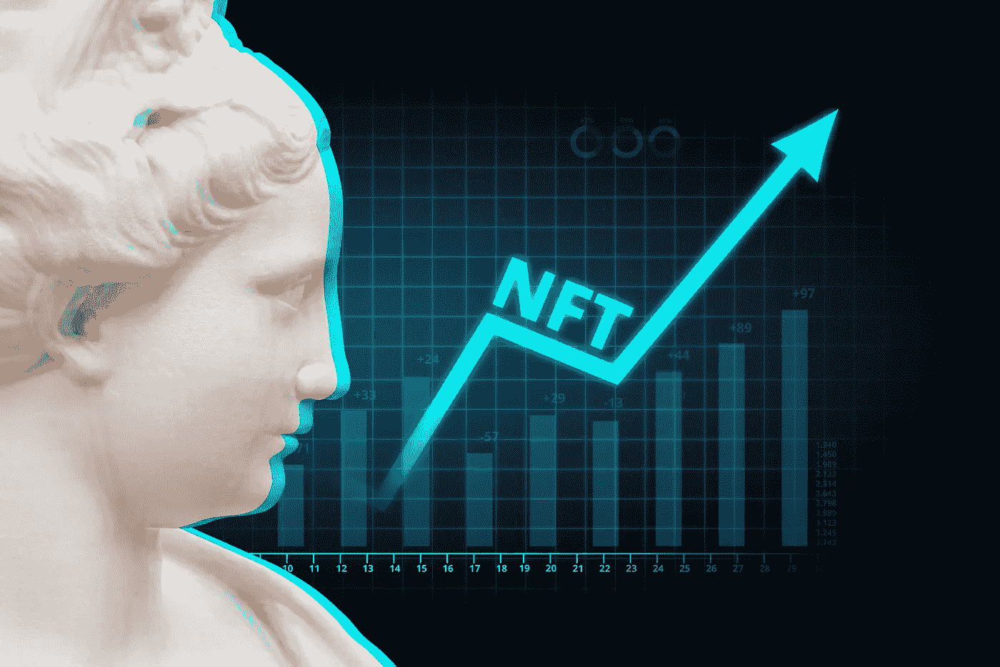
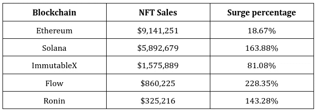
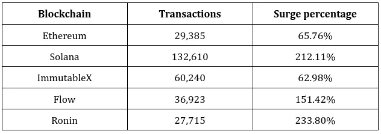

# NFT 交易和交易量在顶级区块链上的激增:这是创建你的 NFT 市场的正确时机吗？

> 原文：<https://medium.com/coinmonks/the-surge-in-nft-transactions-and-volume-on-top-blockchains-is-this-the-right-time-to-create-your-d8053f90bf2?source=collection_archive---------22----------------------->

不可替代的代币是正在失控的数字世界的无形资产。如果你在过去的几年里没有生活在岩石下，你一定听说过 NFTs。如果你没有注意到，NFT 市场是一个 10 亿美元的市场，始于 2014 年，一直持续到今天。根据 2021 年收集的数据，110 亿美元的市值目前正朝着 2030 年 3800 亿美元的目标前进。艺术家和创作者都在这种狂热的趋势下创建自己的 NFT 市场，并看到无可挑剔的结果。

不断增长的市场每秒钟都在世界范围内制造 NFT，创造了对其工艺的需求。为了持有所有这些能源需求大的资产，这个行业分成不同的部分，称为市场。作为一个 NFT 爱好者的退路，让我们进入我们的简短解码一个 [**NFT 市场发展**](https://www.appdupe.com/nft-marketplace-development) 的最佳时间。

# 简要了解壮观的 NFT 市场

把 NFT 市场想象成一个不动产交易平台。它们是通过区块链网络技术在一个分散的论坛上开发的，有利于铸造、交易和创收。许多公司，像可口可乐、福克斯娱乐公司和 NBA，都有他们的 NFT 市场来容纳他们的数字粉丝。为什么？

区块链构成了 web3 空间。市面上排名靠前的区块链有以太坊、Solana、ImmutableX、Flow、Ronin。然而，web3 出现了下滑；多亏了这些公共账目，[**NFT 的销售额飙升如此之高**](https://www.nftgators.com/major-blockchains-experienced-a-rise-in-nft-transactions-and-volume/) 。接下来的部分展示了每个区块链网络在 NFT 的销售额和交易量。

# 区块链交易量和交易量的激增——综述

Top Blockchain NFT Sales Volume

Top Blockchain NFT Transactions

以上给出的数字代表了 NFT 市场的稳步增长。尽管加密领域仍处于萌芽状态，但 NFTs 的总交易量已达到 107 亿美元。根据可靠的消息来源，与前几年相比，这个平台上升了 704%。图表中这条向上的曲线有两个原因，它们是

## 对区块链技术及其价值的坚定信念

NFT 实际上可以是由实物资产支持的任何东西。NFT 项目涉及艺术、音乐、模因、视频、纪念品等领域。这些特定领域的 NFT 因其在社区内令人印象深刻的创新而备受尊重。这些令人印象深刻的区块链的用户的信念之一是，资产的所有权总是可追溯的，可以追溯到所有者，中间没有侵权。

这项技术的建立是为了确保用户的透明性，这是任何现实世界的商务都无法 100%保证的。NFT 的价格也很高，高达六位数。区块链的多功能性允许用户快速获利，每天都可以享受令人兴奋的功能。

## NFT 社区中受尊重的社会地位

世界以赋予万物的地位运行。可能是在现实世界，也可能是在数字世界。NFTs 也属于给予其用户如此尊贵的社会地位的行列。例如，路上的一辆劳斯莱斯让这个人被称为“成功人士”。将同样的方法应用于加密社区，用户的匿名在线化身基于附加的 NFTs 而受到尊重。

由于名人对技术进步和他们自己的作品感兴趣，普通观众对这种对未来的务实投资产生了浓厚的兴趣。也可以参考艺术家的史努比·道格、沙奎尔·奥尼尔、史蒂夫·青木等。在他们的 NFT 收藏中。现在，谁不想成为这样一个众星云集的平台的一部分呢？

## 去哪里进行具有成本效益的 NFT 市场开发，成本是多少？

我满怀希望地回顾了所有必要的步骤，阐述了 NFT 销售量和交易量稳步上升的原因。NFT 市场的发展是一个缓慢而乏味的过程，需要认真对待，细微之处都要注意到。我们了解这些领域，并为开发我们的创新型 NFT 选择了合适的位置。然而，还有一个问题，是什么延伸了开发部分？

*   **从零开始的 NFT 市场—** 从一开始就开发市场，包括区块链、设计和主题专家的开发。
*   **白标 NFT 市场解决方案-** 使用现成的 [**白标 NFT 市场解决方案**](https://www.appdupe.com/nft-marketplace-development) 开发市场，将一些功能和属性调整到专业人员期望的平台中。

# NFT 市场的奇特发展

## 头脑风暴和白皮书写作

利用项目开发所需的所有适当的研究来完成思维导图。重要的是要知道，选择一个合适的利基来建立一个特定情况下的市场变得容易和方便的用户。由于 NFT 面向更广泛的受众，白皮书的起草对于创建平台至关重要，因为它是基础。

## 区块链选择

一旦定位正确，开发团队的主要职责就是得到一个满足用户需求的区块链。这是因为，基于区块链与 NFTs 的兼容性，在跨链网络中建立 NFT 市场也是一个可信的选择。今天流行的一些区块链有以太坊、索拉纳、心流等。

## 用户界面/UX 设计和开发

用户界面和用户体验的开发至关重要，因为它们是平台的脸面。设计一个直观的、有创意的、方便易用的用户界面是创建一个成功的 NFT 市场的必要条件。

## 智能合同集成

智能合约是根据平台的预设规则自动执行的，它们是市场不可或缺的一部分。平台上的所有交易都是一个论坛顺利运行的原因。

## 前端和后端开发

前端和后端开发就像一个工作系统的大脑和心脏。与一些来自 white-label 的专业开发人员一起开发不仅经济高效，而且非常专业。它们是平台中逻辑操作的集成，如加密交易等。

## 紧张的测试运行

跨越开发的步骤，项目必须经历几次激烈的测试，以确定它们没有错误，并且在大流量下是可行的。只有这样，平台才能进入最后的发展阶段。

## 发布和发布后支持

发达市场是在创作者认可并发现他们满足其列出的要求后进入市场的。当平台上线后，发布后监控就开始了。这使得该平台总是紧跟当前趋势，并且能够快速适应每一次最新的升级需求。开发团队的这种发布后支持是基于对应用程序的反馈。

这样构建的平台持有 NFT 的总市值约为 6，677，232 美元，它们的波动性肯定要花费几毛钱。无论是通过 [**白标还是选择从零开始开发**](https://www.appdupe.com/nft-marketplace-development) ，影响成本的几个因素是其效率水平、性能范围、用户满意度，以及最重要的高端安全性。记住这一点，计算各种元素的费用，整合和调整，以创建 NFT 市场，它必须花费大约 60，000 美元。

**关闭思想！**

一个精彩的旅程，通过加密球是爵士乐了！一个 NFT 市场是所有关于其非凡的功能和平台的可用性。NFT 的市场价值随着区块链固有的属性呈指数增长。开创性的去中心化概念，没有中介参与平台上发生的交易。

NFT 市场成功的决定因素取决于公司的声誉和技术进步。用一个适当构建的市场和一个 [**合格的 NFT 市场发展机构**](https://blog.cryptostars.is/top-10-popular-nft-marketplace-development-companies-in-2022-75123c2ad544) 来支持你所有的加密努力，来提升你的社会地位。

> 交易新手？试试[密码交易机器人](/coinmonks/crypto-trading-bot-c2ffce8acb2a)或[复制交易](/coinmonks/top-10-crypto-copy-trading-platforms-for-beginners-d0c37c7d698c)