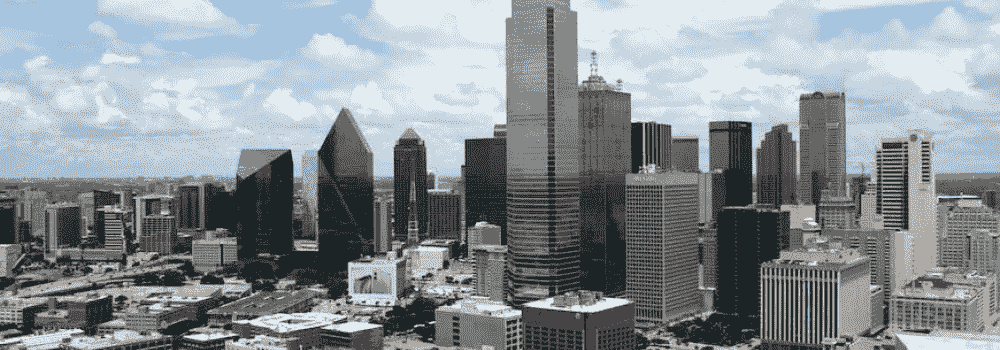
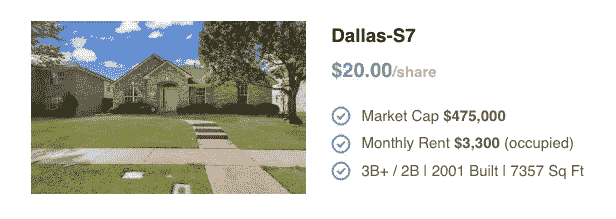

# 在达拉斯投资你应该知道的事情

> 原文：<https://medium.com/coinmonks/the-things-you-should-know-about-investing-in-dallas-78aa7b1d1b13?source=collection_archive---------61----------------------->

# 被忽视的美国第四大城市

达拉斯是 22 家财富 500 强公司的所在地，以其蓬勃发展的经济而闻名，是电信、能源、医疗保健、交通、信息技术和金融服务部门的主要中心。

其经济部门的多样性和友好的商业环境吸引了主要雇主进行扩张，并吸引了创新技术公司进驻。我们已经看到了达拉斯蓬勃发展的就业市场，2022 年将有约 30 万人的年增长率，仅次于纽约和洛杉矶。人口增长速度是全国平均水平的 2.73 倍。

# 为什么投资梅斯基特

从历史上看，梅斯基特的房价比达拉斯低得多。然而，随着越来越多的人从大城市搬到附近提供交通连接和家庭友好设施的较小社区，情况正在发生变化。梅斯基特居民往返于达拉斯市中心并不罕见。

梅斯基特——在这里您可以找到我们最新的 S7、S8 和 S9——被认为比住在达拉斯本身更实惠。根据 Zillow 的数据，查看该地区的数字，梅斯基特在 2022 年 8 月的房屋价值指数为 306，000 美元。另一方面，达拉斯的指数为 393，000。然而，Zillow 的同比数字背后隐藏着真实的故事。仅在 12 个月内，梅斯基特的房价指数就上涨了 31.9%，而达拉斯的涨幅为 23.6%。

你会在这里找到相对较新、相对较便宜的房子——一个被美丽风景环绕的安全社区。这里可能比达拉斯市区安静，但这个社区一点也不安静。由于大公司都在附近，梅斯基特房产投资的市场价格有很大的增长潜力。例如，距离世邦魏理仕集团和德州仪器只有很短的车程。今年早些时候，高盛刚刚宣布将在该地区增加 5000 个新的就业机会。

由于这些原因和其他原因，豆科灌木投资市场现在很热。住房拥有率为 59.2%，低于 64.4%的全国平均水平，预计它将成为一个受欢迎的租赁市场，为投资者带来稳定的收入。在过去 5 年中，租金中位数上涨了+41.4%，也比达拉斯市的租金上涨速度快 1 倍。

# 达拉斯求职者的完美家庭住所

我们的 Mesquite 物业投资 S7、S8 和 S9 是独立学区内的三栋单户住宅，为超过 38，000 名 PK 和 K-12 年级学生提供教育。这个高于平均水平的公立学区的师生比例为 16 比 1。

S7、S8 和 S9 靠近一家杂货店。S7 距离最近的商店 1.4 英里，S8 距离最近的商店 0.6 英里，S9 距离最近的商店 0.5 英里。对于额外的零售疗法，搬进这些物业的家庭可以短途旅行到 Town East Mall，那里有 Macy's、JCPenney 和 Dick 's Sporting Goods 等主要商店和 850 个座位的美食广场。其他当地景点包括梅斯基特艺术中心、梅斯基特竞技竞技场和魔鬼碗赛道。该地区也有几个绿色空间，包括城市湖公园及其小联盟领域，野餐桌，活动中心和网球场。

对于那些想去更远地方旅行的人来说，主要的高速公路将城市与周围的户外景点、艺术文化和体育运动连接起来。

**达拉斯-S7**

S7 是一个单户豆科灌木投资项目，有一个大客厅、三个卧室、两个浴室和一个书房(升级卧室用途以增加租金收入)。它拥有一个一层楼的开放式平面图，允许自然光照射进来，并提供了一个大型私人和有门的后院。这里没有地毯，房客们自带冰箱/洗衣干衣机以节省维护费用。

其他物业功能包括高天花板，瓷砖和层压地板，花岗岩台面，不锈钢器具，炉子，微波炉，洗碗机，中央空调。

**达拉斯-S8**

S8 有三间卧室、两间浴室和一间书房(升级为卧室用途以增加租金收入)。它有一个很大的私人和有门的后院，租户自带冰箱/洗衣机/烘干机，以节省维护费用。

其他功能包括高天花板，瓷砖和硬木地板，中央空调，花岗岩台面，炉子，微波炉，洗碗机和 2021 热水器。

**达拉斯-S9**

S9 是一个豆科灌木投资项目，有四间卧室和两间浴室。它有一个一层楼的开放式平面图，让自然光进入物业和一个大型私人和有门的后院。租户可以在户外平台上放松，并自带冰箱/洗衣机/烘干机，以节省维护费用。

其他功能包括高天花板、不锈钢电器、微波炉、洗碗机、炉子、花岗岩台面、瓷砖地板、2020 年中央空调系统和四年前的屋顶。

查看 [**SEC 课程通知**](https://www.sec.gov/Archives/edgar/data/1923734/000182912622016875/ark7properties_1apos.htm) 了解课程详情。

# 豆科灌木投资:最终想法

如果你以前从未投资过独栋住宅，尤其是在我们看到强劲而稳定的就业机会和人口增长的朝阳地带，选择一栋(或三栋都选！)是一个不可思议的起点。

[**入门**](https://www.ark7.com?utm_source=Medium&utm_medium=Organic&utm_campaign=Why+invest+in+Dallas&tc=SASQN)

> 加入 Coinmonks [电报频道](https://t.me/coincodecap)和 [Youtube 频道](https://www.youtube.com/c/coinmonks/videos)了解加密交易和投资

# 另外，阅读

*   [最佳期货交易信号](https://coincodecap.com/futures-trading-signals) | [流动性交易所评论](https://coincodecap.com/liquid-exchange-review)
*   [火币加密交易信号](https://coincodecap.com/huobi-crypto-trading-signals) | [Swapzone 审查](/coinmonks/swapzone-review-crypto-exchange-data-aggregator-e0ad78e55ed7)
*   [最佳加密交易机器人](/coinmonks/crypto-trading-bot-c2ffce8acb2a) | [购买索拉纳](https://coincodecap.com/buy-solana) | [矩阵导出评论](https://coincodecap.com/matrixport-review)
*   [Coldcard 评论](https://coincodecap.com/coldcard-review) | [BOXtradEX 评论](https://coincodecap.com/boxtradex-review)|[uni swap 指南](https://coincodecap.com/uniswap)
*   [比特币基地评论](/coinmonks/coinbase-review-6ef4e0f56064) | [德里比特评论](/coinmonks/deribit-review-options-fees-apis-and-testnet-2ca16c4bbdb2) | [FTX 评论](/coinmonks/ftx-crypto-exchange-review-53664ac1198f)