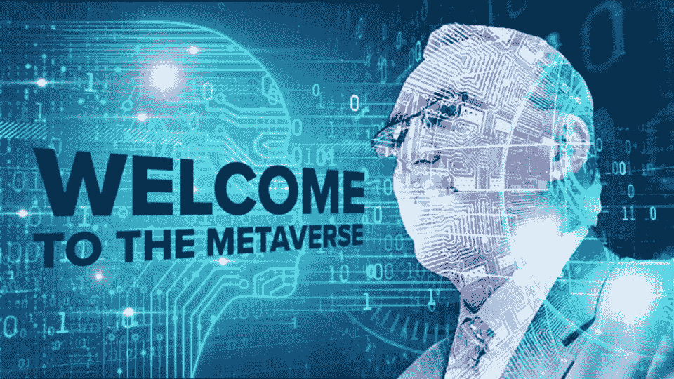

# 元宇宙的三类投资者

> 原文：<https://medium.com/coinmonks/the-three-investor-categories-in-the-metaverse-66912d061c7e?source=collection_archive---------45----------------------->

整个世界都在期待人类互动的下一次大规模进化，投资者也没有忘记这一现实。在预期中，他们不断地为它的发展注入巨额资金。在技术发展的推动下，各个领域的投资者都在寻求在元宇宙最终取得商业成功时获得早期投资的好处。

在这篇文章中，我依靠麦肯锡最近的报告来讨论被认为对元宇宙的发展有贡献的三大类投资者。

让我们开始吧。

# 首先，大型科技公司

我早些时候写过一篇关于大型科技公司将如何主宰元宇宙的文章，所以这并不奇怪。如果你想读这篇文章，你可以在这里找到它。Meta、Nvidia、微软等大型科技公司竞相为消费者创造最身临其境的科技体验。

显而易见的是，这些公司为实现这一愿景不断投入大量资金。微软以 690 亿美元收购动视暴雪已经不是新闻，而脸书已经更名为 Meta，以展示其将元宇宙作为主要焦点的转变。这还不算 Meta 已经承诺在未来十年内投资 100 亿美元用于元宇宙研究。

另外值得一提的是，Nvidia 正在推动其 Omniverse，而索尼计划在今年晚些时候发布其 VR2 耳机。人们还预计，苹果最终将在不久的将来(可能是 2023 年)的某个时候大举进军元宇宙。

这并不令人惊讶，事实上，预计这些技术品牌将在未来几年引领元宇宙的创新。

# 风险投资紧随其后

风险资本在元宇宙的发展中也很突出。这是意料之中的，因为风险投资总是在寻找下一个有巨大商业成功潜力的领域进行投资。元宇宙目前属于这一类。

最近在元宇宙的一些著名投资中，NFT 市场 OpenSea 从投资者 Coatue 和 Paradigm 那里筹集了 3 亿美元的 C 轮融资，而元宇宙技术平台 ibility 在由风险投资 Andreessen Horowitz 和软银牵头的一轮融资中筹集了 1.5 亿美元。宇迦实验室，最有价值的 NFT 收藏品 Bored Ape Yacht Club 的创造者，也带着它的 [Otherside](https://decrypt.co/resources/what-is-yuga-labs-otherside-inside-the-bored-ape-yacht-club-metaverse) 项目冒险进入元宇宙(最近筹集了 4 . 5 亿美元)。

这还不算 Sandbox 和 Niantic 最近分别从软银和 Coatue 获得了 9300 万美元和 3 亿美元。

# 企业和品牌

如果元宇宙将取得巨大的商业成功，那么顶级品牌将不得不搭上它的列车，这正是目前的情况。迪士尼是这些寻求进入元宇宙的公司之一，因为它最近任命了一位新的高管来监督其元宇宙战略。

我们也看到可口可乐、巴黎世家和耐克等商业品牌进入元宇宙。随着传统媒体选择和电子商务平台变得拥挤和饱和，品牌将元宇宙视为击败竞争对手的下一条途径，早期进入可能会有所不同。

# 最后的想法

关于元宇宙已经有很多令人兴奋的事情，这从该空间已经获得的投资金额中可以看出。投资者的资金是必要的，而大型科技公司将引领潮流。商业品牌将是为元宇宙带来大量用户的最后一块。

今天，所有这三个因素都已到位，使元宇宙在未来几年取得巨大成功。

> 交易新手？试试[密码交易机器人](/coinmonks/crypto-trading-bot-c2ffce8acb2a)或者[复制交易](/coinmonks/top-10-crypto-copy-trading-platforms-for-beginners-d0c37c7d698c)