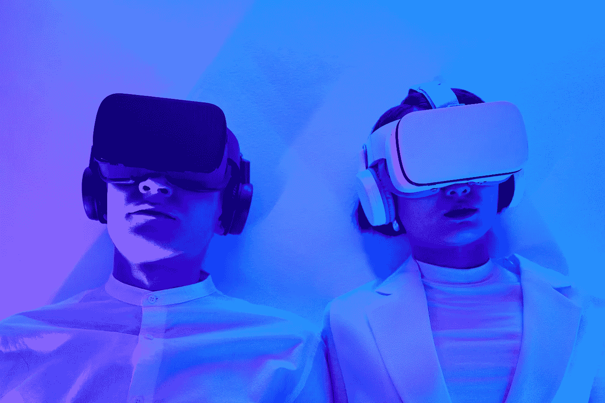

# 增强现实、区块链和元宇宙的明天

> 原文：<https://medium.com/coinmonks/the-tomorrow-of-augmented-reality-blockchain-metaverse-b06368d526a5?source=collection_archive---------58----------------------->

近年来，增强现实技术一直是人们关注的焦点，Magic Leap 等许多公司都看到了增强现实与区块链和元宇宙结合的可能性，并在该市场进行了大量投资。预计增强现实将在未来几年内实现飞跃，特别是与区块链等技术创新相结合，融合现实和数字世界。元宇宙是我们最近也经常听到的东西，它有望成为互联网的一个新的进化步骤，将改变日常生活。那么，在不久的将来有什么在等着我们，在接下来的几年里我们可以期待看到什么呢？

# AR 云

术语“AR 云”通常指的是作为真实世界覆盖层的数字地图，允许将信息和内容放在与其位置相关的任何地方。这为[数字内容和娱乐](https://isotopic.io/)的新可能性打开了大门，允许用户体验新的地点，增强他们的环境并观看否则不可能存在于现实世界中的内容。融合现实和数字内容将为任何领域的艺术家和创作者提供无限的机会来表达自己，向世界展示他们的创作，让世界充满杰作和异国情调的地点。还可以提供与特定位置相关联的服务，并创建个性化体验。

可以创建独特的分散资产，这些资产可以作为 NFT 拥有，并使用 AR Cloud 等系统进行显示，使用户不仅能够看到自己的资产，还能够向世界展示它们。区块链技术可以为 AR NFTs 提供所需的安全级别，并确保每项资产的所有权。

# AR 眼镜

智能 AR 眼镜已经被 Meta 和苹果等巨头公司承诺了几年，尽管目前没有宣布任何一款眼镜的确切发布日期，但我们都可以肯定的一点是:一旦智能眼镜向广大观众提供，我们所知道的世界将会改变。

戴上像普通眼镜一样，他们承诺[增强移动中的物理世界](https://isotopic.io/)，增加信息，并以多种方式帮助导航和探索环境。这项技术几乎可以应用于每个领域，从游戏和广告到教育和旅游。使用标记、传感器和地理定位将允许用信息和数字资产覆盖世界，这些信息和数字资产将在运行时加载，特别是如果与 AR 云技术结合的话。

文章由 Jenny Lis 撰写，来自[同位素](https://isotopic.io/)

[**同位素**](https://isotopic.io) **是一个支持区块链的软件分发服务，托管整合了 NFTs 和加密货币的游戏和应用。**

> 交易新手？在[最佳加密交易](/coinmonks/crypto-exchange-dd2f9d6f3769)上尝试[加密交易机器人](/coinmonks/crypto-trading-bot-c2ffce8acb2a)或[复制交易](/coinmonks/top-10-crypto-copy-trading-platforms-for-beginners-d0c37c7d698c)