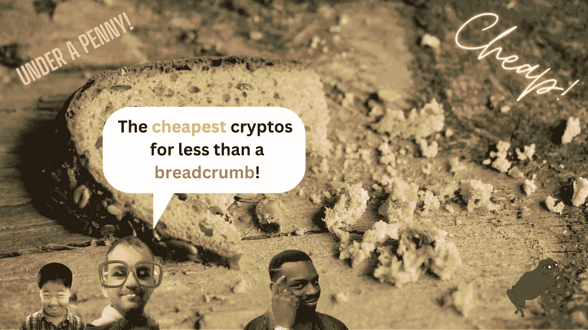
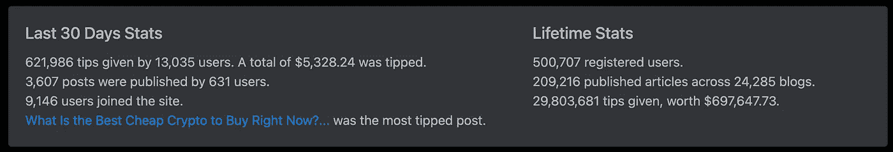
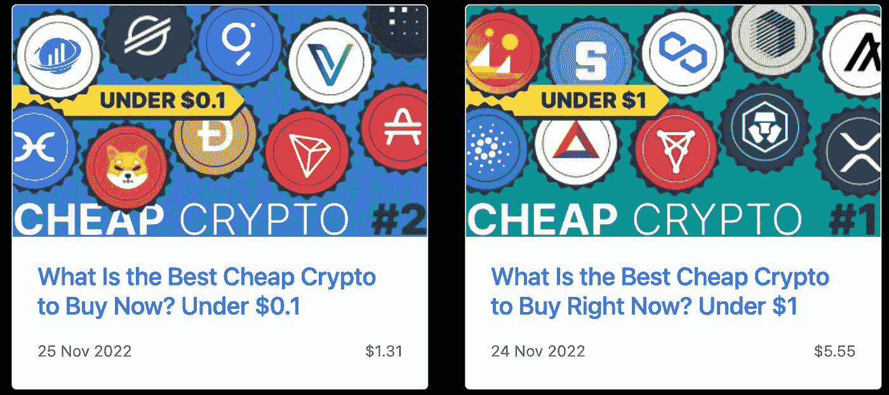
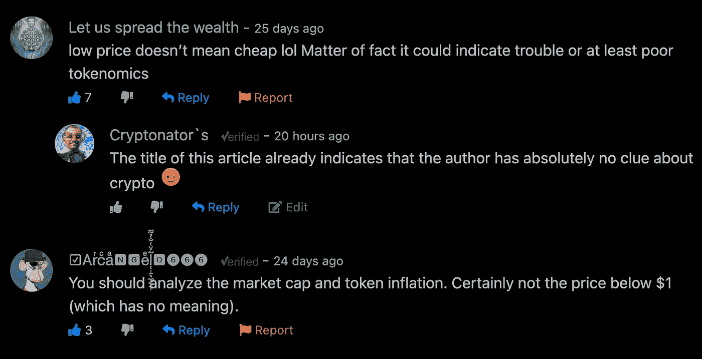
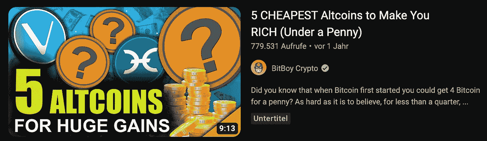

# 十大最便宜的一美元以下的密码让你变得富有…不！

> 原文：<https://medium.com/coinmonks/the-top-10-cheapest-cryptos-under-one-dollar-to-make-you-rich-not-3c5c984c5fce?source=collection_archive---------33----------------------->

你可能想知道我这篇文章的标题。像“2023 年 1 美元以下最便宜的 10 种加密货币”这样的标题对于帖子标题来说已经足够吸引人了，那么为什么在结尾用“不是”呢？

**嗯，答案很简单。你不能仅仅通过价格来判断加密货币是便宜还是贵。让我解释一下。**

# 一个比特币一万美元贵吗？

记得有一次和朋友聊比特币的时候。在我向他解释了比特币的好处以及为什么我认为这是一项不错的投资后，他回答说:“也许我也应该买一个比特币，一个比特币多少钱？”

当时比特币的交易价格约为 1 万美元，这是我告诉他的。“什么？这个超级贵！”

当然，他的反应让我笑了。然而，这是一个从未听说过比特币或加密货币的人的典型反应。

首先，他不知道你不仅可以购买整个比特币。你也可以购买 Satoshies，一个比特币的零头。下一个错误是认为你可以通过看价格来确定一种加密货币是便宜还是昂贵。

价格只是评估加密货币是否是一项好投资的一个因素。顺便说一下，这通常是应该问的问题。

**不要问加密货币便宜不便宜，要问它是否值得投资。**

更重要的是检查加密货币的令牌组学。可能比价格更重要的是代币供应量和市值。最终，你必须看到更大的图景，以及不同因素之间的相互关系。

老实说，非常低的价格实际上可能表明该项目陷入困境，或者至少有糟糕的令牌经济学。

# 大量的“最便宜的密码便签”

我是在检查 Publish0x 上的统计数据时想到写这篇文章的。我看到 2022 年 11 月最热门的帖子标题是“[现在买什么最便宜？低于 1 美元](https://www.publish0x.com/stealthex/what-is-the-best-cheap-crypto-to-buy-right-now-under-1-dolla-xyemyry?a=5xe7xNOa7r&tid=Medium)

Screenshot [Publish0x stats](https://www.publish0x.com/stats?a=5xe7xNOa7r&tid=Medium).

该帖子由用户友好的加密货币交易所 [**StealthEX**](https://www.publish0x.com/@StealthEX?a=5xe7xNOa7r&tid=Medium) 发布。拜托，我希望加密货币交易所更专业，但他们似乎已经聘请了他们在互联网上能找到的最便宜的作家。

这篇文章非常成功，作者很快决定再写一篇。这次“现在买什么最便宜?”？低于 0.1 美元”

Screenshot of [Cheap Crypto Posts on Publish0x](https://www.publish0x.com/stealthex/what-is-the-best-cheap-crypto-to-buy-right-now-under-1-dolla-xyemyry?a=5xe7xNOa7r&tid=Medium).

帖子下面已经有一些回复指出只看价格是多么愚蠢。

*让我们分享财富*在评论区写道:“低价并不意味着便宜，事实上这可能意味着麻烦或者至少是拙劣的象征经济学。”

☑️Arͬcͨaͣ🅽🅶eͤl̜̝̖̼͔̞̃ͮ͑̐̉͌🅾➏➏➏写道:“你应该分析市值和象征性通胀。肯定不是 1 美元以下的价格(没有任何意义)。”

你可以在下面的截图里看到，我控制不住自己，把我的酱加到了评论里。

这听起来可能很刺耳，但这样的标题已经让你觉得作者对记号经济学一窍不通。如果同一个作者在同一篇文章中也给了你最便宜的密码的价格预测，那么你所有的警钟都应该敲响了。

例如，作者在同一篇文章中预测了 XRP:

> 如果公司安然无恙地走出法庭，这可能会导致价格上涨。一些专家甚至声称，到 2030 年，XRP 可能会高达 50-75 美元。

来源:相信我，兄弟。

我想知道人们是否真的根据这些文章做出投资决定。

事情是这样的，我经常阅读这些关于最便宜的密码的文章，它们会让我们都变得富有。这完全是胡说八道，但尽管如此，这种文章和视频正在频繁发布。这就像一个作者复制并粘贴另一个作者的 clickbait 标题，而不熟悉 crypto 的人会上当。

这是 YouTuber BitBoy 加密的另一个例子。他发布了一个关于“让你变得富有的 5 种最便宜的硬币(低于 1 便士)”的视频

5 CHEAPEST Altcoins to Make You Rich (under a Penny) from Bitboy Crypto, lmao.

互联网上充斥着这种点击诱饵，当你看到这样的标题时，你应该得出自己的结论。自己做研究，保持批判性。

我的结论简单明了。每当你读到像“最便宜的密码能让你在一便士或一美元以下变得富有”这样的标题时，你所有的警钟都应该敲响了。

这样的标题告诉你，帖子的作者或视频的创作者对加密货币一无所知，尤其是在令牌组学方面。我的建议是不要接受那些胡说八道的人的建议。

感谢您的阅读，如果这是您喜欢在 Medium 上阅读的内容，请务必关注我以获取更多内容。

如果你喜欢，你可以在 [**Twitter**](https://twitter.com/cryptonator_s) 和 [**Publish0x**](https://www.publish0x.com/@Cryptonators-Airdrop-Hunt?a=5xe7xNOa7r&tid=Medium) 上关注我，这是一个让你获得写作和阅读密码的平台。

> *交易新手？试试* [*密码交易机器人*](/coinmonks/crypto-trading-bot-c2ffce8acb2a) *或* [*复制交易*](/coinmonks/top-10-crypto-copy-trading-platforms-for-beginners-d0c37c7d698c)
> 
> *分散密码持有量，了解* [*币安替代品*](https://coincodecap.com/binance-alternatives)
> 
> *加入 Coinmonks* [*电报频道*](https://t.me/coincodecap) *和* [*Youtube 频道*](https://www.youtube.com/c/coinmonks/videos) *获取每日* [*加密新闻*](http://coincodecap.com/)