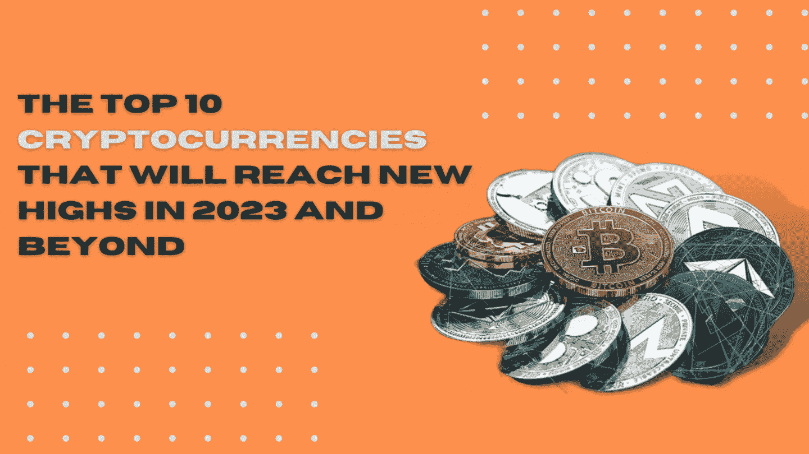

# 2023 年及以后将创新高的十大加密货币

> 原文：<https://medium.com/coinmonks/the-top-10-cryptocurrencies-that-will-reach-new-highs-in-2023-and-beyond-63454e9c7db?source=collection_archive---------21----------------------->

## 众多的加密货币只是勉强挂在边缘，但这里有 10 个具有非凡潜力的最佳加密货币。

加密市场最近一直面临着艰难的局面，因为最近几周，大部分一流数字货币已经失去了大部分价值。这还包括了数字货币，如比特币和以太坊，从那里，天空是极限。恐惧是导致密码市场负面看法的最大因素。在 Land Luna 崩溃和比特币交易低于 2 万美元之后，金融支持者们都吓坏了。在这个巨大的熊市期间，没有多少数字货币几乎没有受到威胁，也不会被忽视。然而，目前数字货币市场出现了一些复苏迹象。本文列出了到 2023 年及以后将达到历史新高的 10 大加密货币。

*[***分步指南开始***](https://thecryptolab.groovesell.com/a/hxfZKodDqjTa) ***你的交易之旅****

## *1.以太坊*

*以太坊与比特币截然不同。最近，crypto 打破了它的记录，解决了它的处境。它的组织允许工程师使用以太组织创建他们的加密货币。尽管它比其他一些数字货币晚发行了很长时间，但鉴于其新颖的创新，它已经远远超过了它在市场中的地位。最令人难以置信的数字货币形式之一将在年底开始牛市会议。*

## *2.卡尔达诺*

*由于其适应性强的组织和快速的交易，卡尔达诺保持着最著名的加密货币之一的过剩。案件更亲切的气候，比不同的货币形式。就像组织在股票上的利润一样，它可以长期合法化更多的接地成本，因为它积累了可证明的目的，从牧场供应链到打击零售假冒。适应性、可维护性和互操作性是它的主要卖点。该组织的新改革使该办公室能够就其组织制定精明的合同。*

## *3.Dogecoin*

*Dogecoin 是数字货币的一个主要形象，很久以前，它开始是一个在网络上流传的笑话。自 2013 年开始以来，Dogecoin 为一些人拯救了一个幸福的地方，它很可能在 2020 年被体育团体认可为分期付款模式，并进入 AMC 影院。此外，像埃隆·马斯克和斯坦普·库班这样的大牌更倾向于 Dogecoin，而不是其他数字货币形式。他们的一条微博就能让总督的花费变得疯狂。*

## *4.Uniswap*

*Uniswap 是一个著名的分散式交换约定，因其参与分散式金融(Defi)令牌的机械化交换而闻名。作为机器人化市场创造者(AMM)的一个例子，Uniswap 于 2018 年 11 月被淘汰，但由于 Defi 的特殊性和相关的 come 符号交换，今年已经获得了显著的普遍性。Uniswap 的意思是保持代币交换的自动化，并完全接受任何持有代币的人，同时提高交换的生产率，而不是传统交易的生产率。*

## *5.柴犬*

*最后一位参赛者是柴犬。这种基于图像的数字货币在上个月以 800%的成本收益击败了它有时站在竞争对手 dogecoin。尽管市场专家不理解 SHIB 在 2020 年被罚下时的变化，但它在市场上的现金执行已经击败了许多顶级数字货币。*

## *6.索拉纳*

*索拉纳与以太坊在两个基本领域合作得很好——速度和低交易成本。以太坊的结构限制了其组织每秒 15-30 次的交换，从而形成了导致高额燃气费用的瓶颈。由于其进步的特性，它吸引了众多的加密金融支持者。*

## *7.币安硬币*

*币安币，由地球上最大的加密交易之一发出——很快，已经从仅仅在币安的交易舞台上与交易所合作扩展到一个阶段，人们可以继续交换，分期付款处理，或者在任何情况下，预订旅行课程。值得注意的是，这些年来，它的价值有了巨大的增长。*

## *8.多边形*

*多边形是最著名也是最重要的第二层缩放声明以太坊区块链。我们将它列入最有潜力的最高密码之一，因为它的利用率很低。此外，越来越多的连锁品牌此前曾表示有兴趣在舞台上扩张。*

## *9.Filecoin*

*Filecoin 类似于 Web3 的文件管理器。这是一个分散的库存网络，作为一种受保护的选择，而不是集中的分布式存储和一种不涉及现金的方法。Filecoin 将被用来存储几乎任何种类的信息，无论是声音文件，录音，实际上是图片，还是文本。它还声称能够足够安全地存储更敏感的数据，如私有的商业数据和记录。*

## *10.波尔卡多特*

*波尔卡多特是全球市场上最著名的数字货币之一，然而金融支持者可能不会意识到这是一个 Web3 项目。该组织被理解为寻求适应性，与以太相比，它在收取低费用和提供快速速度方面定位更高。由于其最高级别的地位和持续上升的市场认可度，Speck 可以继续作为市场首席，并负责分散网络领域。*

# *在加密货币市场分散投资组合*

*现在你可以自己为自己建立一个持续的被动收入流*

*➤一步步引导你开始交易之旅*

*➤初学者友好，并适用于有经验的交易者*

*➤不仅一个，但 10 个不同的策略将被详细教授*

*[**现在加入**](https://thecryptolab.groovesell.com/a/hxfZKodDqjTa)*

> *交易新手？试试[密码交易机器人](/coinmonks/crypto-trading-bot-c2ffce8acb2a)或[复制交易](/coinmonks/top-10-crypto-copy-trading-platforms-for-beginners-d0c37c7d698c)*