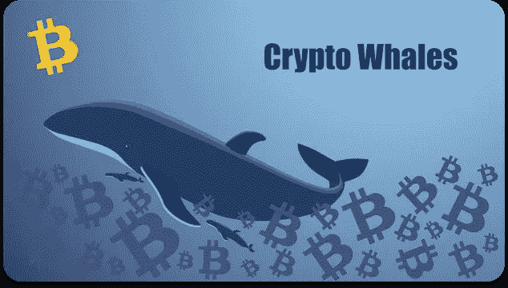
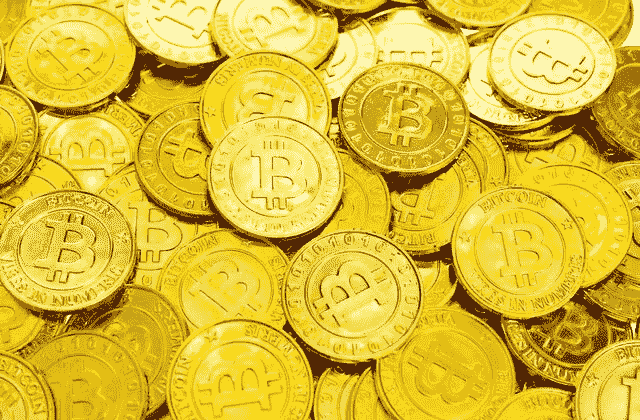

# 2022 年鲸鱼投资的五大秘密

> 原文：<https://medium.com/coinmonks/the-top-5-crypto-that-whales-are-investing-in-for-2022-66b81344d6f8?source=collection_archive---------10----------------------->

该指南将涵盖鲸鱼正在购买的加密货币，以及哪些是最佳的长期投资。

用户一定很好奇加密货币里的鲸鱼是什么。拥有大量加密货币的个人或机构投资者被称为“**加密鲸**”

在决定 2022 年购买何种加密货币之前，消费者可以研究和分析他们感兴趣的资产的可能性和价格。

> 以下是加密鲸投资的五大加密货币。以下章节涵盖了 2022 年最值得购买的五种加密货币。

1.  [**战斗无限**](https://accounts.binance.com/en-IN/register?ref=133457645) **:** 我们建议将战斗无限作为 2022 年购买的顶级加密货币之一。战斗无限是一个分散的倡议，使用区块链技术，使用户和生产者能够参加众多的玩赚(P2E)游戏。战斗竞技场是一个元宇宙平台，让用户能够参与虚拟生态系统来玩游戏并获得游戏内奖励，是该公司的核心产品。主战无限。
2.  另一个长期的顶级加密货币是 [**幸运块**](https://accounts.binance.com/en-IN/register?ref=133457645) 倡议。进入 NFT 白金滚子俱乐部参与每周奖励的玩家可以访问这个分散项目的 NFT 竞赛平台。每周五，幸运街区有一次每周主抽奖和一次 NFT 抽奖，奖金高达 50，000 美元。这个平台的实用令牌 LBLOCK 用于支付大部分奖励。通过购买至少五张每张 1 美元的门票，用户可以参加抽奖。
3.  [**比特币**](https://accounts.binance.com/en-IN/register?ref=133457645) 市值 4500 亿美元，是世界上第一种也是最有价值的加密货币。重要的金融机构对这种点对点的在线硬币感兴趣。比特币的鲸鱼投资者是指拥有 1000 枚或更多 BTC 代币的人。加密鲸鱼跟踪器显示，超过 40%的 BTC 代币由鲸鱼持有。比特币的创始人中本聪据说拥有 7.5 万至 100 万比特币。人口增长后。
4.  [**Ripple 的**](https://accounts.binance.com/en-IN/register?ref=133457645) 开源、无权限技术的原生令牌叫做 XRP。Ripple 希望通过利用区块链技术成为顶级的企业加密货币解决方案提供商。在处理全球范围的交易时，Ripple 为商业和金融机构提供了透明、高效且经济实惠的解决方案。法定货币、比特币等知名加密货币，甚至不同商品的交易都可以通过去中心化平台实现。XRP 是一个。
5.  流行的分散式区块链平台 [**Cardano**](https://accounts.binance.com/en-IN/register?ref=133457645) 使用利益相关者(PoS)共识来运行其操作。为了能够在其网络上开发多个 DApps(分散式应用)和 DeFi 协议，该平台部署了智能合约。Cardano 已经成为开发人员中最受欢迎的区块链之一，其平台迄今已经生产了超过 800，000 个 NFT。Cardano 提供快速交易和长期可伸缩性，这有助于其吸引力。

[**币安:免费交易比特币**](https://accounts.binance.com/en-IN/register?ref=133457645)

> 交易新手？尝试[加密交易机器人](/coinmonks/crypto-trading-bot-c2ffce8acb2a)或[复制交易](/coinmonks/top-10-crypto-copy-trading-platforms-for-beginners-d0c37c7d698c)