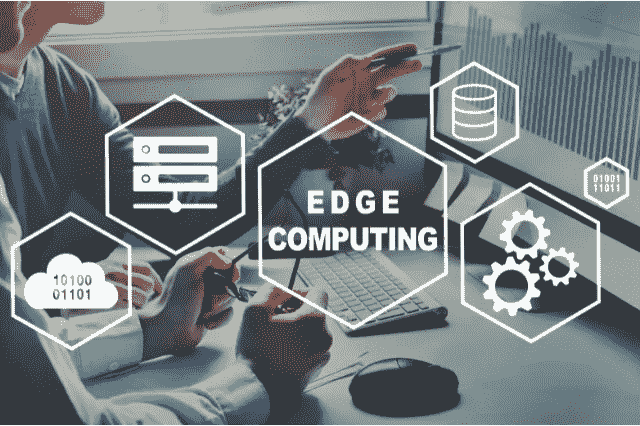

# 值得关注的 5 大边缘计算趋势

> 原文：<https://medium.com/coinmonks/the-top-5-edge-computing-trends-to-watch-out-for-47ebc02e81e5?source=collection_archive---------23----------------------->

# 介绍

随着大多数关于云计算未来的讨论围绕着云展开，人们很容易忘记还有另一个同样有趣的领域:边缘计算。虽然云计算解决方案很受欢迎，也很受欢迎，但它们也有一些缺点，比如连接速度慢或成本高。云服务也意味着企业放弃他们的数据，在别处存储和处理。但是如果有其他选择呢？让我们仔细看看 2022 年及以后你应该关注的五个边缘计算趋势。

# 1)什么是边缘服务器？

边缘服务器是指任何不在数据中心，而是更靠近使用点的计算机，例如零售店或客户家中。它也被称为[边缘装置](https://www.intel.com/content/www/us/en/edge-computing/edge-devices.html)。边缘服务器为部署在组织网络边缘的应用程序提供必要的处理能力和存储空间。

# 2)边缘计算的优势

边缘计算具有诸多优势，例如:

*   它通过消除过程中的中间步骤，减少了数据到达云的时间。
*   它消除了当使用系统的人数超过预期时可能出现的瓶颈。
*   边缘计算提供了一种在设备上存储敏感数据的解决方案，同时仍然允许从远程服务器进行访问。
*   它允许公司根据自己的需求设计硬件解决方案，而不是依赖通用的解决方案。
*   边缘计算对云基础设施的依赖较小，如果需要，可以彼此独立工作。

# 3)构建和管理边缘网络的挑战

在构建和管理边缘网络方面存在许多挑战。这是因为有许多不同的事情可能会出错，如自然灾害或盗窃。一家公司需要有冗余，以便在出现问题时仍能正常运转。他们可以做到这一点的一种方法是将数据存储在多个服务器上，甚至对它们进行加密，这样，除了授权用户之外，没有人能够访问它们。公司还需要确保他们有足够的备份，以防任何种类的灾难发生，如地震、风暴或火灾，这些灾难将摧毁他们的服务器。他们可能希望保护其数据的其他方式是在每个位置设置警卫，他们可以随时检查存储容器，以及用锁保护容器本身。这些只是公司在设计他们的边缘网络时应该记住的一些例子。

# 4)人工智能如何优化您的数据中心运营

人工智能是优化数据中心运营的下一个前沿领域。通过分析和学习过去的行动，人工智能可以自动执行日常任务，并改善决策。此外，人工智能通过预测未来需求，允许更有效地利用资源。这是可能的，因为人工智能可以理解对人类来说过于复杂的大量数据。一个例子是亚马逊如何在订购或交付之前使用人工智能来预测哪些产品将会畅销。因此，它会将商品放置在最有可能被订购的位置，或者提前交付，从而确保客户尽快收到商品。

# 5)雾计算如何帮助以光速交付应用

雾计算是云计算的一种扩展，它利用了网络的边缘，在这里可以更快地处理、存储和分析数据。这比传统的云计算模式提供了显著的优势，传统的云计算模式交付应用的速度要慢得多。你可以把雾计算想象成把你的电脑放在你的路由器的[以太网电缆](https://www.howtogeek.com/795727/what-is-an-ethernet-cable/)的末端，而不是放在它的前面或上面，例如，这就是传统云计算的情况。其结果是，你可以在几秒钟内将信息从你的电脑传到互联网，而不是几分钟甚至几小时。

# 结论

对边缘计算的预测当然是乐观的，但这些趋势在现实中如何发展还有待观察。希望未来几年能带来更多的创新，因为开发人员会找到新的方法来解决业务问题，并使其更易于维护。

## **在**[**cyber hub intelligence**](https://cyberhubintelligence.com/the-top-5-edge-computing-trends/)**博客**上阅读这篇文章

> 交易新手？尝试[加密交易机器人](/coinmonks/crypto-trading-bot-c2ffce8acb2a)或[复制交易](/coinmonks/top-10-crypto-copy-trading-platforms-for-beginners-d0c37c7d698c)