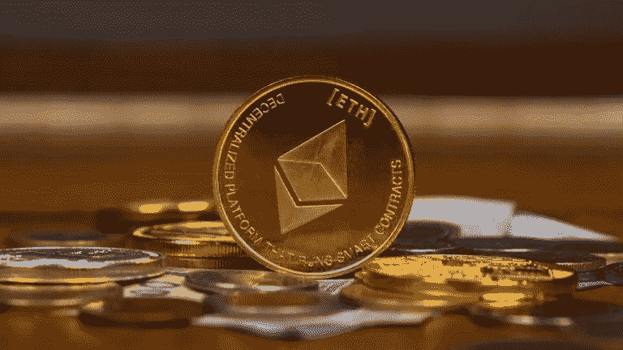

# 你必须知道的三大以太坊钱包

> 原文：<https://medium.com/coinmonks/the-top-three-ethereum-wallets-you-must-be-aware-of-c7c2f2bf296d?source=collection_archive---------11----------------------->

*最好的以太坊钱包有哪些？这是我们现有的最佳名单。*

## 以太坊是最受欢迎的 altcoin。它普及了智能合约的概念，从而推动了 Web 3.0 的发展。就 Defi、NFTs 等的分散化应用而言，它还拥有最发达的生态系统。

因此，在这篇文章中，你会发现市场上最好的以太坊钱包。但首先，你将学会如何选择一个好的以太坊钱包。

**如何挑选一款好的以太坊钱包？**

如果你长期使用 crypto，你应该转移到以太坊钱包，它会给你以太坊生态系统的最佳价值。在选择钱包之前，我们应该记住以下参数:

*   **安全:**你需要选择一个可以存放私人钥匙的地方。
*   集成:这个以太坊钱包将让我们访问所有以太坊虚拟机(EVM)兼容链，如雪崩，Fantom，BNB 链等。
*   **功能兼容:**以太坊钱包兼容加密产品，如 Staking、NFTs 和分散金融(Defi)。它还可以轻松地与 Web 3.0 分散式应用程序集成。
*   **可访问性:**可轻松与 Web 3.0 产品集成，实现价值传递。

寻找具备这些条件的以太坊钱包可能很难找到。所以，这是他们的列表:

**顶级以太坊钱包**

1.  [**元掩码**](https://metamask.io/)

Metamask 是应用最广泛、最流行的以太坊钱包。这款钱包由 Consensys 开发，Consensys 是一家软件公司，在以太坊生态系统中有着深厚的根基。

**a)可用的元掩码功能**

*   分散式网络和移动钱包。
*   存储、接收和发送加密。
*   互换:元掩码聚合器从顶级流动性来源中找到最佳价格，并在各种令牌之间实现互换。
*   EIP 1559: Metamask 根据新的天然气模型(EIP 1559)实施了天然气价格建议
*   购买:直接购买加密使用借记卡，信用卡，或银行账户。
*   NFTs:与 NFTs 交互。

**b) Metamask 优势**

*   可以集成几乎所有以太坊 Web 3.0 应用。
*   易于集成所有 EVM 兼容链(如多边形、Fantom、币安智能链等)
*   高开发者活动导致以太坊更新的快速实现。
*   移动钱包(以及桌面扩展)集成了 Web 3.0 浏览器。

**c)元遮罩缺点**

*   移动应用程序的用户界面很差，并且有多个应用程序崩溃的实例。
*   web 扩展与 NFTs 不兼容
*   无法与其他区块链(非 EVM)集成

Metamask 也在开发高级功能。阅读我们的文章"[转变元蒙版的三个特征](https://www.altcoinbuzz.io/cryptocurrency-news/three-features-that-are-transforming-metamask/)"

2. [**信任钱包**](https://trustwallet.com/)

信任钱包是一个非常受欢迎的加密移动钱包。除了基本的钱包功能，它还提供了一个全功能的 Web3 浏览器来访问 dApps。用户体验比 Metamask 移动应用好很多。此外，该钱包目前支持 65 个区块链和 450 多万资产。

**a)可用功能**

*   分散式纯移动钱包
*   存储、接收和发送加密
*   交换:与币安德克斯联系，无缝交换您的代币
*   购买:使用第三方服务购买加密软件，如 Moonpay、Simplex 等。
*   NFTs:用户目前可以将他们在以太坊(ERC721，ERC1155)和 BSC (BEP721 和 BEP1155)网络上的收藏品存储在他们的钱包上。

**b)优点**

*   兼容多种区块链
*   允许访问高级功能，如打桩
*   可以与任何 dAPP 交互的 Web 3.0 浏览器

**c)缺点**

*   浏览器扩展不可用。因此，与 Web 3.0 桌面应用程序同步的唯一方式是通过 WalletConnect
*   互换的流动性不好

另外，你可以在[这篇文章](https://www.altcoinbuzz.io/bitcoin-and-crypto-guide/how-to-install-and-use-the-trust-wallet/#Exchange)中了解更多关于如何使用信任钱包的信息。

**3。** [**莱杰纳米 X**](https://www.ledger.com/)

Ledger Nano X 是一款保持离线的硬件钱包，是所有提到的钱包中最安全的。它配有桌面和移动软件 Ledger Live。Ledger Live 将帮助您随时监控您的加密。您可以在您的硬件中安装 Ledger 以太坊钱包，并安全地存储您的以太坊。莱杰纳米通常用于长期密码持有。

**a)可用功能**

*   分散式离线硬件钱包
*   存储、接收和发送加密
*   代币交换
*   购买:使用第三方服务购买加密软件，如 Moonpay、Coinify、Wyre 等。
*   NFTs:允许你存储、传输和与 NFTs 交互

**b)优点**

*   移动应用程序使用蓝牙直接与硬件同步
*   最安全的钱包
*   可以与 Metamask 和其他浏览器扩展集成，以便在桌面 dAPPs 中使用
*   兼容多种区块链
*   允许访问高级功能，如定位。

**c)缺点**

*   总是必须携带硬件钱包进行交易
*   当你需要快速交易时很难使用
*   有限的应用存储容量

点击了解更多关于分类账钱包的信息[。](https://www.altcoinbuzz.io/tag/ledger-wallet/)

**其他以太坊钱包选项**

最后，以太坊钱包的好处是，如果您持有私钥(或种子短语)，您可以轻松地将您的帐户转移到任何以太坊兼容的钱包。因此，我们的其他一些钱包推荐包括硬币 98 钱包，出埃及钱包，和 Guarda 钱包。

此外，您可以在此了解更多其他选项:

*   [如何安装和使用 Coin98 钱包](https://www.altcoinbuzz.io/reviews/wallet/how-to-install-and-use-the-coin98-wallet/)
*   [如何使用 Guarda 钱包](https://www.altcoinbuzz.io/bitcoin-and-crypto-guide/how-to-use-the-guarda-wallet-part-i/)
*   [最新出埃及钱包指南](https://www.altcoinbuzz.io/bitcoin-and-crypto-guide/the-latest-exodus-wallet-guide/)

最重要的是，我们建议将你的以太坊从一个集中的交易所转移到本文提到的钱包中。此外，请始终记住保护您的私钥(或种子短语)的安全。

***注:*** *本帖首发* [*此处*](https://www.altcoinbuzz.io/bitcoin-and-crypto-guide/the-top-three-ethereum-wallets-you-must-be-aware-of/) *同* [*一个* ltcoinbuzz.io](https://www.altcoinbuzz.io/) *。*

跟我来

**👉** [推特](https://twitter.com/rumadas123)

**👉**[**Linkedin**](https://www.linkedin.com/in/ruma-das-a1439320/)

> **交易新手？试试[加密交易机器人](/coinmonks/crypto-trading-bot-c2ffce8acb2a)或[复制交易](/coinmonks/top-10-crypto-copy-trading-platforms-for-beginners-d0c37c7d698c)**