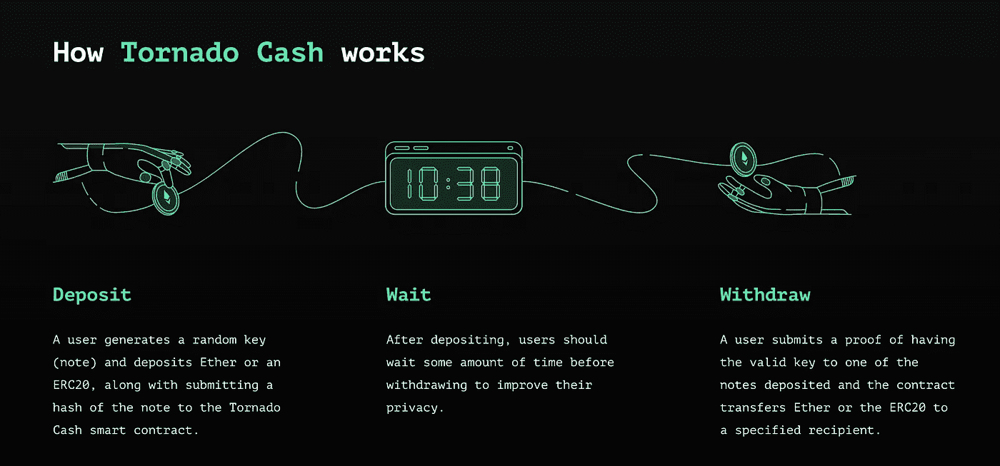
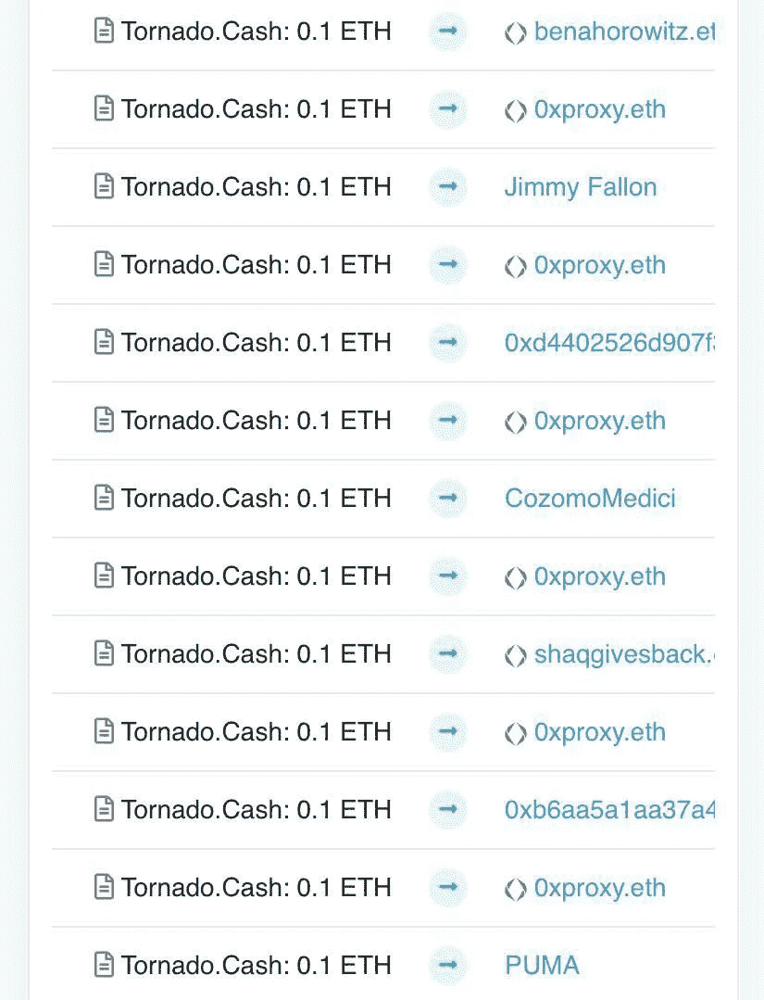

# 龙卷风现金禁令和混乱代理

> 原文：<https://medium.com/coinmonks/the-tornado-cash-ban-and-chaos-agents-b5ceec9685a?source=collection_archive---------7----------------------->

美国政府最近宣布，将禁止以太币混合服务 Tornado Cash。

封杀原因:

龙卷风现金允许用户通过将大量交易集中在一起并混合在一起进行私人以太坊交易，以防止被跟踪。该网站在注重隐私的加密爱好者中很受欢迎，但它也被黑客用来清洗他们的不义之财。像朝鲜支持的拉扎勒斯集团这样的坏演员被特别提到对龙卷风现金有特殊的亲和力。他们是上周 800 万美元的 Nomad Bridge 黑客事件的幕后黑手。

财政部声称，打击黑客是美国禁令背后的推动力，然而，安全专家认为这不会阻止犯罪分子清洗他们的密码。这无疑将为一系列新的托纳德现金式合同打开潘多拉的盒子。联邦政府将需要在无休止的打地鼠游戏中处理这些新的龙卷风克隆体。

合法应用:

在我的 Alpha 聊天中，一个朋友问是否有龙卷风现金即服务的合法使用案例。我能想到的最好的答案是避免暴虐的政府实体的愤怒…然而，这可能会使在上述政权下使用像龙卷风现金这样的服务成为非法。隐私爱好者认为，对 Tornado Cash 的禁令只是朝着更严格的加密监管迈出的又一步。这一举措让我们更加接近我们一直试图通过分散式 Web 3 技术摆脱的监控状态。初创公司 Counterfactual 的联合创始人杰夫科尔曼(Jeff Coleman)在 Twitter 上提出了龙卷风现金的另一个合法使用案例:

“想要向乌克兰捐款是金融隐私正当需求的一个很好的例子:即使你所在的政府全力支持你，你可能也不想让俄罗斯政府知道你行动的全部细节。”具有讽刺意味的是，以太坊的创始人，出生于俄罗斯的 Vitalik Buterin 回信说:

“我会证明自己是一个用 TC 来为这一事业捐款的人。”

当我们继续处理这项禁令的余波时，混乱特工已经把事情掌握在自己手中，作为发表声明的一种方式。

如果来自龙卷风现金的以太坊现在是非法的，那么这么多的以太坊最终进入名人钱包可能是一个问题。也许他们都与时俱进，开始用 crypto 支付他们的附表 1 物质。还有，吉米·法伦总是给我朝鲜支持的黑客的感觉…他们可以让他回来。今天，隐私可能已经被遗忘，但互联网依然不败。

感谢阅读。

看看我在推特上未经过滤的想法:

[https://twitter.com/wasifmrahman](https://twitter.com/wasifmrahman)

在 LinkedIn 上关注我的职业生涯:

https://www.linkedin.com/in/wasifmrahman/

我对媒体的另一个想法是:

 [## 瓦西夫·拉赫曼-中等

### 阅读瓦西夫·M·拉赫曼在媒介上的作品。拉面鉴赏家 Gala Games 的 Web 3 营销高级经理。每…

medium.com](/@wasifmrahman) 

> 加入 Coinmonks [电报频道](https://t.me/coincodecap)和 [Youtube 频道](https://www.youtube.com/c/coinmonks/videos)了解加密交易和投资

# 另外，阅读

*   [CoinLoan 评论](https://coincodecap.com/coinloan-review) | [YouHodler 评论](/coinmonks/youhodler-4-easy-ways-to-make-money-98969b9689f2) | [BlockFi 评论](https://coincodecap.com/blockfi-review)
*   [XT.COM 评论](https://coincodecap.com/profittradingapp-for-binance)币安评论 |
*   [SmithBot 评论](https://coincodecap.com/smithbot-review) | [4 款最佳免费开源交易机器人](https://coincodecap.com/free-open-source-trading-bots)
*   [比特币基地僵尸程序](/coinmonks/coinbase-bots-ac6359e897f3) | [AscendEX 审查](/coinmonks/ascendex-review-53e829cf75fa) | [OKEx 交易僵尸程序](/coinmonks/okex-trading-bots-234920f61e60)
*   [如何在印度购买比特币？](/coinmonks/buy-bitcoin-in-india-feb50ddfef94) | [瓦济克斯评论](/coinmonks/wazirx-review-5c811b074f5b)