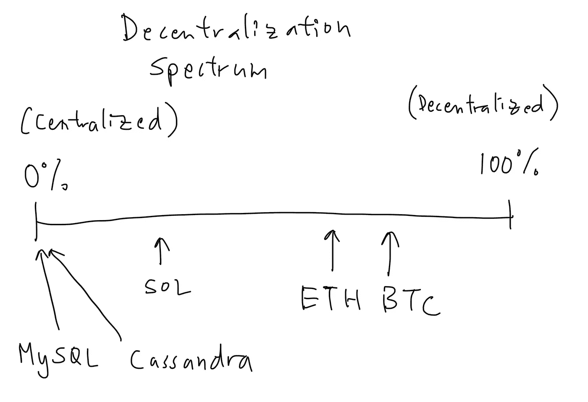

# 极大主义的毒性(上)

> 原文：<https://medium.com/coinmonks/the-toxicity-of-maximalism-part-i-f4f5737087dd?source=collection_archive---------10----------------------->

Photo by [Dan Meyers](https://unsplash.com/@dmey503?utm_source=unsplash&utm_medium=referral&utm_content=creditCopyText) on [Unsplash](https://unsplash.com/s/photos/toxic?utm_source=unsplash&utm_medium=referral&utm_content=creditCopyText)

最大化的问题总是与密码有关。无论是[比特币 maxis](https://twitter.com/saylor?s=20&t=tPr9DxhBHOEaCjyApMlusQ) ，还是 [Eth maxis](https://twitter.com/sassal0x) ，还是[去中心化 maxis](https://newsletter.banklesshq.com/p/the-empire-model-for-blockchains) ，争论从未结束。然而，它似乎经常围绕着最大化主义的哪种*形式*获胜。

事实上，问题不在于结果，而在于过程——争论不应该是哪个会赢，而是更广泛地说，为什么最大化方法会赢。

正如在人类历史的各个阶段所见证的那样，对我来说，最大化是真正的问题——因为最大化，无论是哪一种，本质上都是一种封闭思维的方法。从定义上来说，闭关自守的方法与变化是对立的，因此与适应也是对立的，因此与进化也是对立的——我们知道，基于自然选择和进化论，进化是持续和强劲发展的关键(BTC·马克西在这里开了个玩笑)。

在第一部分，我对区块链最大化主义大便。

## 区块链极大主义

让我们从最上面的绳子开始——crypto &区块链极大主义本身就是愚蠢的。

我和其他人一样看好区块链技术对社会的影响，以及可以在区块链用智能合同构建的潜在应用，但拜托——主张不受任何政府干预的纯粹、100%去中心化的技术栈或支付系统的人是生活在幻想中。

即使技术成功扩展，最终能够支持必要的带宽(这是可能的)，政府也绝不会为了完全的分权而自愿放弃对货币的控制。我们所能期望的最好结果是部分分权。这并不意味着 BTC 在未来没有一个重要的位置，而只是说它永远不会也不可能成为菲亚特的 1:1 替代品。

它可能在功能上取代菲亚特；它可能拥有取代菲亚特的技术能力；见鬼，它甚至有可能收养这样做；但是，一个货币仍是世界储备货币的国家(美国)将竭尽全力保持这一地位。监管和法律仅仅是对抗日益减少的控制的第一枪。

正如我们已经看到的，监管和法律可以证明足够的威胁。

我们看到 [USDC 将与最近](https://dailyhodl.com/2022/08/09/usdc-maker-circle-moves-to-ban-tornado-cash-addresses-after-us-treasury-blacklists-the-crypto-mixer/)[龙卷风现金制裁](https://arstechnica.com/tech-policy/2022/08/us-bans-transactions-on-crypto-system-that-some-used-for-money-laundering/)有关的钱包列入黑名单，证明作为一个分散的实体，你的*理论上*能实现多少“技术”真的无关紧要——只要有人类参与，那些人类就需要生活在某个地方，因此受政府管辖。

当像美国这样的国家发挥其意志时，即使是最“分散”的实体也能找到遵守的方法。

基本面不会因为我们使用新技术而改变。无论你生活在模拟世界、数字世界还是区块链世界，坐牢的威胁都会带来同样的影响。不管你是代表地理城市还是元宇宙。

法律最终不可避免地比技术更强大，因为它们针对的是最上游的源头——人类创造者。

完全去中心化的技术栈的梦想也是愚蠢的。首先，这到底是什么意思？分散在一定程度上发生，它存在于从 0%到 100%的范围内。比特币更接近于 100%去中心化的一面(但也不是完美的！)，然后是 Eth，然后是区块链的其他“数据库”纷纷效仿，变得越来越集中。

然后，有趣的是，遵循其他“传统”数据库——因为 Cassandra 数据库的极端版本，一个有许多节点的数据库，由多个参与者管理，而不是通过中央控制，不就是一个区块链账本吗？一个区块链(咳咳，SQLana，咳咳)最集中的版本本质上不就是一个更努力的 MySQL DB 吗？(如果一个实体控制所有节点，那么让许多分布式节点执行共识对结果有什么影响，对吗？)

Warning: NOT TO SCALE

而这才是重点，它们都共存于同一个频谱上！在后端，web2 和 web3 之间没有真正的“我们”和“他们”。他们只是彼此的两极版本——一些*朝向*去中心化，一些*朝向*中心化——这是连续的，而不是二元或离散的。这怎么可能呢，即使在加密内部也有不同程度的去中心化？

因此，通过只支持“分散的”堆栈，技术堆栈 maxis 任意地在沙地上画了一条线，对于他们的看门母狗来说，分散到什么程度是“足够的”。

实现 100%的去中心化是不可能的，所以他们应该停止假装这是一个真正现实的目标或者一些无可指责的良性的不可批判的努力——在这个过程的某个层面上，你将需要信任一个 Infura，或者 Alchemy，或者 Eth nodes 的 [AWS，或者 MetaMask 来显示你正在签署什么交易，等等。不是*是否*会有中央集权，而是*必须在哪里*注入。](https://decrypt.co/44321/70-of-ethereum-nodes-are-hosted-on-centralized-services)

你只需要权衡利弊，平衡风险。

但是通过*仅仅*与“足够分散”的堆栈一起工作，它故意忽略了 web2 的所有精彩技术，后端服务器技术，疯狂高效和可扩展的数据库技术，几十年来迭代建立。

你是说每一份数据都应该保存在昂贵的区块链账本上？

正如我以前说过的，权力下放只是一个工具；一种有希望优先考虑用户的手段。它应该*而不是*本身就是目的。因此，作为一种工具，有集中式堆栈更好的应用程序(即速度是必需品的非敏感数据)，也有分散式堆栈更好的应用程序；有时混合方法是最好的。

如果开发人员实现集中式堆栈的元素是因为它对某个应用程序更好，这并不意味着他们在某种程度上受到了损害。

*这种*类型的心态是寻找问题解决方案的定义，当你试图将一项技术(区块链)强加到每一个用例上，而不管它的实际适用性或适用性，或者是否得到同意时，批评家们有理由指出这个问题。(我想我会称之为“技术性侵犯”。还在用这个名字。)

我的意思是，从现在到永远，谁会认为锤子在任何情况下都比螺丝刀更好呢？它忽略了上下文。我有螺丝或钉子吗？

但这相当于《密码》中双方的逻辑论证——没有创造者，他们无法想象去中心化的单一用途；加密开发人员想不出保持集中化的唯一理由，他们拒绝承认除了通过 IPFS 以外的任何托管，并且不能接受任何没有完全基于 HOA 式用户令牌的幕后治理的 web 应用程序。

他们是镜像，仅仅是辩论中对立双方的逻辑思考，同样顽固，同样不理性地认为区块链和 web2 必须相互排斥。

事实上，分权对某些事情来说是更好的工具，而集权对其他事情来说是更好的工具。应该庆祝的是，仅仅能够增加一些权力下放现在已经成为可能。但是区块链不需要拆了每一个 web2 应用程序，仍然是一个变革性的技术。web2 不需要仅仅因为区块链的繁荣而被视为“无用”或“过时”。

世界的未来不仅仅是区块链；它仅仅包括区块链。

> 交易新手？试试[加密交易机器人](/coinmonks/crypto-trading-bot-c2ffce8acb2a)或者[复制交易](/coinmonks/top-10-crypto-copy-trading-platforms-for-beginners-d0c37c7d698c)