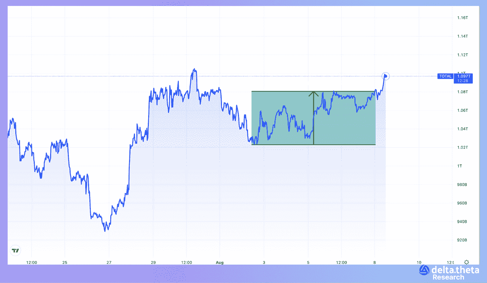
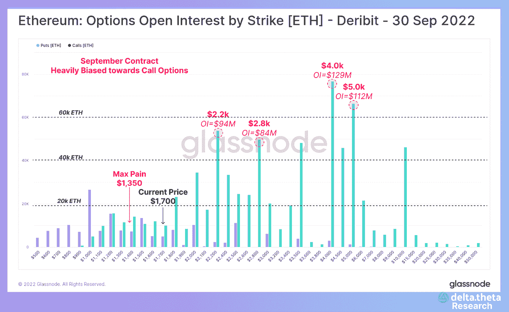
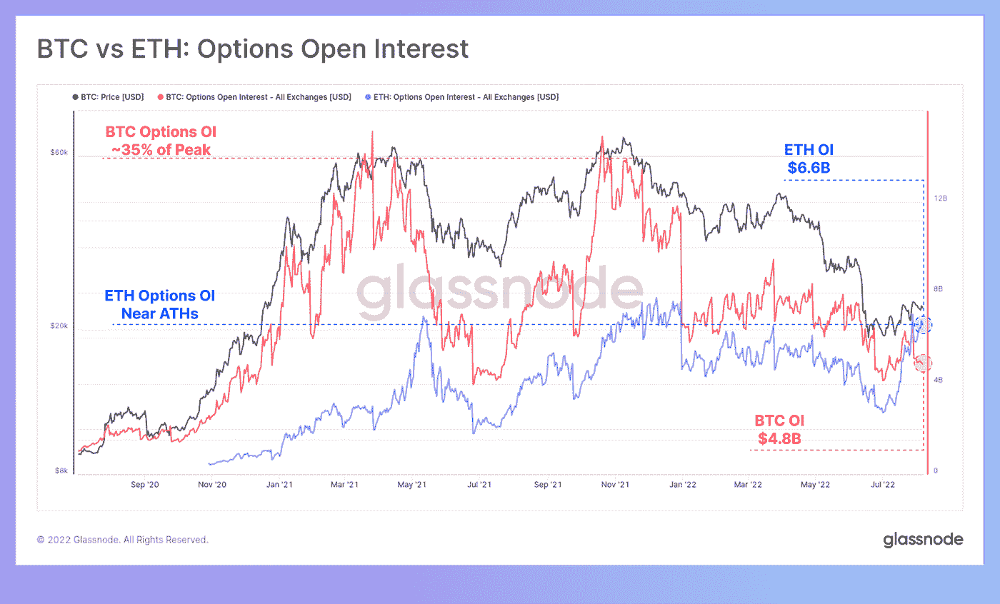
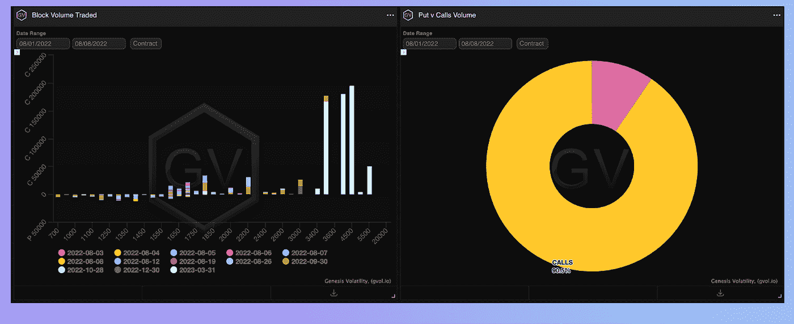
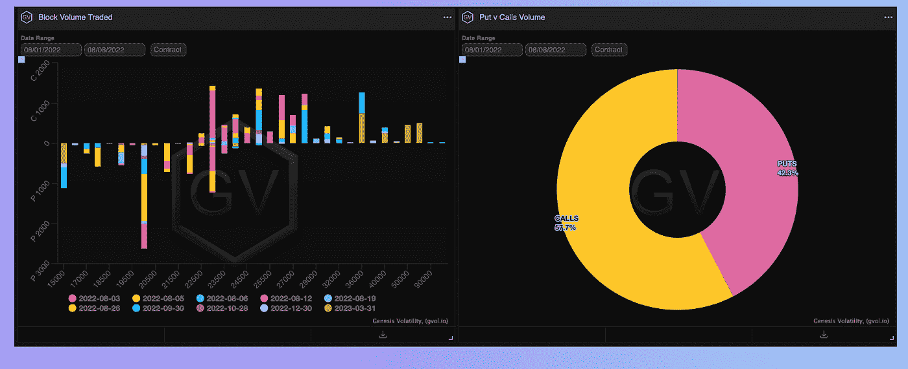

# Tradfi 市场数据有助于加密？

> 原文：<https://medium.com/coinmonks/the-tradfi-market-data-would-help-crypto-ca0c1e36aabe?source=collection_archive---------23----------------------->

过去的一周相对平静，主要加密公司和股票市场领导者之间的整合消息支撑了市场。Meta 正在 Instagram 上通过 Trust Wallet 和 MetaMask 实现对 NFT 技术的支持，而大型投资管理公司 BlackRock 将使用比特币基地基础设施为其客户提供服务。在牛市中，这样的消息可能会将价格推至新的价格高点，但在目前的情况下，市场仍保持在 1-1.08 万亿美元的市值走廊内。

目前，交易者正在等待本周的宏观经济数据(特别是 CPI)以获得更多信息来预测金融监管机构的行动。

# 市场情况

当前的价格复苏期在加密行业是独一无二的，以太坊及其生态系统令牌取代 BTC，成为市值增长的主要驱动力。同样值得注意的是，期权在交易中的使用越来越多，这是过去两年传统金融市场的一个特点，现在也出现在加密市场上。在期权未平仓合约飙升至 60 亿美元后，ETN 已经超过 BTC 50%以上。这种市场定位的一个特点是交易策略的紧迫性——大多数合约的执行日期都被限制在 9 月份，看涨期权占据了巨大的主导地位。然而，在计划的以太坊网络合并之后执行的工具具有相反的动态——更多的看跌期权和更高的预期波动性，这也可能表明交易者希望在网络出现技术问题或极端不利的宏观经济条件开始时进行对冲。

# 期权市场

上周的期权大宗交易图表非常能说明当前的市场动态和对未来价格走势的预期。

对于比特币，有大量的看跌期权交易，价格为 20 000 英镑，在 8 月底和 10 月到期，这很可能表明交易员希望对冲秋季价格可能下跌的风险。

对于以太坊来说，2023 年第一季度末到期的大量看涨期权交易以及 3500 和 4000 的字符串值得注意。这一时间范围的选择可能包括以太坊“合并”的成功和最终实现，以及宏观经济环境的改善，这可能会带来巨大的收益。