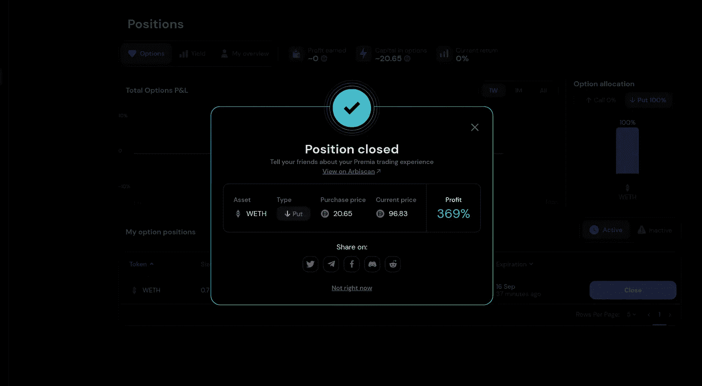
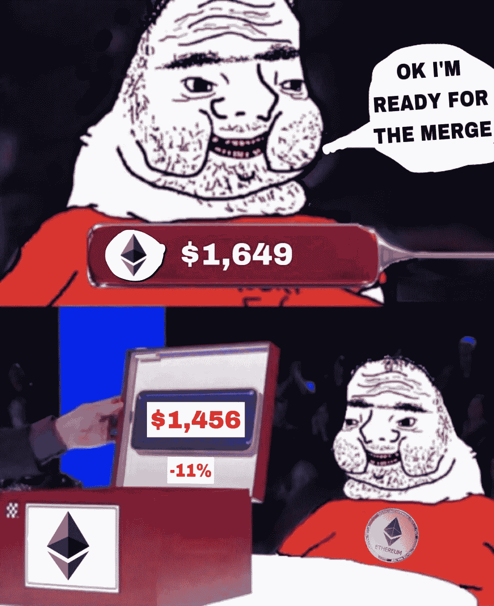

# 三重倾销|＄1k 到 10k 挑战:第 2 周回顾和投资组合更新

> 原文：<https://medium.com/coinmonks/the-triple-dumping-1k-to-10k-challenge-week-2-recap-and-portfolio-update-79ddce083cbd?source=collection_archive---------0----------------------->

嘿大家好，

欢迎回来。第 2 周的＄1k 至 10k 挑战赛，情况不妙。这是艰难的一周，当我写这篇文章时，市场仍在流血。

我在以前的帖子中说过，我预计九月会是一个糟糕的月份，这就是为什么我保守地开始了挑战。上周日，我涨了 12%，感觉很好。我们挺过了快速跌至 18000 美元的危机(市场实际上显示了强有力的支持)，我们期待 CPI 下降(能源价格下降)，我们迎来了合并。尽管如此，我有一种感觉，对 crypto 来说，这将是糟糕的一周。

但你不能凭直觉投资，尤其是如果你不是沃伦·巴菲特。所以我看了事实。CPI 略好于预期，市场将会反弹。比预期稍差一点，市场就会暴跌。然后合并就发生了，没有人，包括我，知道市场会有什么反应。**我唯一知道的是，双方都会有反应。**

所以我必须做出决定:

A) **赌一个好的消费物价指数**和合并成功，作为一些快速获利的催化剂

B) **不要做任何动作**，等待买入，以防下跌发生

**出于各种原因，我选择了选项 A** :

*   一年做 10 倍的投资，尤其是在这样的市场，需要承担风险。这并不像我们有硬币左抽右抽，我们可能会停滞很长一段时间，像这样的潜在催化剂可能是我们现在最多的
*   对我来说，错过加油站比买垃圾场更糟糕(在这种情况下)，因为它限制了我的选择。在我看来，注入的硬币被认为风险太大，不值得投资
*   真心相信合并和以太坊的新代币组学
*   我是个堕落者

# 这出戏

我相信，如果 CPI +合并会产生影响，那将对整个市场产生影响。**无论 ETH 向哪个方向移动，大部分低盖都会跟随**。低市值股票总是更不稳定。所以我是这样想的:

*   我相信买入低市值股票，以防市场下跌。比如 ETH 跳 5%，我预计 Premia 跳 25%。另一方面，如果 ETH 倾销 5%，我预计 Premia 将倾销 20%。
*   通过购买 ETH 看跌期权来对冲我的头寸。对于那些不知道什么是看跌期权的人来说，你实际上是在打赌，在未来的某个日期(到期日)，价格将低于某个水平(执行价格)。到期时的价格越低，你获利越多(显然它需要低于执行价格)。要下这个赌注(买这个期权合约)，你要支付一定的钱(成本)。如果在到期时价格不低于执行水平，你的看跌期权到期时将变得一文不值，你为它们支付的钱也将浪费掉。

所以周一，我在 Premia 上多买了 50 美元，在 dYdX 上多买了 35 美元。我也试图购买更多的 XMON，但**感谢上帝**当时费用太高，所以我没有这样做。

在那之后，ETH 的交易价格在 1700 美元左右，我以 1600 美元的执行价购买了 0.7 ETH 的 20 美元看跌期权，该期权于周五到期。这意味着，例如，如果周五 ETH 的价格是 1400 美元，我将获得 1600–1400 = 200 美元差价的 70%(因为看跌期权是针对 0.7 ETH 而不是 1 ETH)，即 140 美元。

如果你想知道更多关于我为什么选择这个 alts 的背景，请查看下面的帖子:

## 怎么样了？以下是本周发生的事情的快速回顾。

## 星期一

我关注的低市值股票正在下跌，我看到了一个很好的买入机会。我制作剧本，也在 Premia 的平台上购买看跌期权。

## 星期二

CPI 数据发布了。比预期的更糟。被灌篮，上周的所有收获都没了。

## 星期三

合并发生了，一切都很顺利。没有反应，只是在 ETH 和 Polygon 等合并令牌上有一点下降(出售新闻效果)

## 星期四

ETH 疯狂转储(1480 美元)。我的 alt 跟着。我下注 70 美元。我不想冒险在快速反弹时损失利润，所以我用 15 美元买了币安的永久期货。罪犯就像期权一样，但没有到期日。我基本上对冲了 ETH 突然抽水的可能性，直到明天

## 星期五

我的期权在 1462 美元到期，上涨 369%，净利 76 美元。我不退出我的罪犯，因为我相信他会反弹

## 星期六

仍然不要退出我的交易，仍然相信 ETH 会恢复，我会在盈利时退出交易。这没什么大不了的，如果 ETH 跌破 1360 美元(这似乎不太可能)，我会损失 15 美元，所以我决定等到我们再次超过 1500 美元时，在绿色时退出交易。

## 星期日

我快速回顾了一下正在发生的事情。我们经历了两次大的下跌，大多数硬币都在我们认为的底部附近，我仍然处于绿色。我上周的大部分涨幅都消失了，我只上涨了 2-3%，但我很高兴能从暴跌中幸存下来，并相信更好的时代即将到来。**整个市场莫名其妙地下跌了 8%,而 ETH 的跌幅超过了 11%。**我的罪犯被清算了(-$15)，我们现在几乎有 5%的赤字。几小时内总共损失了 105 美元。 *FML*

# 投资组合

这是我写作时的作品集。以太坊是我最糟糕的赌注。表现最好的是戴，因为没有“期权代币”，我必须以某种方式计算期权收益。所以戴代表我以 20 美元买入，以 96 美元卖出的 ETH 看跌期权。

24hour dump

Weekly performance. The sudden drop is me taking money out of the portfolio to buy the put and the sudden hike is profits from the put re-entering the portfolio

Current positions

# 那现在怎么办？

BTC 再次达到 18000 美元。几乎以 30 美元成交。ETH 在 1300 美元左右，DOT 在 6 美元左右。通常的问题又出现了:这是底部吗？但也许这不是正确的问题。人们忙于抓住底部，以至于忘记了思考什么才是真正重要的。当我制定策略时，我关注两个问题:

*   这是一个好的买入点吗？

毫无疑问。考虑到它们的长期潜力，有些硬币被严重低估了，ETH 就是其中之一。记住我们还非常非常早。如果你相信加密技术会一直存在，并且你真的相信这项技术，那么从长远来看，你不可能看不到至少 4 到 5 倍于 T2 的机会。

我说的是现在买，2-3 年后忘记。你不能**不**期望这些项目中的很多至少**达到他们的历史最高水平。是的，这些价格是极度印钞的结果。但我们仍在等待如此多的积极催化剂，在我看来，加密在未来 5 年内至少不会成为 10 倍的产业是不可能的。总之，这不是我们要找的。我们希望一年内增长 10 倍。这意味着我仍然相信这是一个很好的买点，但我有点怀疑**

*   **我们看到短期上涨了吗？**

这个比较难回答。根据宏观数据，我们将面临一个艰难的冬天。我不认为近期会出现疯狂的牛市。很可能是一个停滞期，类似于我们过去几个月的情况。量化紧缩政策以及利率上升将推动市场下行。然而，通货膨胀的降低会消除我们现在的一些不确定性。也许美联储的立场会变得更宽松(选举即将到来)。我预计这些因素会相互抵消，导致与我们现在看到的几乎相同的价格波动，在 18k-23k 左右反弹，平均在 21k 左右。从这个角度来看，现在买入是有意义的，并期待反弹至 20k 水平。从历史上看，在当前水平上积累是明智之举。

问题是我目前有大约 230 美元现金。即使我预计会快速反弹，在 230 美元的价位上涨 5%也就是 11 美元左右。那是花生。牺牲我目前拥有的所有灵活性，去追求一个 100%的加密投资组合，最多只能获得 11 美元的收益，这是愚蠢的。如果我打算押注于快速反弹，我会通过衍生品(期货或期权)来押注。

# 即将举行的活动

## FOMC 会议(9 月 21 日至 22 日)

利率可能会增加 0.75%。市场似乎已经消化了这一点，但如果我们看到更大的涨幅(我认为这不太可能)，我预计市场会大幅下跌

## 卡尔达诺·瓦西里硬叉子(9 月 22 日)

可能是卡达诺生态系统有史以来最重要的更新。这是自己的合并版本。它应该可以提高性能和改进 dapp 开发。我不希望它对价格有任何影响，但我拿着我的 ADA 以防万一。我也在寻找本土项目剧。

在我看来，这是 Cardano 将自己树立为一个值得尊敬的项目的最后机会。如果未来几个月我看不到 dapps 和网络活动激增，我会认为这是一个死项目。我知道他们在努力工作，但那时候他们还远远落后。

# 下周策略

*   寻找一个快速的反弹发挥通过 perps
*   寻找具有重要效用但过去成本较高的代币(如 Seedify.fund)

# 更多更新

## 反思一些代币

*   XMON 进一步下跌，Sudoswap 上的交易量似乎已经枯竭。这是一枚有风险的硬币，须藤空投真的值那么多钱吗？
*   **dYdX** 现在似乎没有催化剂了，他们在二月份有一个极端的象征性通货膨胀。仍然持有，但也在寻找替代品(如$GMX)

## 看到一些新的机会

*   **X2Y2** 是 NFT 的一个市场，它正在从根本上扼杀它。我计划本周对它们做一个全面的分析
*   氦社区批准了搬到索拉纳的提议。在我看来，这是氦未来的大动作。我计划本周对它们做一个全面的分析。
*   **GMX** 是一个 DeFi perps 协议，最近获得了很多关注。我期待它能增长更多，因为 Arbitrum 的 Nitro 升级已经上线。我将在本周尝试，因为我正在为我的永久未来游戏寻找 DeFi 平台(就像我上周对 Premia 所做的那样)。它的一个机制被一只鲸鱼利用，创造了一个套利机会，并通过操纵 AVAX 的价格获利。不过没什么大问题，团队正在调查。尽管如此，它在过去的 24 小时内下跌了 16%，所以这可能是一个很好的切入点。

## 深入了解 NFTs

这个星期我也做了很多关于 NFTs 的研究，试图更多的了解这个行业，寻求机会。我绝不是专家，但我想我终于可以说我“理解”他们了。准备这周写一篇关于他们的长线文章。

## 我对 Premia 的体验

非常流畅的用户界面，一切如预期的那样工作，但是选项上的关闭/练习按钮有点混乱。我看到一些不和谐的人很难意识到什么是什么，并在亏损时平仓盈利。总的来说，团队似乎很快支持和解释事情。它需要更多的流动性才能成功，但我看好它们。

## 我对 ATOM 的看法

尽管处于熊市，ATOM 仍然是过去几个月中为数不多的持续发行的硬币之一。很多人一直在问我这个问题，所以我在这里试着解释一下我的想法。虽然我非常看好 Cosmos 生态系统，但 ATOM 只不过是一个治理令牌的事实让我感到不快。

对于大多数区块链来说，本地令牌用于支付交易费用，随着网络的发展，这种需求也会增加。ATOM 的情况并非如此。因此，虽然我确实相信宇宙项目会成功，但我认为 ATOM 的潜力相当有限。不是说它不会上涨，只是现在对我来说风险太大了，特别是考虑到它在过去 90 天里已经上涨了 2 倍。

## 需要注意的事情:Arbitrum Odyssey

现在应该已经恢复了所以谁知道呢。也许他们在等待合并顺利进行。

# 经验教训

*   **获利回吐**

Premia 上周做了 2x，但我没有获利。相反，我买了更多的蘸酱。我现在总共有-13%在上面，而上周几乎是+100%

*   **蘸料可以继续蘸料**

我买了 dYdX，因为它有良好的基本面，几乎处于历史低点。从那以后又下降了 20%。

*   **期权和佩珀赋予了灵活性**

以太坊和一个永久的未来让我创造了一个双赢的局面。将来可以尝试更多类似的动作。

*   **期权和 perp plays 可以带来丰厚的回报(但具有高风险)**

以太坊看跌期权给了我 76 美元的利润和 369%的投资回报率。它单独减轻了大部分损失。对于这样的短期投资，衍生品应该是首选。另一方面，我的罪犯在几个小时内就在币安被干掉了。高风险-一般来说高回报，但可能正是我所需要的，以提高投资组合

# 本周迷因

伙计们，这就是我今天给你们带来的全部内容。本周我有很多内容创意，请务必关注:

*   **X2Y2 分析**
*   **氦分析**
*   **GMX 分析**
*   **NFTs 深潜**

让我知道你想看什么。

此外，钱包街报告#2 将于周三发布。如果你还没有，在这里订阅，这是我们的双周加密简讯[(第一期](/coinmonks/is-this-the-start-of-the-new-internet-ba5d7a0575ee))。

请记住，如果您想实时查看$1k 至$10k 挑战的进度，请查看我的 [Twitter](https://twitter.com/WolfOfWalletSt) 。否则，祝你一周愉快，下周一见！

记住:这不是财务建议。内容纯属娱乐目的。另外，我知道这张图片不是来自华尔街之狼。它只是看起来很酷。

> 交易新手？试试[密码交易机器人](/coinmonks/crypto-trading-bot-c2ffce8acb2a)或者[复制交易](/coinmonks/top-10-crypto-copy-trading-platforms-for-beginners-d0c37c7d698c)