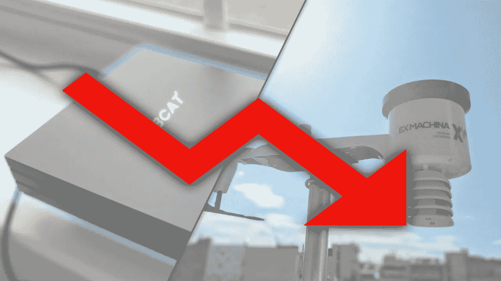

# 关于加密硬件矿工的真相…

> 原文：<https://medium.com/coinmonks/the-truth-about-crypto-hardware-miners-8c7e9daae0a1?source=collection_archive---------6----------------------->

## 投资矿工的真相

自从区块链和加密开始以来，人们就可以通过矿工来收集它们。随着比特币在 2009 年推出，使用机器和硬件生产上述加密货币的时代已经开始，许多其他区块链和加密货币将追随比特币的足迹。在过去的 13 年里，大量的区块链都在进化，他们都使用稍微不同的方式来开采他们各自的硬币。

*想阅读* *媒体上的每一篇文章？立即报名！https://medium.com/*

首先，我们只看到了比特币原始 [SHA256 算法](https://www.mycryptopedia.com/bitcoin-algorithm-explained/)的微小变化。新的链尝试了不同的挖掘算法，这些算法提供了一些优势，如匿名(randomx，Monero)或同一概念的不同设计(scrypt，Litecoin)，但随着加密市场慢慢被越来越多的相同算法淹没，必须进行新的创新以保持对饥渴的投资者的吸引力。

> 不知道什么时候买卖，试试[复制交易](http://coincodecap.com/go/bityard)。

# [在此插入随机申请]

> 这就是为什么我们的应用程序最终会使用区块链，因为它是“开放的”和“去中心化的”，而它们不可避免地不需要它。

例如，看看 [WeatherXM](https://weatherxm.com/) 吧，他把一个已经存在的、完全起作用的概念带到了区块链，这个概念不需要去中心化或开放(因为天气数据已经开放了……)。他们试图推销这样一种理念，即每个人都应该在自己的花园里有一个便携式气象站，唯一的目的是“出售气象数据，对环境有益”。

问题是天气数据已经公开，收集这些数据的气象站比他们提供的便携式气象站先进得多。那么，区块链利用他们的“采矿硬件”收集数据或提供服务的目的是什么呢？

# 一个惊喜…

钱。这个世界不需要每个人的后院都有收集天气数据的便携式气象站。现有的已经足够了，为我们提供了足够的数据和准确的预测，那么为什么还需要区块链呢？

最后，他们只是想卖给你他们的“WeatherXM 加密令牌”，对于那些真正深陷加密兔子洞的人，你甚至可以卖给他们你的“气象站”！现有的收集和开源数据不会创造任何价值，所以他们唯一的目的就是让你相信他们的愿景，这样他们就可以从你身上获利。

以[氦网](https://www.helium.com/)为例看一下。他们把一个现有的概念(如拉勒万)带到了区块链。老实说，这是一个很酷的概念。我甚至在我们的业务开发公司中使用氦技术，直到我们发现这项技术太不可靠，无法像专业设置的 LoRaWan 网络那样做任何事情。

但是我跑题了；参与和开采氦(HNT)你需要一个“氦兼容路由器”，可以这么说。这个装置基本上是一个树莓皮，上面有一个洛拉万盾。带有现成组件的硬件价格约为 100 美元。那么，有什么问题呢？事实上，你只能用他们合作伙伴认可的机器开采氦！是的，你可以创建你自己的洛拉万设备，并将其添加到氦网络，但氦不会让你用自己的设备开采 HNT！这将过于开放和分散，不利于他们业务的盈利能力…

这是聪明的，我不打算说谎，但这就是氦如何为他们自己的氦矿工创造了一个人工市场。他们以大约 600 美元的新品和 1500 美元的二手货向不知情的买家出售了 10 万个树莓派克隆品。承诺是你将支付 600 美元，但能够通过开采当时价值约 50 美元的 10HNT 在 3 个月内获得投资回报。他们就是这样抓住了很多投资人，包括我。

# 真相

许多人在牛市的炒作中买入了他们的 HNT 矿工股票。通过经营一家 HNT 矿商来获取短期利润的承诺颇具吸引力。然而，在购买后 6 个月才交货的通知却不见了！此外，随着熊市的到来，HNT 的价格从 55 美元跌至 1.81 美元(下跌约 97%)，3 个月投资回报的承诺看起来就像一个童话故事。

目前的情况如下:我花了差不多 600 美元买了氦矿机。我采矿半年，已经开采了一个不错的~8 HNT，目前价值~15 美元。我的投资回报率大约是 20 年！如果我现在试图卖掉 HNT 矿工，我只能得到 150 英镑。

# 最后…

我陷得太深了。卖掉矿工或 HNT 不会让我有任何进展。但我确实学到了一件事；(1)不要让炒作影响到你，以及(2)不要投资一些随机区块链的矿工。代币价格很有可能会暴跌，最终，你只是在为下一个加密初创公司不可持续的商业行为买单。肯定会有人从这些矿工身上赚钱，但很有可能你已经错过了炒作的列车，而你将是为他们的利润买单的人。在外面注意安全。阿门。

# 链接>

*   *想阅读* *媒体上的每一篇文章？使用我的链接在 medium 上注册，每月 5 美元！medium.com/@Igor.MD/membership*
*   考虑给我买杯咖啡吧！[ko-fi.com/igormd](https://ko-fi.com/igormd)
*   考虑用我推荐的库币！[www.kucoin.com/r/rf/1de5d](https://www.kucoin.com/r/rf/1de5d)
*   想成为页面上的特色吗？给我发邮件！

> 加入 Coinmonks [电报频道](https://t.me/coincodecap)和 [Youtube 频道](https://www.youtube.com/c/coinmonks/videos)了解加密交易和投资

# 另外，阅读

*   [瓦济里克斯 NFT 评论](https://coincodecap.com/wazirx-nft-review)|[Bitsgap vs Pionex](https://coincodecap.com/bitsgap-vs-pionex)|[Tangem 评论](https://coincodecap.com/tangem-wallet-review)
*   如何使用 Solidity 在以太坊上创建 DApp？
*   [加密交易机器人](/coinmonks/crypto-trading-bot-c2ffce8acb2a) | [OKEx vs 币安](https://coincodecap.com/okex-vs-binance)
*   [币安 vs FTX](https://coincodecap.com/binance-vs-ftx) | [最佳(SOL)索拉纳钱包](https://coincodecap.com/solana-wallets)
*   [如何在 Uniswap 上交换加密？](https://coincodecap.com/swap-crypto-on-uniswap) | [A-Ads 评论](https://coincodecap.com/a-ads-review)