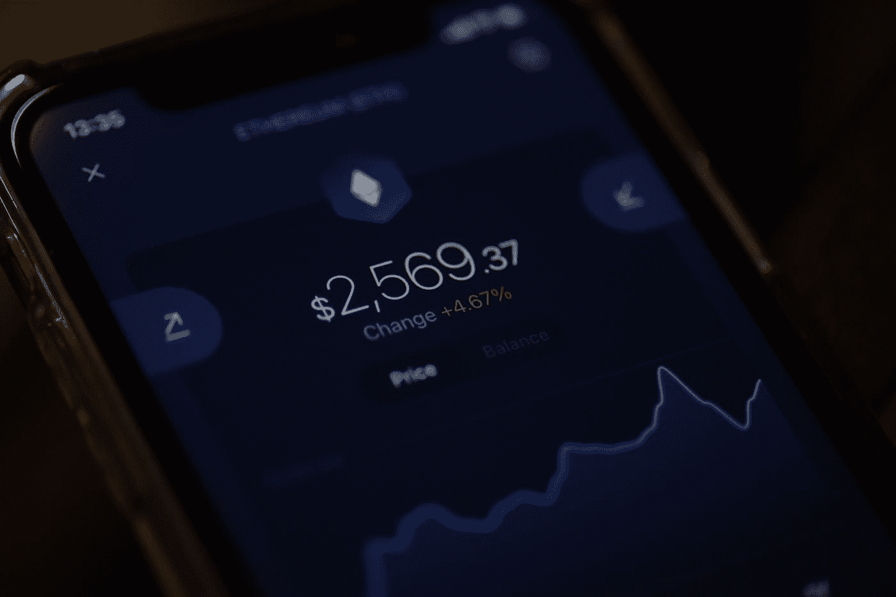

# 去中心化借贷平台的真相

> 原文：<https://medium.com/coinmonks/the-truth-about-decentralized-lending-and-borrowing-platforms-57d8621fd629?source=collection_archive---------32----------------------->

Photo by [Brian Tromp](https://unsplash.com/it/@84media?utm_source=medium&utm_medium=referral) on [Unsplash](https://unsplash.com?utm_source=medium&utm_medium=referral)

电子中心化借贷平台，也称为点对点(P2P)借贷平台，是一种在线平台，使个人和企业能够在不需要传统金融机构的情况下借贷资金。

分散式借贷平台利用区块链技术和智能合约来促进货币兑换，并确保交易的安全性和透明度。

我们将探讨分散借贷平台的概念，并讨论其潜在的好处和挑战。

*分散式借贷平台是一种在线平台，使个人和企业能够直接借贷，而不需要银行等传统金融中介。*

这些平台利用区块链技术和智能合约来促进货币交易，并确保交易的安全性和透明度。

分散式借贷平台可以提供各种贷款产品，包括有担保和无担保贷款、短期和长期贷款，以及用于个人和商业目的的贷款。

借款人通常可以在网上申请贷款，贷款人可以通过该平台审查和资助贷款请求。

分散的借贷平台可以提供额外的服务，如信用评分和风险评估。

> 另见:[与加密货币相关的监管发展](https://www.sammaiyaki.com/regulatory-developments-related-to-cryptocurrencies-41a6d1095a20?source=user_profile---------2----------------------------)

# 分散借贷平台的利与弊

使用分散的借贷平台有几个潜在的好处，包括:

*   **降低成本:**分散的借贷平台可以提供比传统金融机构更低的利率和费用，因为它们没有相同的管理费用。
*   **提高可及性:**分散式借贷平台可能更容易被那些由于缺乏抵押品或信用记录而没有资格获得传统贷款的个人和企业所利用。
*   **增加透明度:**去中心化的借贷平台依靠透明的、不可变的总账，可以增加交易的透明度和安全性。
*   **定制:**分散式借贷平台可能会提供更广泛的贷款产品，可以根据借款人的具体需求进行定制。

然而，使用分散式借贷平台存在潜在挑战，包括:

*   **缺乏监管:**分散的借贷平台需要更多的监管，给借贷双方带来不确定性和风险。
*   **缺乏保护:**传统金融机构通常会为借款人提供保护，比如质疑错误的能力和协商还款计划的选择权。这些保护在分散的借贷平台上可能是没有的。
*   **有限采用:**分散式借贷平台仍处于早期发展阶段，因此可能仍需要广泛采用。

> 另见:[区块链技术的发展和采用](https://www.sammaiyaki.com/the-development-and-adoption-of-blockchain-technology-408bb2e26581?source=user_profile---------3----------------------------)

# 总结一下

分散式借贷平台提供了一种比传统金融机构更透明、更高效、更容易获得的替代方式，有可能扰乱个人和企业获得信贷的方式。

然而，对于贷款人和借款人来说，重要的是要仔细考虑使用这些平台的潜在风险和收益，因为它们仍然相对较新且不受监管。

尽管存在挑战，但去中心化的借贷平台可以极大地惠及借贷双方，并创造一个更加公平和高效的金融体系。

> 交易新手？在[最佳加密交易](/coinmonks/crypto-exchange-dd2f9d6f3769)上尝试[加密交易机器人](/coinmonks/crypto-trading-bot-c2ffce8acb2a)或[复制交易](/coinmonks/top-10-crypto-copy-trading-platforms-for-beginners-d0c37c7d698c)