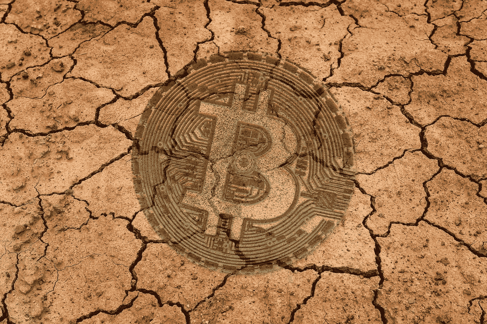

# BTC 马克思主义者不谈的真相

> 原文：<https://medium.com/coinmonks/the-truth-btc-maximalists-dont-talk-about-a840cff9332c?source=collection_archive---------1----------------------->

*Cover picture (background) on* [*Pixabay*](https://pixabay.com/photos/earth-drought-floor-dryness-3355931/)

自 2015 年以来，BTC 不是比特币，不是数字货币，不是货币，也不是一种货币。

方向从在线支付转变为一种货币的模糊隐喻。

BTC 是比特币昔日辉煌的重塑版，支持者和基金经理试图用模糊的叙事吸引银行和机构。