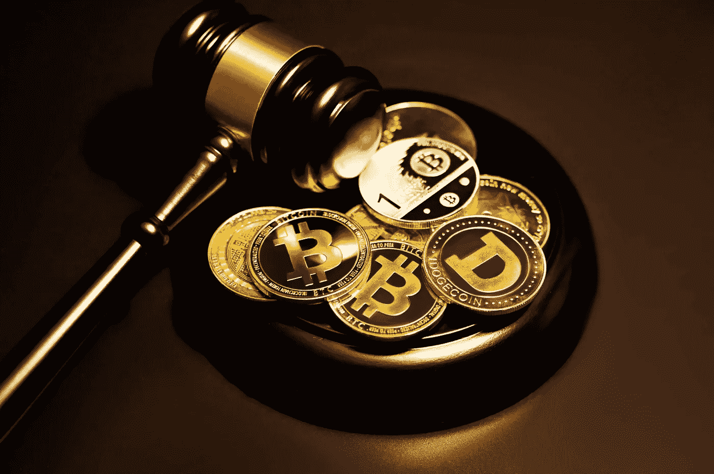

# 购买加密货币的终极指南:给初学者的提示

> 原文：<https://medium.com/coinmonks/the-ultimate-guide-to-buying-cryptocurrency-tips-for-beginners-7f9c6b534e0c?source=collection_archive---------24----------------------->

‍When 听到加密货币这个词，你可能会想到比特币。为什么不呢？这是目前最受欢迎的数字货币。但是有这么多不同类型的加密货币，你如何决定先买哪一种呢？

投资哪种加密货币最好？哪些有可能随着时间的推移而增值？如果您正在考虑购买 crypto，这些只是您脑海中闪过的一些问题。让这个指南帮助你开始成为一个专业的加密买家！

Photo by [Kanchanara](https://unsplash.com/@kanchanara?utm_source=unsplash&utm_medium=referral&utm_content=creditCopyText) on [Unsplash](https://unsplash.com/s/photos/cryptocurrency?utm_source=unsplash&utm_medium=referral&utm_content=creditCopyText)

# 什么是加密货币？

加密货币是一种安全匿名的数字货币。最广为人知和谈论的加密货币类型是比特币，但还有许多其他类型。“加密”一词是指比特币等货币使用加密技术(使用代码和算法)来发挥作用。加密货币是分散的:没有中央银行或政府控制货币的供应或监控交易。用户控制交易，交易被记录在一个叫做“区块链”的数字公共账上正是这种去中心化的区块链技术使得加密货币如此安全。

# 如何购买加密货币

购买加密货币的第一步是找到一个可以购买加密货币的交易所。你可以在比特币基地或币安这样的交易所购买 crypto，或者你可以试试 Coinmama 这样的网站，在那里你可以用信用卡或借记卡购买比特币或以太坊。最重要的是要记住选择一个可以用美元购买数字货币的交易所或网站。有许多不同类型的加密货币，每一种都可以用美元购买。在这些网站上被列为“交易”的是你可以买卖的加密货币。选择交易所后，您需要创建一个帐户并验证您的身份。这是必要的，因为许多交易所都需要遵守“了解您的客户”( KYC)和反洗钱(AML)法律。创建帐户并验证身份后，您需要将资金从银行帐户转移到 exchange 帐户。这可以通过从你的银行账户电汇到你购买密码的交易所来完成。一旦资金被转移，你就可以用你的钱购买你想要的加密货币。一些交易所只接受加密货币存款，这意味着你必须首先使用不同的交易所购买比特币或以太坊，然后用它来购买你想要的替代币。

# 投资哪种加密货币最好？

这是一个非常常见的问题，对于刚接触加密领域的人来说。有许多不同类型的加密货币，每一种都有自己的用处。最好投资的加密货币是最适合你个人情况和需求的加密货币。例如，如果你正在寻求进行一项投机性的高风险投资，可能会产生巨大的回报，那么你可能会选择一种趋势性的、经历大量增长的加密货币。在决定投资哪种加密货币时，需要考虑许多因素。你应该首先决定你的投资策略和时间表。一年的长期投资策略将帮助你避免最受欢迎的硬币周围的炒作和噪音。

# 如何选择购买哪种加密货币？

选择购买哪种加密货币的第一步是决定投资的策略和时间框架。一旦你做到了这一点，你就需要找到符合你投资目标的替代硬币。有许多不同的网站提供关于不同加密货币的信息。一些例子包括 CryptoCompare、CoinMarketCap 和 CoinGecko。最好的开始方式是查看在比特币基地或币安等主要交易所交易的加密货币。比特币基地是最方便用户使用的交易所之一，在其平台上交易排名前 10 位的加密货币相对容易。

# 应该投资比特币还是其他加密货币？

如果你是加密领域的新手，你可能会被诱惑投资比特币，这是最知名和最受欢迎的加密货币。经验丰富的交易员和密码爱好者会给你很多建议，告诉你为什么“必须”购买比特币。虽然比特币确实拥有最高的市值(所有流通硬币的总价值)，并且是最广泛接受的加密货币，但这并不意味着你必须购买它。有许多不同类型的替代硬币(替代加密货币的简称)被证明是更安全、更有利可图的投资。如果你想投资加密领域，最好的方法是将你的投资组合多元化，混合使用比特币和其他适合你投资目标和风险承受能力的替代货币。

# 常见问题解答

如何用信用卡购买加密货币？

*   你可以使用 Coinmama 这样的网站，让你用信用卡购买比特币或以太坊。也有一些交易所让你使用信用卡购买比特币或以太坊，但大多数交易所只允许你使用借记卡。
*   购买加密货币最简单的方法是什么？购买 crypto 最简单的方法是在比特币基地注册一个账户。这是对用户最友好的交易所，它有各种各样的加密货币可供你买卖。该买比特币还是以太坊？
*   买哪个都无所谓。你可以买一个或两个都买。这完全取决于你的投资目标和风险承受能力。许多人选择购买两者的混合物。
*   可以用现金存款买加密货币吗？
*   你可以在比特币基地和币安等交易所使用现金存款购买加密货币。你必须选择购买哪种加密货币，并且只能用现金存款购买加密货币。

免责声明:*我在 Medium.com 的故事(Joseph A Cottrell)仅用于一般信息和教育目的，不构成法律、税务、会计或投资建议。我不是专业的财务顾问、律师或会计师，也不自称是。*

> 交易新手？试试[密码交易机器人](/coinmonks/crypto-trading-bot-c2ffce8acb2a)或者[复制交易](/coinmonks/top-10-crypto-copy-trading-platforms-for-beginners-d0c37c7d698c)