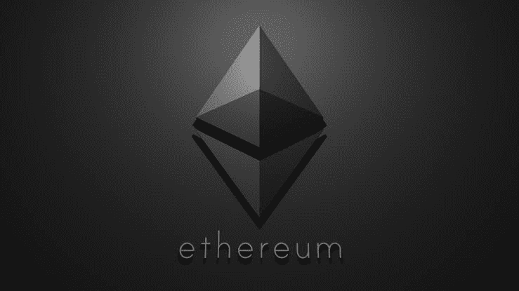

# ERC 代币终极指南

> 原文：<https://medium.com/coinmonks/the-ultimate-guide-to-erc-tokens-e830760835c5?source=collection_archive---------14----------------------->

我们可能很熟悉[以太坊](https://medium.com/u/d626b3859bc9?source=post_page-----e830760835c5--------------------------------)——一个可以在其上书写和执行智能合同的去中心化平台。它是分布式应用程序(dApps)的基础。每当开发使用区块链技术的新应用程序时，就可以创建以太坊令牌。

在本文中，将讨论各种 ERC 令牌及其实用程序。我们走吧！

**ERCs(以太坊意见征询)**

ERC 是技术文档，包含有关协议规范和智能合同描述的信息，如令牌标准、名称注册中心、库/包格式等。ERC 是以太坊应用级规范，描述了智能合约必须遵守的规则。

ERC 主要由智能合约开发者用来实现以太坊生态系统的令牌。

**ERC 代币**

代币是记录在区块链上的可编程价值单位。它们通常也是数字资产，不是区块链的主要货币。

ERC 令牌是利用以太坊区块链的特殊形式的智能合约。这意味着，每当在以太坊区块链上开发区块链技术和智能合约的新应用时，都可以创建一个新的以太坊令牌。任何人都可以在以太坊区块链上制作 ERC 令牌，但是开发者必须阐明他们的标准并获得社区的批准。它的标准化是在通过 EIP(以太坊改进提案)被社区接受后完成的。

ERC 令牌通常根据其标准或可替代性来区分。

**可替代和不可替代代币** 有了可替代代币，每一个可替代代币都是可互换的、平等的。这意味着所有可替换的令牌对于每个单元都具有相同的值。可替换令牌标准的例子有 ERC-20、ERC-223、ERC-777、ERC-827、ERC-664、ERC-667、ERC-621 和 ERC-884。

另一方面，不可替换的令牌是独一无二且不可替代的；也就是他们的价值观不同。NFT 允许像艺术这样的个体资产被标记化。NFT 的主要标准是 ERC-721，但其他标准如 ERC-875 和 ERC-998。

半可替换令牌提供了比 FTs 和 NFT 更高的灵活性。sft 在出售前保持其价值。

**ERC 令牌标准**

在令牌标准化之前，智能合约几乎无法相互通信。创建了特定的实现标准来开发令牌并在以太坊的网络上启动它。从 ERC-20 开始，ERC 令牌的标准化使智能合约之间的通信变得容易，并最终使开发人员更容易在以太坊上创建 dApps(去中心化应用程序)。这些标准有助于确保智能合约保持可组合性，这意味着新项目推出的令牌与现有的分散式交易所兼容。

现在，让我们讨论这些令牌标准及其效用。

1.  **ERC-20:** 这是最流行的标准令牌类型。它是可替换令牌的标准 API。大多数建立在以太坊区块链上的 ICO 代币都使用这个代币标准。它允许任何 dApp 或智能合约以标准方式与令牌交互，而不需要任何进一步的细节。是 2015 年提出的。

ERC-20 合同由 6 个强制功能和 3 个可选功能组成。

强制功能:

*   balanceOf():这个函数检查并跟踪每个用户钱包中的余额。
*   totalSupply():该函数显示流通中的令牌的当前总供应量。它决定了在给定项目的代币经济中将被创建用于交换的代币的总量。
*   transfer():transfer()函数允许所有者将指定数量的令牌发送到接收者的钱包地址。它用于向用户钱包初始分发令牌。这项功能是 ERC-20 代币在 ICO 中如此受欢迎的最大原因，因为它可以在 ICO 完成后轻松地向投资者发送代币。
*   transferFrom():它允许智能合约自动完成转移过程，并代表所有者发送给定数量的令牌。这使得令牌持有者能够在初始分发后相互交换令牌。假设您要向朋友发送一些$ETH，该函数获取您的以太坊钱包地址、接收方的以太坊钱包地址和正在发送的金额，然后执行交易。
*   approve():它批准将令牌从所有者地址撤回到接收者地址。这也保证了没有人可以凭空创造更多的代币，从而控制供应。这保证了经济中的总代币供应量保持不变。换句话说，这个功能是为了确保没有人能够凭空创造额外的令牌来为自己谋利。
*   allowance():这确保所有者拥有的令牌至少与 approve 函数中设置的数量一样多。此函数确保交易在添加到区块链之前有效。每当用户想要将一些令牌转移到另一个钱包时，该函数会检查发送地址是否具有至少与 transferFrom()函数中规定的数量一样多的令牌。如果不符合，则交易无效。

可选功能:

*   name():这个函数描述了令牌的名称。
*   symbol():这通常是令牌名称的缩写；它通常有 3-5 个字符长。
*   decimals():因为在 Solidity(区块链编程语言)中只能写整数而不能写小数，所以这个函数很有用。大多数代币使用 18 位小数。

包裹代币是 ERC-20 代币标准的最大败笔。当使用 transfer()函数将令牌发送到未编程为接收令牌的智能合约时，包装令牌是在智能合约中永远丢失的令牌。这些代币实际上会被记入收件人的地址，但收件人不会识别它们，它们将永远丢失。建立的大多数其他标准都是为了消除这个缺陷。数百万美元以包裹代币的形式被烧毁。

**2。ERC-223** : ERC-223 通过允许用户转移令牌来解决 ERC-20 标准的设计缺陷，但包括一个 tokenFallback()函数，该函数检查相同函数的接收合同。

这意味着，如果收件人是一个钱包地址，转移将运行就像 ERC-20；但如果接收方是智能合约，则会触发 tokenFallback()函数。如果收款合同没有这个功能，交易会失败，资金会全部退回到汇款人的地址。

ERC-223 代币也是一个优势，因为它们提高了 ERC-20s 的效率，使转账只需要一步而不是两步。这意味着 ERC-223 令牌传输更便宜。此外，ERC-223 令牌向后兼容 ERC-20 令牌，这意味着它们保持了 ERC-20 令牌的所有原始功能，同时解决了它们的缺陷。

尽管如此，ERC-223 标准还没有被开发者广泛采用。

然而，ERC-223 标准类似于 ERC-667、ERC-777 和 ERC-995 标准。

**3。ERC-667:** 该标准允许令牌被转移到智能合约，并具有在单个交易中处理接收令牌的合约触发逻辑。这个标准包含了一个新的函数——对 ERC-20 令牌合约的 transferAndCall()。可以调用此函数将令牌传输到协定地址，然后用附加数据调用协定。此函数还防止在不兼容 ERC223 的契约中包装令牌。它与 ERC-223、ERC-777 和 ERC-995 标准相关。

**4。ERC-721:** 这是非功能性测试的标准。它提供了跟踪和传输 NFT 的功能。该合同由八个强制功能和两个可选功能组成。其中大多数与《金融时报》的标准相似，但也有一些显著的区别。这个标准在 2017 年受到 CryptoKitties 的欢迎。

强制功能:

*   name():这个函数描述了 NFT 的名称。
*   symbol():这通常是令牌名称的缩写；它通常有 3-5 个字符长。
*   totalSupply():该函数显示流通中的 NFT 的当前总供应量。
*   balanceOf():这个函数对分配给所有者的所有 NFT 进行计数。
*   ownerOf():该函数通常会找到 NFT 的所有者。它检索拥有被搜索的 NFT ID 号的地址；所有权仅仅通过拥有令牌来定义。
*   approve():该函数更改或重新确认 NFT 的批准地址。
*   takeOwnership():这个函数从当前持有 NFT 的另一个地址转移 NFT。
*   transfer():当任何 NFT 的所有权发生变化时，这个函数就会发挥作用。

可选功能:

*   tokenOfOwnerByIndex():该函数允许通过用户拥有的令牌列表来搜索 NFT id；如果我们想要更多的 NFT，这是必要的。
*   tokenMetadata():该函数检索元数据，即用于标识的信息。

这个标准的主要缺陷是，要将 NFTs 发送到一个地址，需要与发送的令牌数量一样多的事务。本标准与 ERC-875 和 ERC-998 相关。

**5。ERC-777** : ERC-777 也旨在改进 ERC-20 令牌标准，并与其向后兼容。ERC-777 优于 ERC-20 的一个原因是，它还解决了包裹令牌的问题。它的优势在于它所包含的事务处理机制的广度。它还允许人们批准智能合同来代表他们移动令牌。

ERC-777 使用用户和运营商之间的布尔映射，而不是使用单位给经批准的第三方来代表用户转移令牌。这简化了语言和审批流程，降低了汽油成本。ERC-777 还包括数据传递功能。

这使得 ERC-777 具有高度的可定制性，因为它允许人们在令牌的基础上建立额外的功能，如改善交易隐私的混合器合同或在您丢失私钥时保释您的紧急恢复功能。ERC-777 为铸造和燃烧代币创建了一个标准，根据项目特定的代币经济性，这个标准可能非常有用。

ERC-777 与 ERC-223、ERC-667 和 ERC-995 有关。

**6。ERC-809** :这是竞争对手 NFT 的租赁标准。ERC-809 允许用户租用他们的竞争对手的 NFTs。如果使用 NFT 的用户阻止另一个用户同时使用它，那么它就是对手。对竞争对手 NFT 的租用访问是通过使用一组标准的命令来完成的。用户可以查看租赁交易的历史记录。它使用与 ERC-721 类似的功能，但具有更基本的租用功能，如 reserve()、access()、settle()、checkAvailable()和 cancelReservation()。

**7。ERC-864** :这是一个允许共享 NFTs 所有权的标准。它与 ERC-721 和 ERC-981 有关。

**8。ERC-865** :该标准允许用户将转移代币的能力委托给第三方。煤气费由第三方支付，但收取代币费用。它的功能与 ERC-20 和 ERC-965 相关，但有一个 TransferPreSigned()函数。

**9。ERC-874** :这一令牌标准用于加权非功能性金融资产，允许资产持有人决定如何设定他们的令牌权重。权重使 DAO 能够识别独特资产持有的价值。它与 ERC-721 有关。

**10。ERC-888** :这是一个多维令牌标准，它提出了一个多维令牌化模型，利用标识符来引用余额和数据。它与 ERC-994、ERC-998 等有关。

**11。ERC-918** :这是一个可开采令牌标准，具有标准化可开采令牌的规范，使用工作证明算法进行分发。它与 ERC-20 有关。

**12。ERC-965** :这是一种令牌标准，允许第三方转移令牌，而无需原始发送方执行链上交易。这是通过 sendByCheque()函数使用预签名消息来完成的。它与 ERC-865 有关。

**13。ERC-981** :这是一个部分所有权令牌标准。它允许用户交易一定数量的资产。然后，用户可以决定将资产划分为增加资产可替代性的单元。

**14。ERC-994** :它是一个 NFT 授权的 NFTs 标准，以类似于 DNS 的格式排列。NFTs 可以在一定的地理空间内被委托和分包。

**15。ERC-995** :该标准提供了增强的令牌转移功能，因为它允许在令牌转移前后执行转移和批准调用。

16。ERC-998 :这是一个可组合的 NFT 标准 NFTs 拥有其他 ERC-20 或 ERC-721 令牌的扩展。

17。ERC-1067 :这是一个可升级的令牌合约标准，允许在令牌合约部署后实现新功能。它为令牌契约提供了简单的可升级协议。

18。ERC-1132 :这是一个带有锁定功能的令牌标准。它允许用户在合同中对令牌进行时间锁定。该标准允许提取可用于转移的锁定和解锁令牌的令牌余额。

**19。ERC-1155** :这是金恩在 2018 年创建的多令牌标准。它允许在同一契约(FTs、SFTs 和 NFTs)中存储和创建不同的令牌，尽可能减少数据量；它更便宜也更方便。它允许合同跟踪多个令牌余额和所有权，以提高批量转移效率。

**20。ERC-1178** :这是一个多级令牌标准，适用于具有多个令牌类别的令牌合同。

**21。ERC-1190** :这是一个不可替代的版税令牌标准，适用于向原创者或所有者或两者支付数字资产的版税。

**22。ERC-1203** :这也是一个多级令牌标准，适用于具有多个令牌类别的令牌合同，但也兼容 ERC-20。

**23。ERC-1238** :这是一个不可转让的令牌标准，代表徽章。徽章是一种令牌，一旦分配就不能转让。徽章可以通过时间积累和赌注。

photo via blockchain-council.org

随着以太坊区块链上更多令牌标准的建立，我们将继续看到对标准 ERC-20、ERC-223 和 ERC-777 令牌标准的改进和偏离。

除了 ERC 标准之外，还有其他标准。但是每种令牌标准都有其用途、优点和缺点。区块链项目必须确保所使用的令牌类型或标准为其用户提供最大价值。

> 交易新手？尝试[加密交易机器人](/coinmonks/crypto-trading-bot-c2ffce8acb2a)或[复制交易](/coinmonks/top-10-crypto-copy-trading-platforms-for-beginners-d0c37c7d698c)