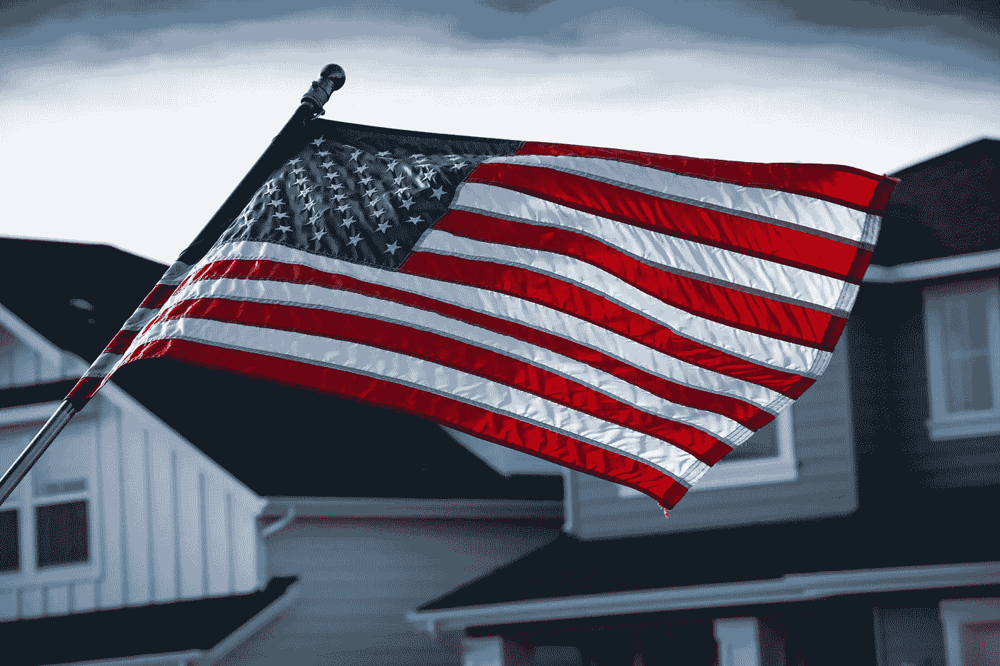

# 美国再次上调美元基准利率，此次上调幅度为 0.75%，至 3.75%-4%，为 2008 年 1 月以来的最高水平

> 原文：<https://medium.com/coinmonks/the-united-states-has-once-again-increased-its-benchmark-interest-rate-for-dollars-this-time-by-0-7-d2c2c1ae1bc9?source=collection_archive---------13----------------------->

Source photo [Close-Up Photography of American Flag · Free Stock Photo (pexels.com)](https://www.pexels.com/photo/close-up-photography-of-american-flag-1069000/)

周三，美国联邦储备理事会，世界上最强大的中央银行，投票决定连续第四次提高利率，提高 0.75%，同时也暗示利率可能发生变化…