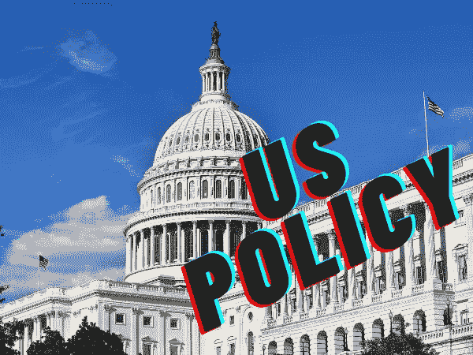

# 美国最近的加密政策概述

> 原文：<https://medium.com/coinmonks/the-united-states-has-recently-bombarded-us-with-a-sloth-of-reports-regarding-cryptocurrency-346d52669258?source=collection_archive---------21----------------------->

[For the best Crypto News in the world, visit TheCoinSphere.com](http://thecoinsphere.com/)

美国最近用大量关于加密货币的报道轰炸我们。共有 3 份报告和 8 份出版物，来自 6 个不同的政府机构，共 244 页。这可能有点让人不知所措，所以精灵来了，让你轻松搞定！

# 财政部