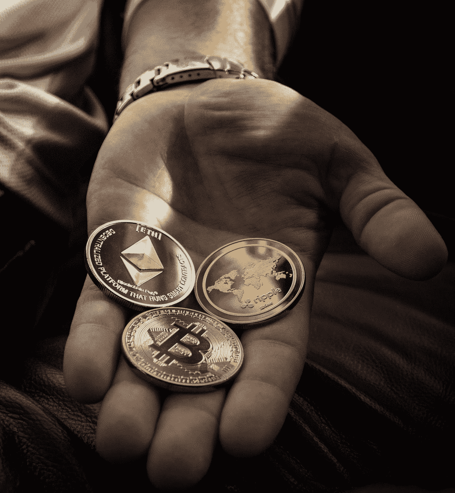
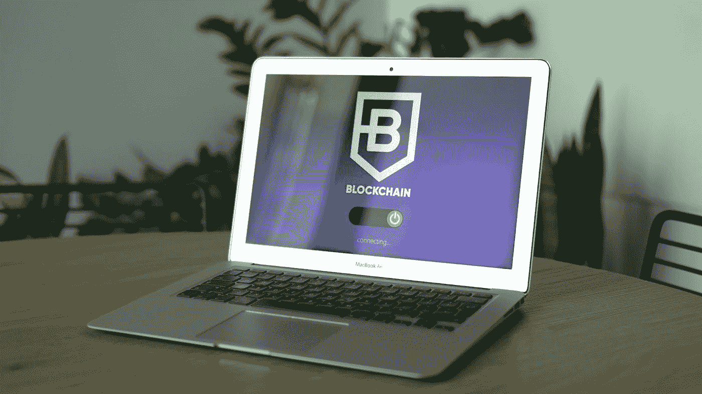

# 区块链三难之谜未解

> 原文：<https://medium.com/coinmonks/the-unsolved-mystery-of-the-blockchain-trilemma-1a468073ccee?source=collection_archive---------18----------------------->

区块链技术在三个核心属性上蓬勃发展:安全性、去中心化和可扩展性，俗称“区块链三难困境”。

三难困境是区块链的三重奏，有时是我们在发表这篇文章之前拥有的每一个区块链生态系统的诋毁者。由于没有任何有记载的区块链能够超越这个问题，也就是说，没有任何区块链生态系统可以预期地吹嘘在它们的顶点拥有这三个品质，他们被判为为了另外两个而牺牲其中一个属性。

事实上，大多数可操作的区块链都有这些属性(1-0-1，0-1-1)。

也许你对这件事一无所知。让我们浏览一下这些属性，看看其中任何一个属性的缺失会如何影响整个系统。

**了解三难困境**

[**Photo by Morthy Jameson:**](https://www.pexels.com/photo/macbook-air-on-brown-wooden-table-9577252/)

中本聪在 2009 年创建的电子点对点现金转账系统比特币的出现，是一项推动世界采用区块链技术的发明。从那时起，这项技术就一直在不停地传播，许多创始人也纷纷效仿，推出了自己的产品。

以比特币为例，它是一个密码加密链，使用 SHA-256 哈希函数编写，用于在 Merkle 树上存储交易数据。

比特币带来了去中心化和安全性，但也有一个突出的问题。比特币区块链不可扩展，因为它平均每秒只能处理 7 笔交易，阻塞时间为 10 分钟。现在，那是很长的时间。

让我们仔细看看这三个因素。

**分权**

区块链技术被宣传为 DLT(Distributed Ledger Technology)，它将权力从政府和集中式公司分散到一个分布式主体(称为“节点”)。这种模拟为实现用户数据的透明度和用户之间跨境交易的便利性铺平了道路。

我喜欢称之为“区块链的民主”，“去中心化”带走了审查的瘟疫，这是目前 Web2 空间中一个迫在眉睫的问题。

决策权分配给社区中的每个人，或者在某些情况下，分配给可以行使 51%权力的个人，这可以影响核心决策。完全权力下放的问题仍然是一个牵强的现实。相反，我们只能满足于提供最佳分权形式的链条。

**安全**

区块链安全就像任何一种安全一样，对于用户和公司之间信任的整合至关重要。

这是区块链抵御外部攻击或任何其他形式篡改的能力。

为什么区块链安全很重要？

它是连接这种关系的核心属性。一旦桥梁被破坏，用户对公司的信心就会消失。

近年来，有报道称一些区块链、交易所和公司遭到了骗子的攻击。

有一种说法是，“一个依赖于提高可伸缩性的区块链将会在安全上遭遇一个铰链。”

**可扩展性**

任何区块链网络的可伸缩性都利用其处理大量事务输出的能力。

早期的区块链，如比特币和以太坊，为了去中心化和安全性而牺牲了可扩展性。

比特币平均运行 7 txns，而以太坊处理 35 txns。

在您意识到像 Visa 这样的金融网关处理 24，000 笔庞大的交易之前，这可能看起来不像是一个萌芽中的问题。

对于区块链来说，要获得广泛的采用，它需要与现有的金融服务提供商一起扩展。

由于这些限制，开发人员开始构建所谓的“第 2 层扩展解决方案”，例如，分片、照明网络和 Zkrollups。

这些解决方案基本上建立在原有的第 1 层区块链之上，但是有人声称这些第 2 层解决方案并不安全或分散。

有人声称，节点验证器较少的区块链比节点较多的区块链有更快的事务处理时间。例如，像 Avax、Cardano 和 Solana 这样的连锁店验证器较少，但交易时间更快。

这背后的科学原理是，当一个事务的验证器越来越少时，验证时间就会大大减少。

我们有索拉纳坐在令人难以置信的 65k TXNs，但索拉纳的[安全](https://finbold.com/solana-wipes-out-almost-1-5-billion-in-a-week-as-network-related-hacks-mount/)是一个主要问题，因为它近年来遭受了如此多的攻击。

隧道的尽头有一盏灯。随着以太坊 2.0 的合并，它试图将链扩展到 100k txns，这仍在进行中，因为链正在逐渐卸载到其利益证明(POS)系统。

**结论**

区块链爱好者一直在寻找一个能够超越这些限制的区块链生态系统。

还没有，“也许在不久的将来，我们会不知疲倦地称之为“天选之子”。"

区块链行业仍然非常年轻，现在是这些连锁店为其落后的属性提供解决方案的时候了，因为区块链不断获得更广泛的采用。

你喜欢读这篇文章吗？

我为区块链的初创公司写内容，在开发者和用户之间架起一座桥梁。

联系我-[AdetolaO@hotmail.com](mailto:AdetolaO@hotmail.com)

[Linkedin](https://www.linkedin.com/in/adetola-ogunsanya-7634901aa/) ， [Twitter](http://www.twitter.com/zoeyhs_) 。

请鼓掌，并提出你可能有的任何问题。

> 交易新手？试试[密码交易机器人](/coinmonks/crypto-trading-bot-c2ffce8acb2a)或[复制交易](/coinmonks/top-10-crypto-copy-trading-platforms-for-beginners-d0c37c7d698c)