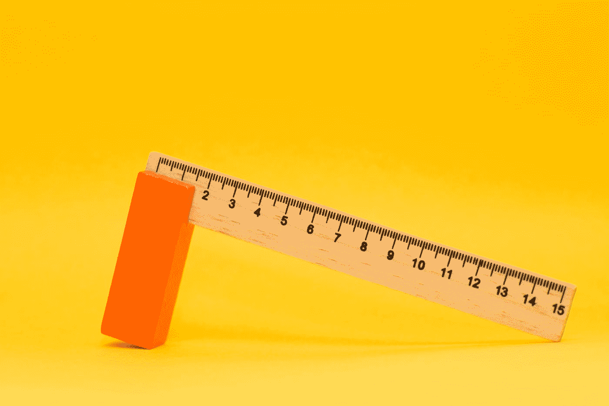

# 美国稳定币法案即将出台

> 原文：<https://medium.com/coinmonks/the-us-stablecoin-bill-is-coming-soon-eec123dcfb94?source=collection_archive---------50----------------------->

Photo by [Markus Spiske](https://unsplash.com/@markusspiske?utm_source=medium&utm_medium=referral) on [Unsplash](https://unsplash.com?utm_source=medium&utm_medium=referral)

是的，我们正在谈论美国稳定硬币法案。该计划将通过央行发行的 CDBCs 逐步调节稳定的美元储备货币盯住美元的政策。其目的是结束目前法定主导的金融体系，创建一个多样化的全国性银行体系，并配备集中的清算和结算中心。稳定硬币法案将实施这些变化以及限制…