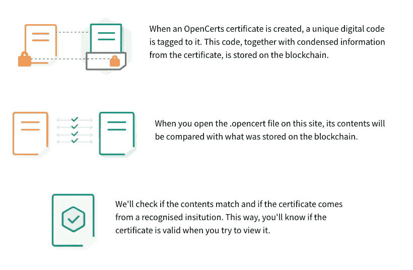

# 去中心化区块链的价值

> 原文：<https://medium.com/coinmonks/the-value-of-decentralised-blockchain-e25cb8057460?source=collection_archive---------19----------------------->

*我对公共区块链的核心价值主张的看法，以及什么将推动下一波大规模加密的采用*

在过去一年左右的时间里，我遇到了许多区块链去中心化的牛市和熊市案例，它们都相当两极化。区块链不可能同时“改变世界”和“成为一个骗局”，对吧？作为这一领域的参与者，我自然更倾向于区块链采用，但同时，我认为区块链在实现大规模采用之前还有很长的路要走。这并不意味着它不能。把握和权衡利弊的能力会让你保持客观和清晰。这是我试图将我对去中心化区块链的价值的想法合理化，以及我们如何将它们应用于金融投机之外的实际案例。

在本文中，我们将探索区块链的两个使用案例:

1.  区块链作为一个抵制审查，可验证的真理来源
2.  全球标记化标准的能力

# 可证实的真相来源

反对区块链的一些论点是，它只是另一个昂贵的数据库。由于分散化，从区块链存储或检索任何东西自然会更慢、更贵。这就是为什么许多 NFT 没有将它们的图像存储在区块链上的原因。然而，与其使用区块链作为信息存储，我认为它更有潜力作为一个安全和可验证的层。

这可能是一些关于区块链的词汇。这个想法是，通过去中心化，一个统一的分类账由一堆节点同时维护。要更改或撤销已经发生的操作，必须编辑所有现有的分类帐副本，这在客观上比更改一个分类帐更难。考虑到假设有激励个人或多个公司维持这个分类账，这是很棒的。为了这篇文章，我们将假设区块链目前的状态是足够分散的，不会受到 Sybil 攻击。

Image from OpenCerts

有了这种能力，公司可以使用区块链作为“验证层”来验证用户的敏感信息。与加密技术相结合，区块链可用于认证诸如证书、资格等信息，而不会将底层信息暴露在公共网络上。这方面的一个例子是 OpenCerts，用户可以在一个无缝的过程中发布和验证他们的证书。这不仅允许认证的数字化，还允许系统之间的互操作性。即使你有来自不同组织的不同认证，它们都能被区块链快速验证。

然而，区块链不是未经许可的吗？问题是任何人都可以向区块链发布信息，那么如何阻止其他人发布欺诈性信息呢？我们如何设定区块链上哪些数据是真实的标准？严格来说你不能。对我来说，这更像是一个网络效应问题，而不是区块链问题。任何人都可以开发出和 OpenCerts 一样的系统，但是信任和使用他们的标准取决于权威机构。政府机构和教育机构等机构越多地使用这一系统，它就变得越可信。最终，中央机构仍需保持开放的态度，将区块链纳入其体系。好消息是，OpenCerts 正在与许多新加坡大学和政府公司合作，这可以为许多新加坡人建立可验证的数字证书。

从这个例子中我们可以看到不变性是多么强大。除了教育证书，其他分类帐，如身份证明、健康记录等也有可能使用区块链作为验证层进行数字化

# 全球令牌化标准

Tascha Labs Website

这是我第一次从 Tascha 实验室听到的概念，所以请在下面的参考资料中查看她的观点。作为一名来自 defi 领域的加密专家，我亲眼目睹了标记化的威力。任何人都可以在同一标准下部署令牌，这意味着我们可以轻松创建任何价值单位的市场。这种显式表示使任何人都有能力凭空创建一个令牌，并根据其用例赋予它一定的值。我们已经在我们的 yield farming Ponzi、play-to-earn 游戏和密码世界的更多实验中看到了这一点，这使得猖獗的金融投机在公开的区块链(有足够的流动性)之前不可能达到的规模。当然，这些庞氏骗局最终会失败，但这并不能抹杀这样一个事实，即令牌化有可能成为刺激增长的伟大经济工具，尤其是在需要巨大网络效应的企业中。

很多公司依靠网络效应。一个典型的例子是二手商品的数字市场。建立市场的基础设施是容易的部分。但是你如何吸引最初的卖家在市场上列出商品呢？从而吸引买家使用该平台。这是一个典型的先有鸡还是先有蛋的问题，任何依赖网络效应的产品都会有这个问题。对此最简单的答案就是砸钱，但是对于那些根本没有资源的公司来说，这是不可能的。通过令牌化，你可以获得公开区块链的二级流动性，从而人为刺激问题一方的需求。

忠诚度计划就是一个简单的例子。这些奖励存在于今天的许多产品中，想想你的 kris 飞行里程或你的信用卡积分。通过忠诚度计划，价格被分成几个等级，用户使用产品越多，收取的费用越少，从而增加了产品的利润。产品可以支持的定价层次越多，产品的预期利润就越高。这是假设较贵层的用户无法利用较低的价格。这也是为什么不允许用户出售他们的忠诚度积分，以确保只有最高使用率的用户才是这些折扣的目标。

那么，为什么会有人想要对他们当前的系统进行令牌化呢？毕竟，象征性的忠诚计划意味着你可以获得所有层级的补贴，消除价格歧视，并减少利润。但论点是，随着令牌化和获得二级流动性，这种额外的激励将增加所有价格水平的需求，这有可能增加整体用户增长。这正是在加密货币领域看到的行为，从协议到第 1 层的每个人都分发大量的令牌激励，以增加对块空间的需求。当然，我们看到的大部分需求并不具有粘性，但这并不能否认这样一个事实，即当被正确的公司使用时，标记化可以成为一个强大的工具

Tascha 强调了符号化工作的一般条件

1.  具有某种产品市场契合度的功能性产品:令牌化有助于增加短期需求，但除了短期利益，用户还需要享受产品并长期使用
2.  你的边际成本随着规模的扩大而降低:由于令牌化有望推动你的增长，你的产品必须能够受益于网络效应，并在规模扩大时降低成本
3.  你处于一个巨大的潜在市场:这个市场应该有足够的空间，通过令牌化来有意义地增加需求
4.  你的商业模式可以清楚地定义你的令牌的效用

# “潜力”

以上的想法只是我相信区块链的用法可以到达大众的一些方法。但请记住，我完全是在抽象加密货币的价格影响。那么，如果全球都采用区块链作为验证层，会怎么样呢？我不知道这对 BTC 和 ETH 的价格意味着什么。

此外，对于任何新生的技术，很多只是谈论其潜力，仍然承担着巨大的执行风险。鉴于该行业的发展速度，我也预计未来几个月这种情况会发生很大变化，但这也是令人兴奋的地方。

令牌化可能是一把双刃剑，增强你的网络效应的能力也意味着你可以在公开的区块链获得流动性。这也是为什么我们在空间中看到如此多的恶意行为者向普通用户泵送和倾倒狗屎硬币。随着熊市如火如荼，许多骗局被清除，我希望看到更多用户理解去中心化区块链的价值，以及它如何融入当前的商业模式。我们可以愤世嫉俗，称之为骗局，或者我们可以思考如何使用这个强大的工具做好事。

# 参考

[https://taschalabs . com/utility-tokens-from-real-business-will-drive-next-wave-of-crypto-adoption/](https://taschalabs.com/utility-tokens-from-real-businesses-will-drive-next-wave-of-crypto-adoption/)

https://www.opencerts.io/

 [## JavaScript 不可用。

### 编辑描述

twitter.com](https://twitter.com/TaschaLabs) 

> 交易新手？试试[密码交易机器人](/coinmonks/crypto-trading-bot-c2ffce8acb2a)或[复制交易](/coinmonks/top-10-crypto-copy-trading-platforms-for-beginners-d0c37c7d698c)