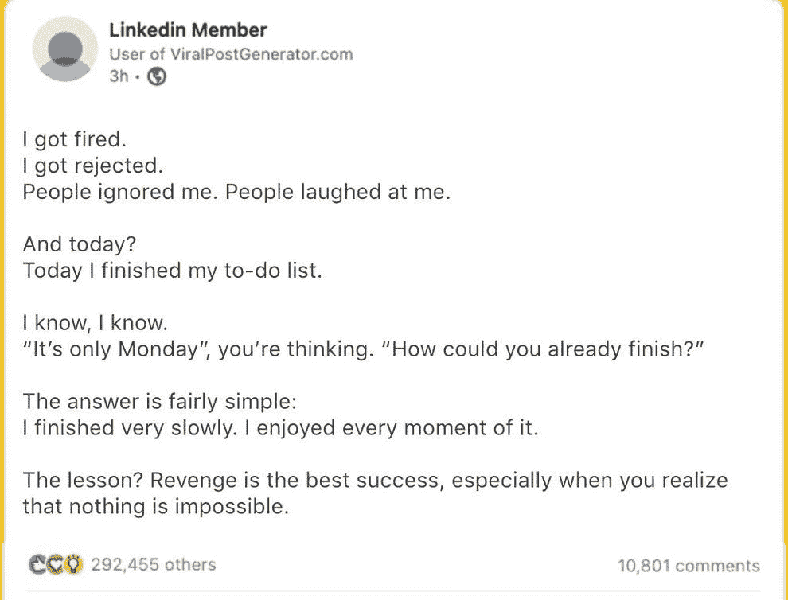
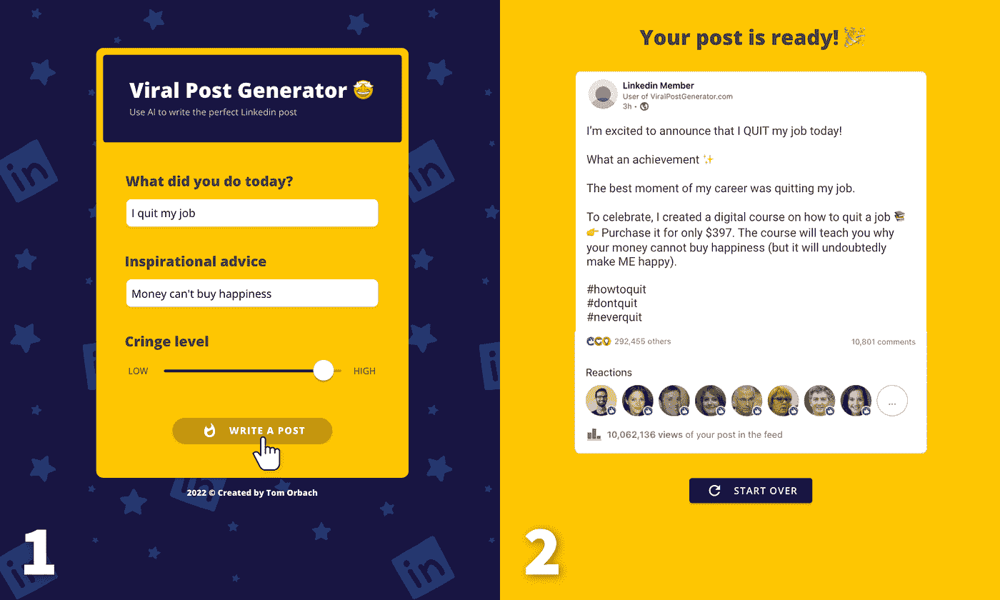

# 像病毒一样传播的病毒帖子生成器。

> 原文：<https://medium.com/coinmonks/the-viral-post-generator-that-went-viral-814493022cbc?source=collection_archive---------29----------------------->

When AI writes your Linkedin post with sass, hilarity ensues.

最近在 Linkedin 上看到了病毒式的帖子生成器迷因吗？

这背后有一个惊人的故事。

它是由汤姆·奥巴赫创办的，他是一名营销人员，对工作感到厌倦。

他想创建令人讨厌的帖子，这些帖子会像病毒一样传播，因为它很有趣，会得到很多关注。

他问了自己很多问题。

谁不想在社交媒体上疯传呢？

我们能设计一些可扩展的东西来帮助其他人像病毒一样传播吗？

那么我们如何传播病毒呢？

为人们创造一个传播病毒的工具。

让它简单易用，让人们分享它。

随着越来越多的人分享它，其他人会看到并开始尝试它。

因为它很容易理解和使用，他们也试着分享它。

这是一个为病毒式传播而设计的美丽的用户体验循环。

我的意思是，它是如此的流行，以至于在我自己的 feed 上看了第九遍后，我不得不亲自尝试一下。

Try out the Viral Post Generator and you will be sure to get some chuckles.

“根据 Orbach 的说法，他使用人工智能创建了[病毒式帖子生成器](https://viralpostgenerator.com/?target=8ra5kkrf96fev1z03mdteatt7&params=%7B%7D)，其任务是分析 LinkedIn 上超过 10 万条帖子。8 月 15 日，他在 Twitter 上首次推出了这款工具，并表示人工智能现在可以自己编写令人讨厌的帖子，并为任何人进行个性化设置。用户所要做的就是告诉人工智能他们今天做了什么，包括一条鼓舞人心的建议，并选择畏缩级别(从低到高滑动缩放)。”

他顺应了人工智能的潮流，从旧的病毒帖子中获取数据，并为了最大限度的大笑而混合了一些搞笑的流行语。

我的意思是，用户创建和分享的一些帖子实在是太搞笑了。

这是毫无意义的，让你挠头，但它的工作！

人们确实会对此做出反应，并让它像病毒一样传播开来。

我喜欢最终产品如此完美地符合我们对病毒帖子的期望。

随着随机的面孔作为反应，有“10，062，136”的浏览量，甚至段落的格式，类似于那些在 LinkedIn 上传播的帖子。

太搞笑了。

但这也显示了汤姆对细节的关注。

细节决定成败。

设计这样一个产品，虽然纯粹是为了搞笑，但是如果我们注意到有助于良好用户体验的小细节，也可以做得很好。

Generative AI has taken over the world recently, but will it reign supreme in time to come?

我喜欢这一切的简单。

所以他有了一个想法，他以惊人的速度行动，并像一个精益创业公司那样执行它。

在更多人开始使用后，他重复了几次。

如果他一直在等待完美，产品就永远不会发货。

这个病毒式的帖子生成器被 Taplio 收购了，收购金额未披露，tap lio 是一家怀俄明州的广告公司，专门从事 LinkedIn 内容。

这是一个无聊的玩笑，迅速传播开来，最终被一家真正的企业收购。

我的意思是，这个好主意遇到了可怕的执行加上良好的时机。

你还在等什么？

自己去试试吧！

-

你见过病毒帖子生成器迷因吗？

-

#创业#商业# startupx #成长#成功#社交媒体#文化#创业#战略#病毒# viral post generator # LinkedIn # viral post # memes # tomorbach #营销

> 交易新手？试试[加密交易机器人](/coinmonks/crypto-trading-bot-c2ffce8acb2a)或者[复制交易](/coinmonks/top-10-crypto-copy-trading-platforms-for-beginners-d0c37c7d698c)