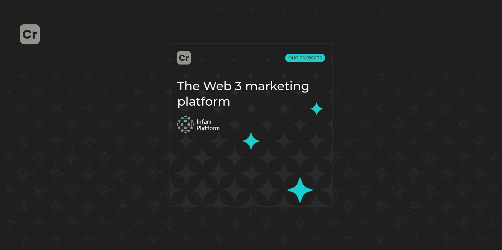

# Crypton Studio 开发的 Web 3 营销平台

> 原文：<https://medium.com/coinmonks/the-web-3-marketing-platform-developed-by-crypton-studio-dfcae592dbe6?source=collection_archive---------29----------------------->

让我们检查一下 [Infam 平台](https://medium.com/u/ff50f3012246?source=post_page-----dfcae592dbe6--------------------------------)项目案例。在那里，我们开发了一个平台，引导对加密资产的投资或直接投资区块链初创企业。

Infam 创始人在加密会议上遇到了 Crypton Studio 的首席执行官。客户已经有了一个项目的想法，所以我们的首席执行官聘请了业务发展经理，并在 [Crypton 工作室](https://crypton.studio/)开始工作。

# Infam 创始人分享了这个问题

据 2021 年统计，全美约有 4600 万人*(约占美国成年人口的 22)*拥有比特币份额。不幸的是，许多投资者都是区块链的新手，很容易被迷惑或欺骗。

这就是为什么他们需要一种新的组织形式来引导他们进入秘密投资的世界。客户联系我们解决这个问题。Infam 的所有者希望担当这个角色——为人们提供投资加密资产的便利工具。此外，所有者认为，该组织必须是值得信赖的，有一个现代化的区块链基础设施，并有利于先进的加密用户，尤其是新手。

# INFAM 生态系统的目的是什么？

该项目旨在实现智能和负担得起的加密投资，为投资者、初创公司和加密专家提供更好的服务，并形成一个社区来传播关于金融科技市场的诚实、客观和可靠的信息。

[Infam](https://infamplatform.app/) 的核心是希望为投资加密行业创建一个全面的智能分析平台，为所有三个目标用户群体提供尽可能广泛的机会:

投资者

项目

Infam 合作伙伴(影响者、大使、专家)

INFAM DAO 的主要特征之一是公平和分散的治理。所有道成员都参与政府，利润按比例在成员之间重新分配，所有关键决策都通过投票做出。此外，INFAM DAO 的一个特性是所有令牌都存储在一个公共池中，而不是成员的钱包中。因此，DAO 中的所有现金流都尽可能透明和分散。

我们的团队对[这个案例](https://crypton.studio/portfolio)非常感兴趣，我们聘请了一个业务分析师团队。他们做了评估，市场分析，并提出了分析机制。

我们意识到为这个平台开发一个基本的演示版本和 MVP 是很酷的。此外，我们决定围绕平台上的令牌部署一个生态系统。因此，我们需要开发:令牌、平台、桥梁和发射台。

我们带着软件需求规范、堆栈描述和路线图来到客户面前。店主很高兴！

# 客户批准后，团队将项目带入开发阶段。

## **前端开发者使用:**

—类型脚本编程语言，因为它的快速开发以及静态类型

—使用服务器渲染开发应用程序的 Vue nuxt 框架。

## **后台开发者使用:**

—用于构建 web 应用程序的框架 Hapi.js

—数据库管理系统 PostgreSQL

—消息代理 RabbitMQ

— Docker 可自动化部署和管理。

## **智能合约开发者使用:**

——Solidity 允许您编写智能合约，人们可以通过这些合约进行 ico、公开投票、拍卖和发行货币

— NodeJS 允许您编写智能合同、编译、测试、部署、与现有合同交互以及发送事务

— Hardhat 允许智能合同开发人员进行测试和部署，以及天然气成本估算和 Etherscan 合同验证。

# 特征

Infam 平台有一个**多链基础设施**，目前包括多边形、以太坊和币安智能链。我们使用 Hardhat 上的中继服务验证了区块链之间的传输。你可以在一个对你来说方便的区块链找到在正确的链中工作的项目和/或博客，进行交易，签署智能合同。

每个 Infam 会员都可以直接在我们的平台上进行安全透明的区块链交易。

Infam **Launchpad** 允许项目和投资者在我们的平台 Solidity 上轻松启动和轻松参与 IDO。我们的智能合同得到了很好的保护和测试，以避免黑客攻击。

此外，我们创建了 Infam 的 **INF 实用令牌**。它是一种生态系统货币，可用于平台上的赌注、交易、农业和支付。你可以在一个对你来说方便的区块链找到在正确的链中工作的项目和/或博客，进行交易，签署智能合同。

# 结果

现在，Infam 平台已经准备好为智能投资和业务推广提供广泛的工具。该平台有一个多链基础设施，目前包括多边形，以太坊和币安智能链。

此外，客户与我们分享了 Infam 平台用户的反馈:一个方便的兼容区块链的计算机集成系统，用于扩展多链方向。通过 web3 和多链账户方便地使用平台。对平台内部机制、安全交易、发帖、聊天、通信的好评。

我们非常自豪的是，该项目成功开发，并在不久的将来的结果！

# 客户的反馈

客户在其他团队中选择了我们，这要归功于 Crypton Studio 商业分析师部门的良好运作以及来自其他企业家的积极反馈。对项目进行定性评估，制定路线图和有截止日期的时间框架达到了目的。

此外，Infam 的所有者告诉我们，工作流是在最高级别上组织的:反应迅速的团队，对问题的快速响应，甚至在周末也提供支持。

当客户注意到工作就像与家人和朋友在一起时，我们的项目经理很高兴。

除了所有积极的反馈，客户还希望 [Crypton Studio](https://crypton.studio/) 能够扩大和增加机会范围。我们会听他的，我们只会成长，只会走得更远。

你想启动一个成功的区块链项目吗？我们会将任何想法和项目带入生活！[联系我们](https://t.me/crypton_studio_bot)讨论您的案例细节。

> 交易新手？尝试[加密交易机器人](/coinmonks/crypto-trading-bot-c2ffce8acb2a)或[复制交易](/coinmonks/top-10-crypto-copy-trading-platforms-for-beginners-d0c37c7d698c)