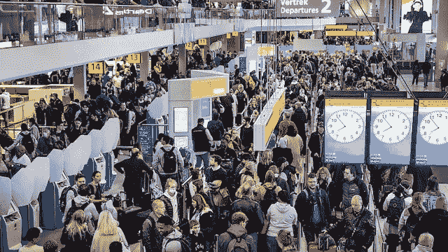

# 加密的一周:3AC 清算，索拉纳手机，市场再次暴跌(2022 年 7 月 3 日)

> 原文：<https://medium.com/coinmonks/the-week-in-crypto-3ac-liquidated-solana-phone-markets-plunging-again-july-3rd-2022-4d80cb0fe2e2?source=collection_archive---------29----------------------->

the queue at Schipol airport — July 2022

上周，当我在前往法国的途中在荷兰滞留了两天，并利用醒着的每一分钟试图找到一趟不会被取消的航班时，我被提醒了加密的潜力。

我发现一家公司的航班不太容易被取消和重新安排，但它很贵，因为…