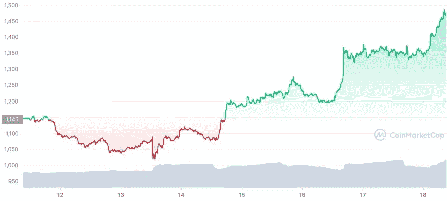

# 加密的一周:我们在风暴的中心吗？(2022 年 6 月 18 日)

> 原文：<https://medium.com/coinmonks/the-week-in-crypto-are-we-in-the-eye-of-the-storm-june-18-2022-f6fa873b3e4?source=collection_archive---------41----------------------->

## 几天的平静

ETH price from July 12 to July 18, 2022 — source: coinmarketcap.com

令人惊讶的是，在一周又一周的坏消息(崩溃、清算和其他熊市事件)之后，crypto 给了我们几天的喘息时间。

虽然 3AC、Celsius 和其他航海家的清算仍在进行(并将持续数月)，但过去几天…