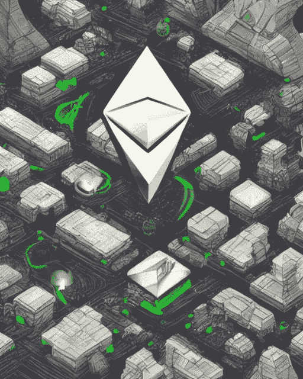

# 加密的一周:为合并做准备，通货膨胀持续，magic Eden vs . open sea-2022 年 9 月 13 日

> 原文：<https://medium.com/coinmonks/the-week-in-crypto-getting-ready-for-the-merge-inflation-persists-magiceden-vs-opensea-sept-ce0eef0c8523?source=collection_archive---------46----------------------->

AI generated image — “The Ethereum Merge is coming”

## 以太坊合并:不到 48 小时，如何准备？

以太坊的合并(又名从比特币风格的工作证明转移到环境友好的利害关系证明)还有几个小时！按照目前的哈希速率，它应该发生在晚上的某个时候，从…