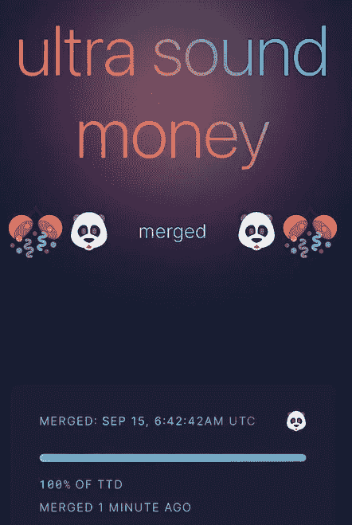

# 加密一周:合并成功，消息传出后市场下跌，NFT 价格略有上涨

> 原文：<https://medium.com/coinmonks/the-week-in-crypto-the-merge-a-success-markets-drop-on-the-news-slight-uptick-in-nft-prices-ba08891d061b?source=collection_archive---------39----------------------->

## 以太坊成功合并导致市场暴跌

Screenshot of the Merge happening in real time

备受期待的合并，以太坊放弃了工作证明并过渡到环保的利益证明，从技术角度来看，这是一个完全成功的工程壮举。转变发生在…