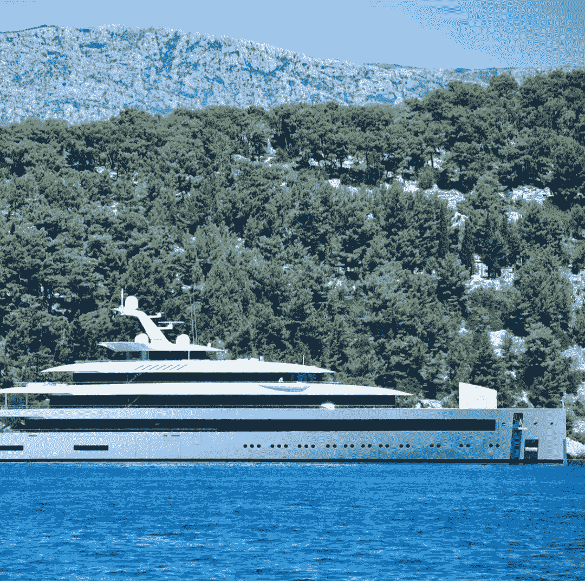

# 瓶子里的信息回顾一周

> 原文：<https://medium.com/coinmonks/the-week-in-review-by-message-in-a-bottle-fa04ffbbf91e?source=collection_archive---------64----------------------->

By [Holly Eimer](https://medium.com/u/e25f399c6d84?source=post_page-----fa04ffbbf91e--------------------------------) for [Message in a Bottle Newsletter by Lazy 8ight YC](https://medium.com/u/6dcb932fb22b?source=post_page-----fa04ffbbf91e--------------------------------)

一些投资者想知道加密熊市是否已经过去，因为比特币和以太网预计将经历自去年 10 月以来最好的一个月。据数字资产管理公司纽约数字投资集团(NYDIG)的分析师称，尽管持续上涨，但市场数据“继续表明交易者的头寸较为保守”。总体而言，研究人员强调，宏观经济环境仍然是关键。IDX 数字资产公司创始人兼首席投资官本·麦克米兰断言:“不出所料，美联储及其计划将主导今年全年。”。周五，比特币上涨 40%，至 23，890.91 美元；以太坊下跌 0.06%，至 1723.02 美元；索拉纳上涨了 0.74%，至 42.33 美元；Dogecoin 下跌 0.2405%至 0.0689 美元。

此外，上周五，彭博表示，联邦存款保险公司(FDIC)重申，它不为加密资产提供保险，这种资产可以保护消费者免受机构故障的影响。NFT 被归类为“数字资产”，与股票、债券、商品和因欺诈或盗窃造成的损失属于同一类别，所有这些都是不受保护的存款产品，没有银行保险；与支票和储蓄账户不同，后者在银行破产时受到保护。

熊市何时会转变为牛市？最近，加密货币的投资者正在问这个问题，因为在经历了整整三个月的低迷和厄运后，出现了一道暂缓的彩虹。在过去的 30 天里，以太网上涨了惊人的 50%，比特币飙升了 18%，Polkadot、Uniswap 和 Aave 等其他 DeFi 蓝筹股也取得了惊人的成就。索拉纳在过去的一个月里增加了 80%，类似于 2021 年的夏天。最坏的情况已经过去了吗？这是现在每个人都关心的问题。投资的分布发生了显著变化，不再像 2018 年那样由散户主导。

然而，在从 2018 年持续到 2020 年的秘密冬天，DeFi 的种子被播下。总部位于柏林的授权加密货币交易所 Swarm 的联合创始人蒂莫·莱赫斯(Timo Lehes)对《The Defiant》表示，“ICO 泡沫中形成的大多数企业都是建立在以太坊基础上的，当时以太坊还非常不成熟。”。"该网络没有太多真正的参与或活动。"如果 DeFi 有一个强大的基础，夏季反弹是否预示着乐观做法的回归？我们如何确定最坏的时候已经过去？应该有一个根本性的转变。“除非我们看到通胀数据下降，股票和债券市场复苏，市场情绪明显改善，否则我们无法对市场充满信心，”Lehes 补充道。

“我的建议是，寻找你认为与公司、项目或基金会相关的资产，这些公司、项目或基金会实际上正在做他们承诺要做的事情，具有强大的基本面和良好的业绩记录。”——提莫·莱赫斯，Swarm

越来越多的职业运动员将他们的收入兑换成比特币(BTC)，尽管加密货币市场暴跌，曾经成功的企业纷纷倒闭，个人零售消费者的钱包也受到影响。来自巴西的 UFC 战士 Luana Pinheiro 上周与历史悠久的加密货币薪资服务提供商 Bitwage 合作，开始将她的部分收入转换为比特币。

比特币提供基本的银行服务，即储蓄和转账，但也有许多缺点，包括不确定性和与工作证明挖掘相关的大量费用。但它提供了一条真正的“第三条道路”，既不是缓慢的政府经营的机构，也不是以利润为中心的私人机构。Twitter 或谷歌等企业提供的服务与比特币形成鲜明对比，它们故意称自己为“平台”，以营造一种开放和中立的氛围。正如我们在过去十年中所了解到的，即使是最好的 Web 2.0“平台”实际上也是一个受控的商业实体，很容易受到华盛顿政治的影响。

与此同时，纽约扬基队(New York Yankees)最近与总部位于纽约的比特币公司 NYDIG 合作，向其所有员工提供比特币支付，包括球员、特许经营工人和会计。几个运动项目的运动员正在接受比特币作为支付方式，这凸显了加密货币越来越大的吸引力。然而，他们受到了许多人的抨击，这些人认为球员不应该公开宣扬投资风险。然而，根据玩家的说法，比特币支付不会去任何地方，任何时候都不会很快。想想巴西 MMA 拳手 Matheus Nicolau。Nicolau 目前在 UFC 轻量级比赛中排名第七，他表示:“我真诚地相信，世界上越来越多的运动员和专业人士将开始接受支付，至少部分接受比特币。”

薪酬专家 Fred Whittlesey 表示，接受加密货币作为支付方式的运动员将在未来两年内越来越受欢迎。除了最近的下跌(比特币从 69，000 美元跌至约 24，000 美元)，在本文发表之时，玩家们正着眼于更长期的投资。皮涅罗补充说:“考虑一下这个:一个人通常需要 10-15 年才能在巴西柔术中获得黑带；因此，我的首选时间框架至少有这么长。我称之为“黑带时间偏好”。据 NYDIG 的首席营销官 Kelly Brewster 称，在 BTC 宣布接受付款“为运动员和团队提供了一种突出自己并展示他们有多么超前思维的手段”。"

营销人员正试图让他们的不可伪造代币(NFT)对消费者真正有用，而不仅仅是作为品牌纪念品赠送。商界领袖表示，目前对公司来说，最有希望的 NFT 计划是那些提供社区感、联系实际体验或提供激励的计划。在 Web3 咨询公司，AJ Dalal 董事总经理 Publicis Sapient 说:

“它应该是关于它在完成你的日常生活中给你的价值。”

尽管许多买家继续投资 NFT 藏品，以求获利，但 NFT 艺术品市场正被迫重新思考。今年 4 月，一家名为“看不见的北方”的营销公司在今年的科切拉谷音乐艺术节上为 NFT 的一项活动提供了现场体验。科切拉在因病毒而缺席两年后，于今年亲自回归，并售出三套非功能性测试。10 张提供终身观看年度活动机会的 NFT 最近被拍卖，作为一套。此外，第二批 1000 张 Coachella NFTs 合集的买家可以独家获得合集照片，售价 180 美元。

正如科切拉向其 NFT 持有者提供独家的 Web3(真实世界)访问权限一样，Lazy 8ight Yacht Club (L8YC。)NFT 豪华酒店公司率先将一艘 90 米长的巨型游艇整体绘制成 NFT。这种技术能力允许 L8YC 在虚幻引擎 4 中创建一个交互式游戏世界，但这种创新通过与真实世界的游艇制造商合作来创建可穿越的 1:1 NFT 真实世界游艇模型，从而延续到 Web0。随着 L8YC 的发展，他们的目标，就像一些精选的创新项目一样，是利用智能合同无缝地促进豪华酒店领域的大型金融交易。

*由于 L8YC 与现实世界中的企业有着密切的联系，因此它能够为其会员在量身定制的活动中节省大量费用。*

豪华酒店和 NFT 公司为 NFT 社区、Web2 公司、有影响力的人和个人组织活动。每个活动都是个性化的，以满足 L8YC 客户的特定需求。Lazy 8ight 利用的合作伙伴关系的一些例子如下:游艇和别墅上的活动，为贵宾组织的直升机旅行或豪华汽车护送，豪华 CBD/TBH 风格的餐饮，定制运动鞋设计，安全服务，名人露面，当然，L8YC 媒体团队为社交媒体渠道创建资产。

传统包机是完全可定制的体验，可以为全球客户进行协调。这些包机可能会被保留一天，或长达几个月。L8YC 在世界各地与 NFT 项目共同举办活动。联合主办点每个项目、每个活动的起价为 1 万美元，根据地点和活动细节而有所不同。这些活动是有益的，因为项目分担成本，允许公司相互合作和联网，同时让 L8YC 负责其他一切。此外，所有活动还可获得 L8YC 社区折扣。通过 Lazy 8ight 的奢侈品合作伙伴网络，私人奢侈品活动是可能的，为客户及其社区汇集了奢侈品活动的每个细节。对于豪华活动来说，天空是真正的极限……如果你能梦想到，Lazy 8ight 可以让它实现。

请务必访问位于[http://www.l8yachtclub.com](http://www.l8yachtclub.com)的 Lazy 8ight Yacht Club 网站，了解最新信息和可用的豪华服务，或者通过 Twitter、Discord、Instagram 和 Medium 访问社交媒体。

> 交易新手？试试[密码交易机器人](/coinmonks/crypto-trading-bot-c2ffce8acb2a)或者[复制交易](/coinmonks/top-10-crypto-copy-trading-platforms-for-beginners-d0c37c7d698c)