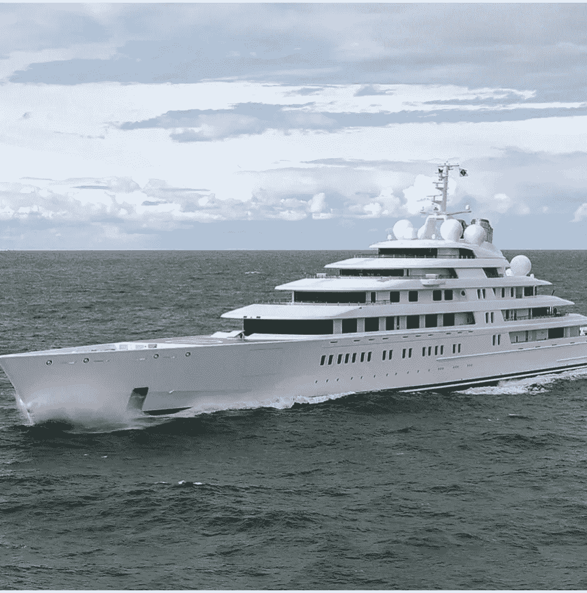

# 每周回顾密码，非功能性测试，和好客的瓶子里的消息

> 原文：<https://medium.com/coinmonks/the-weekly-review-of-crypto-nfts-hospitality-by-message-in-a-bottle-5dd89490ffbb?source=collection_archive---------27----------------------->

By [Holly Eimer](https://medium.com/u/e25f399c6d84?source=post_page-----5dd89490ffbb--------------------------------) for [Message in a Bottle Newsletter by Lazy 8ight YC](https://medium.com/u/6dcb932fb22b?source=post_page-----5dd89490ffbb--------------------------------)

周三早些时候，索拉纳的 SOL token 设法守住了一个关键的支撑位，尽管数百万美元的平台攻击导致一些投资者表达了他们的不满。通过这次黑客攻击，一名身份不明的攻击者从 Phantom 和 Slope 数字钱包中窃取了索尔、SPL 和其他基于索拉纳的令牌，价值至少 500 万美元。鉴于入侵和利用通常会导致与受害者加密系统相关的令牌价格出现两位数的下降，SOL 的损失似乎并不算大。尽管如此，对于世界上第五大智能合约区块链来说，这次黑客攻击看起来很糟糕，它承诺比以太坊更快更便宜的交易。Solana 作为以太坊区块链替代品的承诺已经被它在过去 12 个月中经历的无数次网络中断所削弱。什么支持令牌的弹性？观察人士声称，SOL 的超卖状态，以及鲸鱼对加密货币的持续所有权，正在支撑着它。

纽约州金融服务局(New York State Department of Financial Services)已对 Robinhood 的加密货币部门罚款 3000 万美元，这是该公司面临的一长串问题中的最新一起。该机构对 Robinhood 处以数百万美元的罚款，称其违反了该州的反洗钱和网络安全立法，这是其首次专门针对加密货币行业的执法行动。根据金融服务部门的通知，监督检查发现该组织的合规制度存在严重缺陷。

据主要新闻媒体报道，在最近的经济动荡中，智利人在稳定的城市中找到了避难所。居民选择稳定的货币，以保护他们的钱免受最近创纪录的通货膨胀和比索持续贬值的影响。在过去的三个月里，地区加密货币交易所的稳定货币交易增长了 50%。

著名占星家 Susan Miller 讨论了 NFT:她首次涉足 Web3 是占星家收集的生肖主题不可替换令牌(NFT)和令牌门控 Discord channel。周三，多边形区块链将举办 12，000 个亲民党收藏品的发布会。

在为一只专注于 Web3 和区块链投资的新基金筹集了 5 亿美元两个月后，加密货币交易所币安任命联合创始人易和领导其风险投资部门币安实验室。根据一份新闻声明，专门从事早期投资的币安实验室监管着 200 多个投资组合项目和 75 亿美元的总资产。投资组合公司包括安全公司 CertiK、加密货币交易所 FTX 和以太坊侧链多边形。

易将负责币安实验室的日常运营和整体战略，重点是支持基础设施项目，提高加密货币和区块链项目的实用性。周三，币安首席执行官赵昌鹏在接受美国有线电视新闻网采访时表示，易建联“非常雄心勃勃”，将在不久的将来进行“大量投资”。他补充说，币安打算继续扩大其员工队伍，目标是在年底前将员工人数从目前的 6000 人增加到 8000 人。

美国银行在一份研究报告中表示，它拒绝经常听到的相反指控，并认为区块链和在其上运行的应用程序 ***具有内在价值*** 。今年迄今，以太坊区块链的交易费收入约为 39 亿美元，去年约为 99 亿美元。周五发布的统计数据表明，去年的总数比前一年增加了 1，558%。

根据分析，今年迄今为止，比特币区块链已经产生了约 9300 万美元的费用，而去年全年的费用约为 10 亿美元。据该银行称，由于持有人“离场观望”，以太坊交易费用今年迄今可能已经下降。自从实现更快和更小的比特币(BTC)支付的闪电网络实施以来，比特币的成本可能已经下降。

根据美洲银行的说法，因为区块链是一项“新兴业务”，所以目前不可能预测现金流。区块链通过收取交易费来验证使用本机令牌进行的交易或运行在区块链上的应用程序进行的交易，从而产生收入。根据这份报告，区块链拥有强劲的用户发展和增长，以及独特的使用案例，可以看到交易费形式的现金流加速。

想象一下，花数百万美元购买一个猴子形象，却被人从你的电子钱包里抢走。这正是演员赛斯·格林所经历的，他最终不得不乞求黑客把 NFT 还给他(可能为此支付了 10 万多美元)。格林的情况比人们想象的更典型，这就引出了一个问题，当这种情况发生时，NFT 平台是否应该帮助他们的客户寻求补救。在一个以自主、透明和自我主权为基本价值观的行业，打击盗窃和行使所有权极具挑战性。Upstream 的创始人兼首席执行官 Alex Taub 声称，NFT 投资者仍然需要对保留他们购买的数字资产感到安全。

“使用加密技术，安全性真的很难。人们失去了他们的种子短语，他们的导出密钥，他们点击了一个不好的东西，他们签了字——那个人可能会拿走很多东西……有时，当你半睡半醒时，你正在毁灭滚动，你点击了一个不好的链接，一切都结束了，”陶博说。Upstream 将自己描述为开发 Dao(去中心化自治组织)的全栈、无代码平台，并在 3 月份筹集了 1250 万美元的最新一轮资金。该公司最近发布了一款名为“Vault DAO”的新产品，Taub 声称通过利用其在 DAO 工具方面的专业知识，该产品将提高 NFT 持有者的安全性。

安全性绝不是加密中的新问题，但是可用的解决方案，特别是对于个人来说，是不够的。例如，硬件钱包为用户提供了一种安全的方式，将钱包的私钥保存在实际上是硬盘的驱动器上，但这些“冷”钱包并不太受用户欢迎。Taub 还指出，丢失访问加密货币所需的种子短语就像丢失硬件钱包一样容易。另一个选择是“热”钱包，这是在线的，但 Taub 说他不会在一个钱包中存储任何珍贵的资产，因为大多数 NFT 解决方案都是托管的或由一个集中的组织运营。Taub 补充说，他担心存储在热门钱包中的贵重物品可能会因连接问题而消失。

Taub 表示，Vault DAO 解决方案与 MetaMask 和 Rainbow 等流行钱包以及 WalletConnect 网络相接口，使用户能够将“冷”存储中的商品连接到他们的 Vault DAO。至于这些资产的实际持有地点，陶博补充道。“最终，无论是你的 NFT 还是你的加密货币都不在我们手中。Taub 解释说:“这个多重签名钱包是你完全可以使用它的地方。我大概是这样看的:我感到安全，因为我知道我在防止不小心点击了一个链接，丢失了我所有的东西，也因为我知道我仍然拥有它们。

根据专注于数据的风险投资公司 Telstra Ventures 的一份新报告，terraUSD (UST) stablecoin 的崩溃，加密货币贷款人 Celsius 的破产，以及对冲基金 Three Arrows Capital 的清算，都是导致加密熊市的因素。尽管有这些因素， ***Web3 开发者的兴趣一直居高不下*** 。这份题为“区块链开源开发者标志着 Web3 社区的力量”的分析研究了 Solana，Ethereum 和比特币区块链上的开发者活动。数据研究人员从各种来源收集信息，包括代码库 GitHub，以检查整个链中为超过 30，000 个开源项目做出贡献的 1，000 家活跃公司。

Telstra Ventures 的普通合伙人萨阿德·西迪基(Saad Siddiqui)表示:“我们查看了 GitHub 知识库每月活跃贡献者的数量，我们注意到，尽管过去几个月价格大幅下跌，但(贡献)总体上仍相当强劲。”“最常见的贡献仍然是以太坊和比特币。茄果类的降幅稍大一些，但远不及价格下降的预期。

为什么最高的月活跃贡献者减少发生在索拉纳？澳大利亚电信数据科学部门负责人乔纳森·塞尔法蒂(Jonathan Serfaty)表示，“我的印象是，严格说来，比特币和以太坊社区已经存在很长时间了，他们以前也面临过这样的低迷。他们有一个由开发人员和合作者组成的核心团队，这个团队和他们一起度过了困难时期，并且还在扩展它。

Web3 开发人员最喜欢的行业在调查中没有被挑选出来，但是 Siddiqui 强调了支持应用程序开发的工具项目的重要性。塞尔法蒂对此表示同意，他说:“我认为，从广义上讲，我们看到了区块链领域正在生产的三种应用程序。”重新设计当前系统是第一步。第二种涉及老牌传统企业，它们将区块链用于自己的内部用例，并创造新的收入来源。第三个是面向熟悉加密货币的人的区块链应用。

Lazy 8ight Yacht Club (L8YC)了解到，世界上只有大约 3%的人了解加密、NFTs 和区块链提供的实用程序。这家 NFT 豪华酒店公司专注于通过频繁的 Discord AMAs 和 Twitter 空间，以及通过其用户友好的网站教育其他 97%的人口，网站上有 Web0(真实世界)游艇船长和酒店合作伙伴回答问题。人们通常害怕他们不知道的事情，因此 L8YC 的目标是完全*，在与成员的交往中利用*。**

**除了 Web0 中的私人豪华活动和独一无二的可穿越大型游艇 NFTs，L8YC 还通过其独家酒店合作伙伴关系提供前所未有的游艇服务和独特体验。L8YC 经验丰富的内部销售团队协助满足游艇销售需求，无论是购买第一艘游艇，还是更新换代。L8YC 专家指导客户的每一步，Lazy 8ight 经验丰富的船长还提供一对一的定制咨询，包括虚拟和面对面咨询。NFT 和豪华酒店公司为船主提供各种各样的帮助，如机舱 101、导航、船坞咨询和海上安全。L8YC 会员可以在 L8YC 的一艘游艇上享受一日游，起价仅为 300 美元。拥有全天和半天两种选择，持有者可以享受超过 500 天包租游艇的大幅折扣，无论是在美国还是在国际上。L8YC 的内部包机经纪人团队帮助规划完美的包机，无论是在米克诺斯岛过夜游览，还是去阿拉斯加旅行一周。Lazy 8ight 设计一切，从路线和活动，下至船只本身，同时协商最佳价格。**

**此外，Lazy 8ight 还提供私人厨师服务。他们的餐饮合作伙伴，草药厨师，策划了令人难忘的高端之夜，选择 CBD & THC 注入，以改善多菜餐。Chris Sayegh 和他的团队为活动提供豪华餐饮，提供鱼子酱站、生海鲜吧、豪华自助餐、顶级牛肉切肉站、国王三文鱼片等选项。L8YC 现在也很高兴通过他们的合作伙伴 Security & Consulting 以及他们由经验丰富的军事特种作战人员、前执法人员和情报界退休人员组成的团队来提供活动安保。Lazy 8ight 的安全合作伙伴利用广泛的培训来确保活动的安全，同时为全球的知名客户、贵宾、精选企业和组织提供最高质量的近身保护、监控和应对措施计划。**

****请务必访问 Lazy 8ight 游艇俱乐部的网站**[**【http://L8yachtclub.com】**](http://L8yachtclub.com)**进行造币和豪华接待服务查询，或访问他们在社交媒体上的 Discord、Twitter、Medium 和 Instagram 页面，了解最新的 L8YC 新闻。****

> **加入 Coinmonks [电报频道](https://t.me/coincodecap)和 [Youtube 频道](https://www.youtube.com/c/coinmonks/videos)了解加密交易和投资**

# **另外，阅读**

*   **[Bookmap 点评](https://coincodecap.com/bookmap-review-2021-best-trading-software) | [美国 5 大最佳加密交易所](https://coincodecap.com/crypto-exchange-usa)**
*   **[如何在 FTX 交易所交易期货](https://coincodecap.com/ftx-futures-trading) | [OKEx vs 币安](https://coincodecap.com/okex-vs-binance)**
*   **[CoinLoan 评论](https://coincodecap.com/coinloan-review) | [YouHodler 评论](/coinmonks/youhodler-4-easy-ways-to-make-money-98969b9689f2) | [BlockFi 评论](https://coincodecap.com/blockfi-review)**
*   **[XT.COM 评论](https://coincodecap.com/profittradingapp-for-binance)币安评论 |**