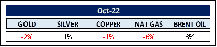

# 我们在 2022 年 10 月看到的世界

> 原文：<https://medium.com/coinmonks/the-world-as-we-saw-it-in-october-2022-9e70511580e4?source=collection_archive---------21----------------------->

**Make-it 资本版#26**

**加密货币的世界**

10 月份，在过去 11 个月遭受重创的加密市场迎来了可喜的复苏。总市值上升 660 亿美元，重新测试 1 万亿美元大关。

以太坊(ETH)的表现超过了比特币(BTC ),这在很大程度上是由于 ETH 自 9 月份里程碑式地转向股权共识(PoS)以来经历了第一个通缩月。比特币价格不断创出历史新高(ATHs ),考虑到比特币价格下跌和电费创纪录高位的双重打击，这一点尤为突出。年初至今，hashrate 已经上涨了大约+52.95%，而且还没有结束的迹象。虽然更高的 hashrate 使矿工的生活更加困难，但它对工作验证(PoW)共识系统的整体安全性确实是积极的。

尽管一年中损失了大约 140 亿美元，但备受讨论的 stablecoins 在加密领域的市场份额翻了一番，从 7.3%增加到目前的 14%。尽管在总价值锁定(TvL)分散融资(DeFi)协议中损失了 800 亿美元，但它们各自的市场份额仍稳定在 7%。

根据 **Glassnode** 的链上数据，加密交易所持有的比特币交易量创下历史新低。越来越少的投资者希望放弃他们的比特币。一对与日俱增的机构牵连( ***签证*** *，* ***万事达卡*** *，* ***大本营*** *，* ***查尔斯·施瓦布*** *，* ***保真*** *，以及* ***黑因此，我们确实预计，一旦鹰派转变为鸽派，释放利率压力，市场将达到之前的高点。毕竟，套用一句**奥马哈先知**的智慧:“利率之于资产价格，就像重力之于苹果。”***

**商品的世界**

黄金和白银在 10 月份表现平平，今年以来均大幅下跌，跌幅分别为-10.5%和-18%。

从历史上看，贵金属在通胀时期表现良好。也许这一次真的不同，因为我们不像理查德·尼克松在 1971 年废除钉住黄金之后的上一次大通胀周期那样，应对由货币疲软引发的通胀。1978 年，美元指数从 120 跌至 83，跌幅约为-31%。

2022 年，我们将面临完全不同的局面。随着美元指数持续指数式上涨(*【18 个月+24%】T1)。那么，这种通胀周期的原因可能是什么？*

除了长达十年的经济和财政政策失误之外，世界还面临着由 COVID 政策、战争和恐惧造成的重大供应链中断，并带来毁灭性的全球影响。

在这种完全不同的环境下，加息有助于降低通胀吗？或者换句话说，人为诱导的需求破坏能治愈明显的供应链创伤吗？我们让读者自行决定这个问题的答案。

总之，回到商品。天然气价格继续回落，最明显的是在欧洲。在年初 65 英镑后，价格在 8 月 26 日攀升至奥林匹克高峰 352 英镑，但现在又回落到 95 英镑。

布伦特原油当月上涨 8%，今年以来上涨 20%。总统**乔·拜登****步行去卡诺莎**(此处为****沙特*** )的结果与预期正好相反:石油输出国组织的日产量减少了 200 万桶，而不是增加了。沙特阿拉伯还暗示，如果其宿敌伊朗增加对西方世界的石油出口，将进一步减产，目前油价上涨似乎成为新常态。*

*表现最好和最差的商品同比概述:*

***能量***

*煤:+129.50% /丙烷:-36.57%*

***金属***

*锂:+194.34% /热轧卷钢:-62.13%*

***农业***

*橙汁:+79.13% /燕麦:-48.73%*

***工业***

*沥青:+47.03%/锡:-51.47%*

***其余的……***

**

*本月，西半球股市再次经历熊市反弹。然而，市场仍然低迷，S&P500 和纳斯达克的年初至今回报率分别为-19%和-30%。根据彭博的数据，在这场熊市中，迄今为止美国股市已经缩水约 15 万亿美元。顺便提一下，让这次熊市与众不同的是，债券价格的跌幅甚至超过了标准普尔 500 指数。那是一个 novum。*

*自 1929 年以来，我们经历了 19 次熊市，平均峰谷跌幅为-37.4%。好消息是，自 1940 年以来，熊市平均持续了 353 天(T26)，而牛市为 1456 天(T27)。因此，最糟糕的情况似乎已经过去了。话说回来，我们显然还没有脱离险境。*

*再来看中国，中国共产党第二十次全国代表大会期间，国家主席 Xi？习近平再次当选，引发了中国股市的另一场泥石流，导致恒生指数月跌幅达-15%，年初至今跌幅达-37%。中国会坚持其经济崩溃的零 Covid 政策吗？难以置信。*

*另一个引起越来越多关注的问题是，我们是否已经陷入衰退，或者我们何时会陷入衰退(*，因为这不再是一个‘如果’的问题*)。两个关键指标显示出强烈的衰退信号。*

*首先。反向收益率曲线触及 2000 年以来的最低息差-43 个基点。2 / 10 年期收益率息差在今年 7 月首次跌入负值区域。通常，衰退会在第一次反转后的 6-24 个月发生。因此，我们可能会在 2023 年 1 月正式进入衰退。*

*第二个指标是**大企业联合会领先经济指标** ( **雷**)。当人民币汇率在一年内下跌超过 1%或更多时，衰退就会随之而来。事实上，在过去的六个月里，雷亚尔贬值了 2.8%。因此，根据世界大型企业联合会(Conference Board)高级经济主管阿塔曼·奥兹伊尔德勒姆(Andrew Ozyildirim)的说法:“最近几个月的持续下行趋势表明，在年底前出现衰退的可能性越来越大”。*

*所以，两个最可靠的指标是闪烁的警告信号。衰退即将来临。*

*从更积极的角度来说，我们已经看到机构投资者积累了大量现金。他们知道衰退即将到来，他们急切地等待重新分配所有这些资金的机会。*

*衰退和熊市是投资世界的自然组成部分。投资者应该冲出去卖掉他们现在拥有的所有半流动资产吗，不管是加密的还是普通的？*

*富达仔细研究了从 1980 年到 2018 年，如果错过了一些最好的日子，对标准普尔 500 指数的投资会发生什么。错过了最佳的五天，回报将缩水 35%。错过了 50 个最好的日子，回报将减少 91%。数据是直截了当的——当错过一个好年景的机会成本可能对一个人的长期表现造成更大的损害时，试图避免一个坏年景是没有意义的。*

***创富资本基金(本基金)***

*该基金由 Make-It Singapore 运营，由 Make-It New Zealand 管理。作为区块链/加密货币综合投资组合的独特对冲基金，该基金让投资者只需一项投资即可参与区块链世界的完整生态圈。该基金始终以精确的资产净值交易，并对机构投资者和合格投资者开放。*

*该基金的主要目标是通过降低风险和波动性来实现资本保全。这是通过采用我们专有的 5 支柱战略实现的。*

**

*本月的封面图片取自上个月在 NFT 市场 **Opensea** 上拍卖的 1000 张**不可替代代币** (NFTs)表演传奇**安东尼·霍普金斯**。*

*曾经被炒作到郁金香之外的非关税壁垒当然没有彻底消亡。它们仍然是即将到来的 Web3 生态圈的重要组成部分，并将拥有超出我们目前想象的应用。像素化的 ape 图片引起了早期投资者的兴奋，然而，它们的价格又回到了现实。然而，安东尼·霍普金斯在令人难以置信的 7 分钟内以 110 万美元或 830 ETH 的价格售出了全部藏品。这一领域还有更多的机会。*

*该基金没有参与早期的 NFT 喂养狂潮，但是，该小组正在积极监测市场。一旦 Web3 投资进入第二波更持久的投资浪潮，我们可能会用它取代目前的 5 大支柱之一。*

*自我们成立以来，每隔一个 10 月，该基金都以绿色结束。尽管担心经济衰退，我们仍然坚定地看好中长期前景。区块链的采用仍然处于与 1995 年互联网相当的水平。事后看来，目前的价格将被视为绝佳的切入点。*

*感谢您的时间和关注。*

*真诚地*

*菲利普·冯·戈特伯格*

*有关 Make-It 资本基金的更多详情，请直接联系我们。*

> *交易新手？尝试[加密交易机器人](/coinmonks/crypto-trading-bot-c2ffce8acb2a)或[复制交易](/coinmonks/top-10-crypto-copy-trading-platforms-for-beginners-d0c37c7d698c)*