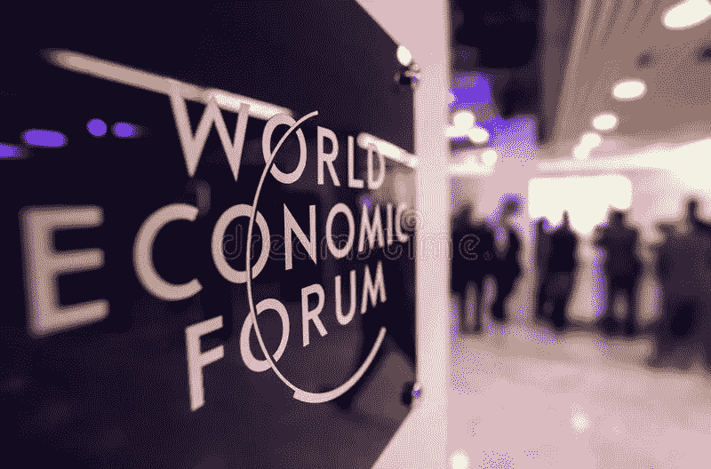

# 世界经济论坛和它对隐字世界的意义

> 原文：<https://medium.com/coinmonks/the-world-economic-forum-and-what-it-means-to-the-cryptoverse-216459b04aba?source=collection_archive---------65----------------------->

dreamstime

**WEF**

世界经济论坛(WEF)致力于帮助确保区块链以减少腐败、增加信任和赋予用户权力的方式安全地分散信息传输。

“我们的目标是与合作伙伴和成员合作，保证每个人，包括社会中最边缘化的成员，都能够……