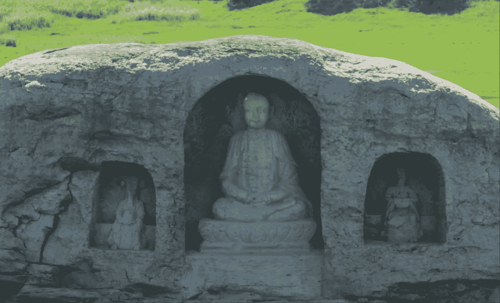
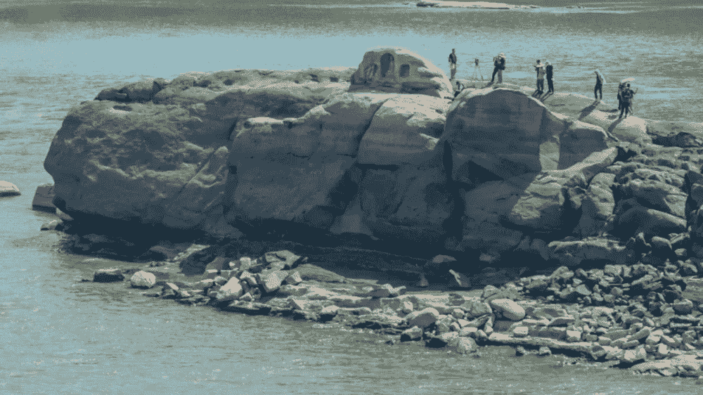

# 长江佛像是希望的礼物

> 原文：<https://medium.com/coinmonks/the-yangtze-buddhas-are-a-gift-of-hope-d6dda2283f73?source=collection_archive---------17----------------------->

PHOTO: CHINA NATIONAL RADIO

在禁闭期间，我真的进入了非暴力的佛教哲学(不是宗教),我可能已经找到了我最喜欢的佛像！最近，在创纪录的干旱导致长江水位下降后，淹没在长江下 600 年的三尊小佛像被发现。到目前为止，对我来说，这是我见过的最元的象征之一，它告诉我们痛苦的循环，以及其中的希望。它在一个最痛苦的时期向我们展示了自己。

让我们回到 600 年前，当一个人或一小群人决定在岩石上雕刻这些小佛的时候。对他们来说，能够接触到这块岩石意味着他们也经历了一场大规模的干旱。干旱在当时是一个更大的问题，所以可以想象当时的人们会经历多少痛苦和焦虑。那么在河里雕刻一堆雕像有什么好处呢？

根据考古学家的猜测，文章认为这些雕刻是为了保佑旅途中的船只，但我觉得这些佛教雕塑家试图表达更多的东西。

PHOTO: CHINA NATIONAL RADIO

佛教哲学的核心是将世界描述为无尽苦难的循环——我们今天忍受的苦难与人类已经忍受并将永远忍受的苦难是一样的。接受这一生活事实是通往觉悟之路的第一步，但这也意味着生活将继续下去，无论这个世界在此刻可能显得多么黯淡或虚无。

600 年前，干旱将是最悲惨的情景之一，除非佛教徒知道这将会过去，生活将会继续。他们也知道，因为这是一个无休止的循环，干旱总有一天会回来，当它来临时，他们想提醒我们这个生活的事实，因为否则，我们可能会陷入进一步的混乱和暴力。干旱带来的混乱将包括人类可以证明对邻居实施的暴力，继续暴力反应链。因此，每个人都有责任在面对暴力时保持和平——通过一个冥想的人在雕像中象征了这一点。

所以这些雕像不是为他们雕刻的，而是为包括我们在内的后代雕刻的。我们可以称之为人为的奇迹，某种刻意的东西，因为他们知道他们的重现是不可避免的。这些雕像是雕刻在岩石上的，而不是从岩石中雕刻出来的，它们被包裹在一个外层中，这个外层在这些世纪里保护了雕像免受水流的影响。这张照片让我想起了儿童节目《阿凡达:最后的气宗》中的安昂，他把自己藏在一个淹没在海底的冰球里，以此来逃避暴力。

这些不起眼的雕像与我们习惯在寺庙和宗教场所看到的巨大佛像形成了鲜明的对比。这些雕像中最大的是根据统治者的命令建造的，其资源是通过使用强制和武力收集和组装的。从表面上看，其目的似乎是为了崇拜佛陀，但事实上是为了展示统治者的权力和威严，他们建造这些雕像是为了保护他们的自我。现在把这些与长江大佛相比:它们可能是由一个人建造的；它们是永久的，如果不是更多的话；他们只在最糟糕的时候出现。

我们再次生活在似乎是最糟糕的时代。随着世界变得越来越暗淡，我们会感到越来越绝望。但是就像这些佛教雕塑家一样，他们会经历和我们一样的痛苦，我们可以找到平静，因为我们知道这是生命周期的一部分，它会过去，当它再次发生时，我们的痛苦会提醒我们对后代的希望。

*来源文章:*[*https://www . vice . com/en/article/dy 7y 3y/长江-dries-佛教-造像-重庆*](https://www.vice.com/en/article/dy7y3y/yangtze-river-dries-buddhist-statues-chongqing)