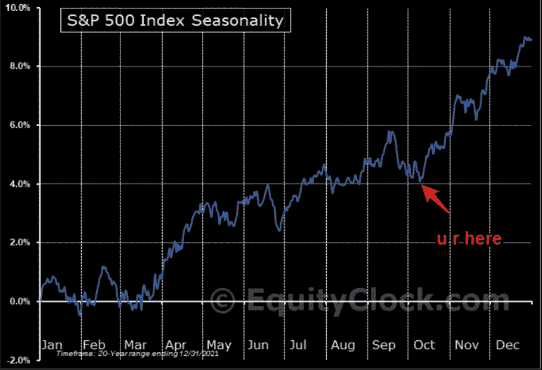
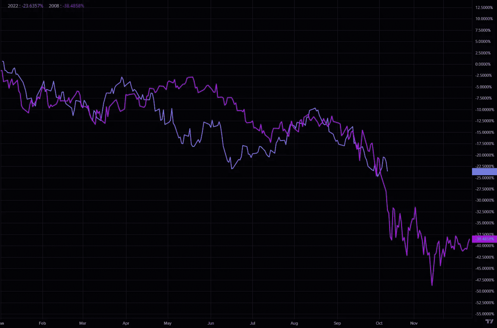
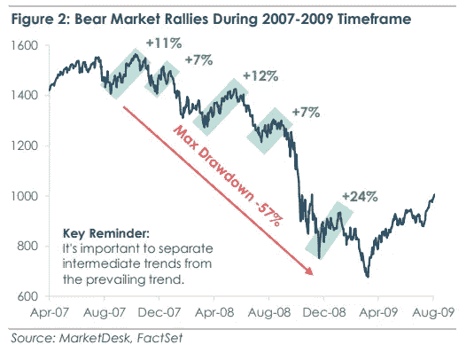
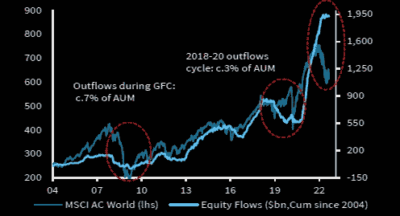
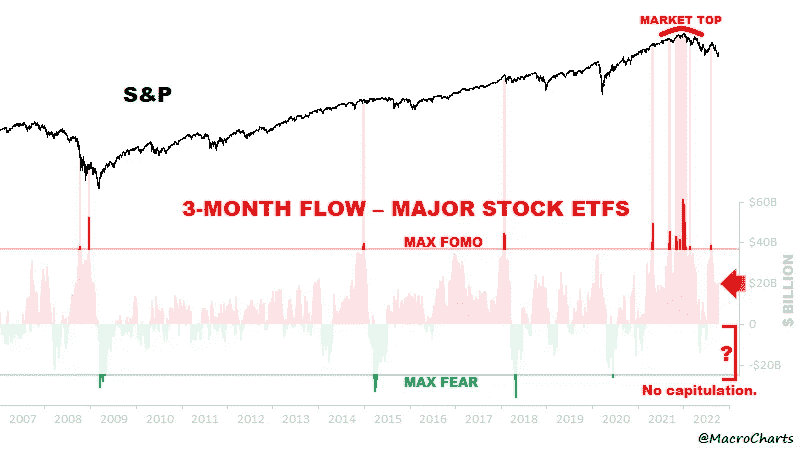
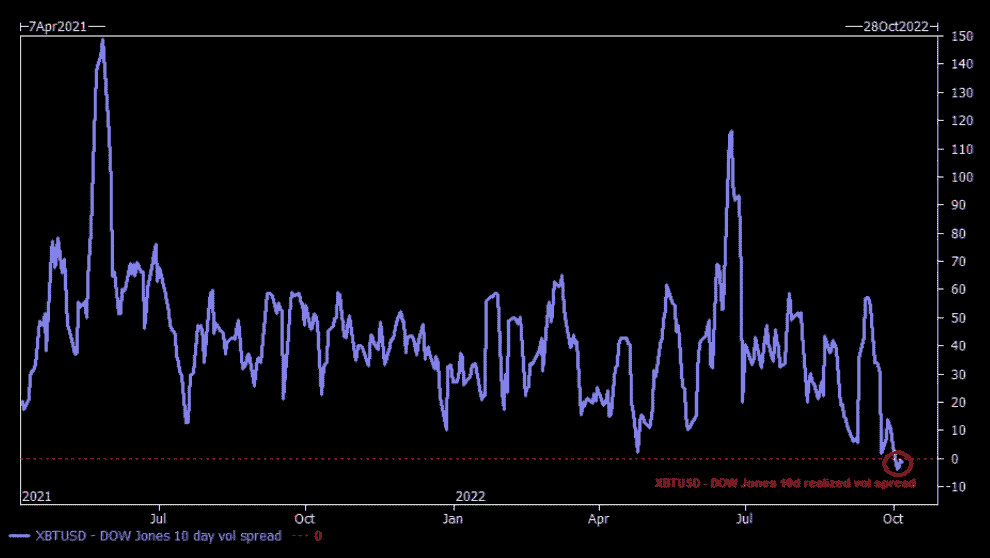
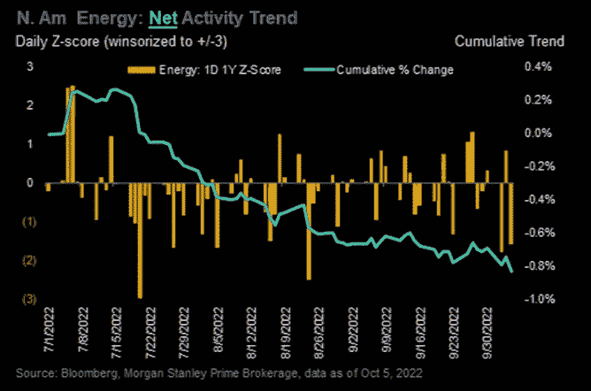

# 年末反弹现在开始了，对冲基金正在抛售石油股，这些股票比比特币更不稳定

> 原文：<https://medium.com/coinmonks/the-year-end-rally-starts-now-hedge-funds-selling-oil-stocks-stocks-more-volatile-than-bitcoin-945b9289e663?source=collection_archive---------36----------------------->

嘿，我是基兰！市场又将迎来新的一周，以下是需要注意的关键事件，以及来自投资银行的最有趣的宏观研究。我希望能在本周的[贸易挑战](http://www.traderseed.io/)中与你交谈，并且一如既往，如果你有任何问题，请在下面给我留言。

# 每周观察列表

本周需要关注的关键事件是周四的美国通胀数据。周五的就业报告显示，尽管美联储努力通过削弱增长来降低高通胀，但美国劳动力市场仍然强劲，通胀数据再次上升将巩固美联储加息的呼声。

经济日历还包括消费者信心数据，该数据将显示美国消费者在经历了数月的紧缩货币政策后的表现，以及首次申请失业救济人数和批发价格通胀数据。

# 宏观视角

**季节性最强。我们一整年都在跟踪这张标准普尔 500 指数季节性图表。本周通常标志着历史底部，以及年末反弹的开始。**

S & P 500 2022 v 2008。不要太兴奋，因为 2008 年的 P500 类比正好赶上最后的暴跌。

2008 年金融危机期间的熊市反弹。在 2008 年熊市期间，我们看到了无数次熊市反弹，随后是持续的暴跌，因此提醒我们在这种类型的市场中要始终小心行事。

**流入股市的资金保持弹性。**今年非常有趣的一个数据点是，尽管我们看到了非常悲观的价格走势，但我们并没有真正看到大量资金流出股市，这意味着大多数市场参与者仍保持“最大多头”。

还没有投降。对于一个有意义的底部的发生，我们预计会看到严重的投降，长期持有人变成被迫出售。到目前为止，我们还没有看到任何这样的事件。

**股票 v 比特币波动。**高盛的这张图表显示，“道琼斯(全球最大的 30 只工业股票)现在的官方波动性超过了比特币”。

**对冲基金抛售石油股票。如果你希望本周“躲”在石油行业，请记住，摩根士丹利(Morgan Stanley)的数据显示，上周对冲基金大举抛售石油行业多头。在这个疯狂的市场无处可藏。系好安全带。**

我希望你觉得这很有趣，很有用。我每周一写这份时事通讯，所以**一定要关注我**！像往常一样，把风险管理放在第一位，安全交易，保持敏捷。

祝你一周愉快！基兰

**想在本周交易市场吗？** 100k 节目起 **$75** ！！点击这里查看新节目 [**！**](http://www.traderseed.io/)

[**查看节目**](http://www.traderseed.io/)

> 交易新手？尝试[加密交易机器人](/coinmonks/crypto-trading-bot-c2ffce8acb2a)或[复制交易](/coinmonks/top-10-crypto-copy-trading-platforms-for-beginners-d0c37c7d698c)